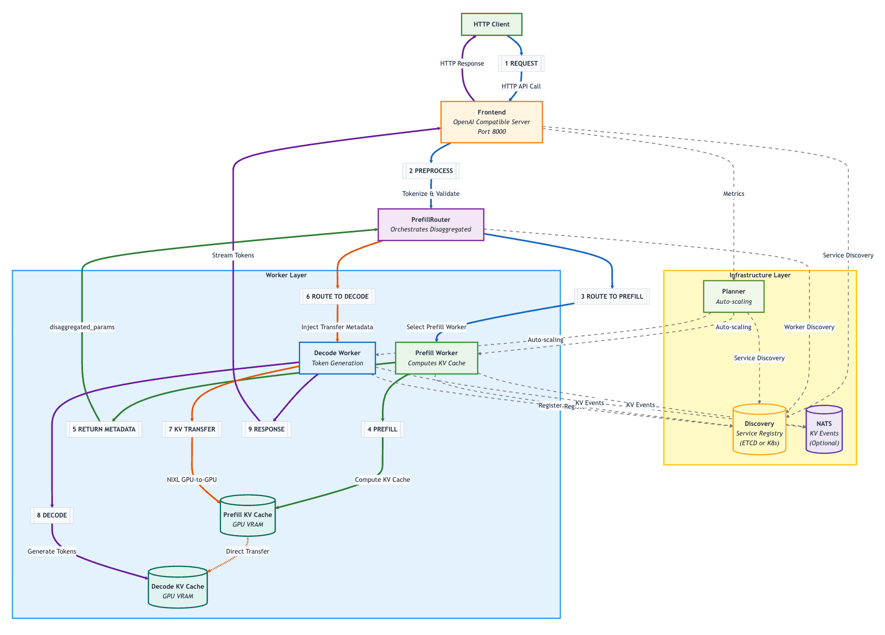
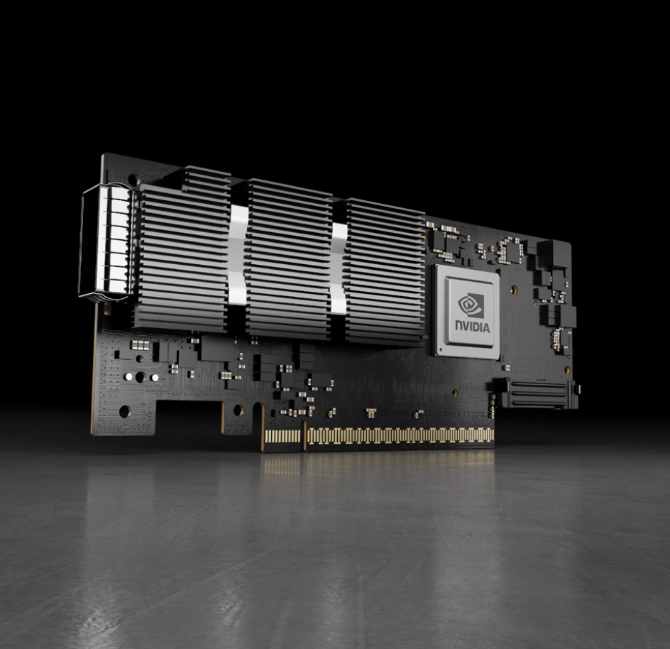

# Glossary

Definitions and explanations for the hardware, RDMA, networking, Kubernetes and Dynamo terms used throughout this repository. Use this as a complementary resource when a term in a document or runbook is unfamiliar.

Read [Network Architecture](network-architecture.md) for the network design of the nodes.

## High-level Picture

The cluster has two physical GPU servers (nodes): `gpu05` and `gpu06`. Each server runs multiple Kubernetes Pods. A disaggregated Dynamo deployment places prefill and decode workers in those Pods and transfers KV cache data between them.

Each worker Pod needs two kinds of communication:
1. **Ordinary Kubernetes communication** for APIs, service discovery, control messages and general TCP/IP traffic.
2. **High-volume data communication** for moving KV cache data between GPU workers with RDMA over Ethernet.

```text
gpu05                                        gpu06
┌──────────────────────────────┐             ┌──────────────────────────────┐
│ Prefill Pod                  │             │ Decode Pod                   │
│                              │             │                              │
│ eth0: ordinary Pod network   │··· Ethernet ··│ eth0: ordinary Pod network   │
│ net1: RoCE network           │=== RoCE ====│ net1: RoCE network           │
│ /dev/infiniband: RDMA API    │             │ /dev/infiniband: RDMA API    │
│ GPU memory                   │             │ GPU memory                   │
└──────────────┬───────────────┘             └──────────────┬───────────────┘
               │                                             │
       host port rdma7                                host port rdma7
       RDMA view mlx5_8:1                             RDMA view mlx5_8:1
               └──────────── Ethernet switches ──────────────┘
```

### software layer hierarchy

```text
Dynamo          Routes requests and decides which worker holds/needs which KV blocks
   ↓
vLLM / SGLang   Runs the model. Engine's NIXL connector issues the KV transfer
   ↓
NIXL            Describes memory/storage regions and picks a backend
   ↓
UCX             (one NIXL backend) Selects transport, device and GID
   ↓  ── control path only: open device, register memory and create QPs ──
Linux RDMA      libibverbs + kernel RDMA subsystem (/dev/infiniband)
   ↓
ConnectX NIC    DMAs registered GPU memory over the RoCE fabric (kernel bypassed)
```

### Dynamo Architecture Flow



Source: [NVIDIA Dynamo architecture flow](https://docs.nvidia.com/dynamo/knowledge-base/concepts/system-architecture/architecture-flow)

## Hardware

### Host and Node

A **host** is a physical or virtual computer. In this repository `gpu05` and `gpu06` are physical GPU hosts.

A **node** is a host registered with Kubernetes so that Kubernetes can schedule Pods on it.

The terms have slightly different nuances: host is the hardware/Linux view and node is the Kubernetes view. Since both describe the same physical machine we use them interchangeably throughout this repository.

The host owns the physical GPUs, CPUs, memory and NICs. A Pod runs on one node and uses selected portions of those host resources.

### NIC, HCA and ConnectX



A **Network Interface Card (NIC)** connects a computer to a network.

A **Host Channel Adapter (HCA)** is an adapter that exposes RDMA capabilities. Here an adapter is a physical card that plugs into a host through PCIe and connects it to an external network or device.

**ConnectX** is NVIDIA's adapter family. ConnectX models may support Ethernet, InfiniBand or both. The adapters in this cluster use Ethernet mode for RoCE.

In practice NVIDIA documentation and tools use all three terms interchangeably for a ConnectX adapter.

See the NVIDIA [ConnectX-7 introduction](https://networking-docs.nvidia.com/connectx7hw/introduction) and [specifications](https://networking-docs.nvidia.com/connectx7hw/specifications) for the full hardware family list.

### NVLink

**NVLink** is NVIDIA's high-bandwidth GPU-to-GPU interconnect within a server. RoCE is a separate physical path for Pod-to-Pod traffic on the same node or across nodes. Pods can't attach to NVLink directly. Same-node Pod-to-Pod transfers therefore use RoCE too.

### NVLS

**NVIDIA NVLink SHARP (NVLS)** accelerates supported collective operations over an NVLink topology by using in-network reduction capabilities.

NVLink/NVLS and RoCE serve different physical paths in this cluster:

- GPU-to-GPU within an NVLink domain -> NVLink / NVLS
- GPU memory between pods/nodes -> ConnectX / RoCE

## RDMA

### RDMA and GPUDirect RDMA

**Remote Direct Memory Access (RDMA)** is a family of operations that let one machine's RDMA adapter move data to or from memory registered on another machine with little CPU and kernel involvement in the data path.

If we compare the conceptual paths:

```text
Conventional socket path
application -> kernel TCP/IP work -> NIC -> network -> remote kernel -> application

RDMA path after setup
registered memory -> RDMA NIC ===== network ===== remote RDMA NIC -> registered memory
```

[**GPUDirect RDMA**](https://networking-docs.nvidia.com/gpudirectrdma/) lets a NIC or another PCIe peer device directly DMA to or from GPU memory without staging the data through a CPU bounce buffer:

```text
staged path: GPU -> host memory -> NIC -> network -> NIC -> host memory -> GPU
direct path: GPU ========= NIC/network/NIC =========> GPU
```

### RDMA Verbs

[**RDMA verbs**](https://www.ietf.org/archive/id/draft-hilland-rddp-verbs-00.pdf) are the low-level API (`libibverbs`) for registering memory and issuing RDMA operations. UCX calls verbs internally so you won't call them directly.

### Queue Pair

A **Queue Pair (QP)** is the per-connection send/receive queue an HCA uses to run RDMA operations asynchronously. UCX manages QPs internally. They stay invisible to Dynamo and NIXL.

### InfiniBand

**InfiniBand** is a network architecture designed around RDMA. It defines its own link-layer fabric, addressing, transport behavior and switching ecosystem.

InfiniBand and RoCE both expose RDMA operations to applications. They carry them over different fabrics:

```text
RDMA operation over an InfiniBand fabric -> InfiniBand
RDMA operation over an Ethernet fabric   -> RoCE
```

This cluster uses Ethernet ConnectX ports for its cross-host RDMA path and therefore uses RoCE.

### RoCE

**RDMA over Converged Ethernet (RoCE)** carries RDMA traffic over Ethernet.

“Converged” means that Ethernet infrastructure can carry both ordinary network traffic and RDMA traffic. The same infrastructure can support the RDMA path without requiring InfiniBand.

### RoCE Fabric

A **fabric** is the connected network between participating endpoints. For RoCE this includes each ConnectX port plus the Ethernet switches and cabling between them.

### `rdma` and `mlx`

Linux exposes the same physical ConnectX port through two subsystems:

```text
one physical ConnectX port
              |
       +------+------+
       |             |
network subsystem   RDMA subsystem
name: rdma7         name: mlx5_8 port 1
use: IP/MAC/routes  use: verbs, QPs, registered memory
```

`rdmax` (where x is an arbitrary number e.g. rdma7) is a Linux **network-device** name. Tools such as `ip addr` and `ip route` use it.

UCX and RDMA tools use `mlx5_x:1` (where x is an arbitrary number e.g.`mlx5_8:1`) as naming form.

These are two software views of the same physical port. The mapping must therefore be validated before use.

### `/dev/infiniband`

Linux exposes RDMA character devices under `/dev/infiniband`. Their names include `uverbs0` and `rdma_cm`. User-space libraries open these device files to issue RDMA operations and connection-management requests.

The directory name comes from the Linux RDMA subsystem's history. It is used for both native InfiniBand and RoCE. Seeing `/dev/infiniband` in a RoCE Pod is therefore expected.

Network interfaces and RDMA device files provide complementary pieces:

```text
net1              -> Pod IP identity and route onto the RoCE network
/dev/infiniband/* -> API path for issuing RDMA operations to the HCA
```

A useful Pod needs both pieces aligned to the intended physical port.

### GID and GID Index

A **Global Identifier (GID)** is the RDMA-layer address (IPv6-shaped) that a network device gets once it has an IP. NV-IPAM assigns `net1` its IP. Linux exposes a GID for it and UCX uses that GID to reach the peer. No GID means no usable RDMA path.

A **GID index** is just that GID's row number in one HCA port's local table (e.g. "GID index 3"). It is a lookup slot and should not be expected to match across machines. `show_gids` lists a host's GID table when you need to check one.

## Linux Networking

### Linux Network Namespace

A **network namespace** is a separate instance of Linux network state. It contains its own interfaces, IP addresses, routes and TCP/UDP socket table.

Kubernetes normally gives each Pod its own network namespace:

```text
gpu05 Linux kernel
├── host network namespace
│   ├── node interfaces
│   └── host sockets
├── prefill Pod network namespace
│   ├── eth0 and net1
│   └── Pod sockets
└── decode Pod network namespace
    ├── eth0 and net1
    └── Pod sockets
```

All of these namespaces share the same Linux kernel while their network configuration remains separate. This is why two ordinary Pods can each listen on port `8000`: each has its own IP address and socket table.

### Network Interface

A **network interface** is a Linux object through which a network namespace sends and receives traffic. An interface may correspond directly to a physical port or may be a virtual interface built on another interface.

Examples in this cluster:

| Name | Where it appears | Role |
| --- | --- | --- |
| ordinary node interface | host | SSH, Kubernetes node traffic and general TCP/IP |
| `rdmax` | host | Linux network view of a RoCE-capable physical port |
| `eth0` | Pod | primary Kubernetes network interface |
| `net1` | Pod | secondary interface connected to the RoCE subnet |

An interface name has Pod-local scope. `net1` inside one Pod and `net1` inside another Pod are separate Linux interfaces.

### `hostNetwork`

The normal Pod model uses `hostNetwork: false`. A Pod then has its own network namespace and Pod IP.

With `hostNetwork: true` a Pod enters the **host's network namespace**. The Pod sees the host interfaces and uses the host IP addresses and socket table. Two host-networked processes on the same node therefore compete for the same `IP:port` combinations.

```text
gpu05 host socket table
├── process A binds 10.18.96.143:8000  -> succeeds
└── process B binds 10.18.96.143:8000  -> address already in use
```

This repository's Pod-native RoCE design therefore keeps `hostNetwork` as `false` and adds a RoCE interface to it.

### MacVLAN

**MacVLAN** is a Linux networking feature and CNI plugin that creates virtual Ethernet interfaces on one parent NIC.

All Pods share the bandwidth and hardware of the parent port (the same NIC). Each Pod still has a distinct network identity inside its own network namespace. MacVLAN creates the interface.

Calico provides the primary Pod data path using the cluster's configured routing, filtering and optional encapsulation mechanisms. MacVLAN serves a different purpose here. It creates a virtual Ethernet interface linked to the host's `rdma7` parent netdev and gives the Pod a direct L2 attachment to the RoCE network without partitioning the NIC in hardware.

MacVLAN does NOT allocate IP address but only gives MAC address which can receive its own IP address.

```text
host rdma7: physical Ethernet/RoCE port
├── Pod A net1: unique MAC and IP
├── Pod B net1: unique MAC and IP
└── Pod C net1: unique MAC and IP
```

### SR-IOV

**Single Root I/O Virtualization (SR-IOV)** splits one NIC into hardware-backed virtual functions (VFs) that can be assigned directly to Pods. This cluster uses MacVLAN instead because sharing one HCA was simpler to set up. See NVIDIA's [SR-IOV documentation](https://networking-docs.nvidia.com/doca/archive/2-9-5/single-root-io-virtualization-sr-iov).

## Kubernetes

### Namespace

A **Kubernetes namespace** is a logical scope for Kubernetes objects. Names such as Services, Pods, Secrets and DGD only need to be unique inside their namespace.

All experiments now share `dynamo-bench`. Their object names provide uniqueness instead of separate workload namespaces. For example:

```text
namespace dynamo-bench -> Service model-a-frontend
namespace dynamo-bench -> Service model-b-frontend
```

**Commonly confused name:** a Kubernetes namespace groups API objects. A Linux [network namespace](#linux-network-namespace) isolates interfaces, routes, IP addresses and ports. This is why two Pods on the same node can each use the same port without colliding.

### Kubernetes Pod

The scheduled unit created for a component replica.

If a component has `replicas: 4` the operator normally creates four equivalent Pod replicas.

e.g. four TP=2 prefill worker pod on a cluster.

### Container

A **container** is an isolated runtime environment inside the Pod created from an image.

Each Pod starts the containers from its Pod template. Each container then executes its configured command.

### PVC

A **PersistentVolumeClaim (PVC)** is a Pod's request for storage managed by Kubernetes. The manifest describes the required capacity and access mode. Kubernetes binds the claim to compatible storage.

### RWX

**ReadWriteMany (RWX)** is an access mode that allows the same volume to be mounted read-write by multiple nodes. Dynamo experiments may use RWX storage when several worker Pods need the same model files or artifacts. The underlying storage system must support this mode.

### CNI and CNI Plugin

**Container Network Interface (CNI)** is a specification for configuring container network interfaces in Kubernetes.

A **CNI plugin** is an executable that performs part of that configuration such as creating an interface, assigning an address or adding routes.

When a Pod starts the container runtime invokes the configured CNI chain. Kubernetes schedules the Pod and supplies its desired configuration. The plugins perform the Linux network setup.

### Calico

[**Calico**](https://github.com/projectcalico/calico) is one of the primary CNI implementations used when a Kubernetes cluster is initialized.

### Multus

Kubernetes by default adds one network interface.

[**Multus**](https://github.com/k8snetworkplumbingwg/multus-cni) is a CNI meta-plugin (or orchestrator) that allows multiple CNI plugins to be attached. In this cluster it adds MacVLAN for RoCE.

```text
Pod creation
   |
   +-- primary CNI: Calico ----------------------> eth0
   |
   +-- Multus reads requested secondary network
          |
          +-- MacVLAN + NV-IPAM -----------------> net1
```

The Pod requests the extra network through the `k8s.v1.cni.cncf.io/networks` annotation or an equivalent higher-level resource. Multus finds the referenced network definition and invokes its configured plugins.

### NAD

A **NetworkAttachmentDefinition (NAD)** is a Kubernetes custom resource that describes a secondary network for Multus.

Conceptually it includes these contents:
- name: roce
- method: MacVLAN
- parent interface: rdma7
- IP allocation: NV-IPAM
- IPPool: roce-pool

The NAD describes how to build `net1`. It does not expose RDMA device files. The RDMA device plugin handles that part.

### IPAM and NV-IPAM

**IP Address Management (IPAM)** allocates, records and releases IP addresses. A CNI plugin delegates address selection to an IPAM plugin so concurrently created Pods do not receive the same address.

**NV-IPAM** is NVIDIA's IPAM plugin for Kubernetes secondary networks. In this design it does not allocate the Calico `eth0` address. It allocates a unique address from the `roce-pool` IPPool to each MacVLAN `net1` attachment and releases the address when that attachment is removed.

So the responsibility boundary among MacVLAN and NV-IPAM is:

- MacVLAN  -> creates net1 and its MAC identity
- NV-IPAM  -> chooses and assigns net1's IP address
- RDMA stack -> creates GID entries associated with that IP/device

### Kubernetes Device Plugin

A **Kubernetes device plugin** registers special node resources with the kubelet. A Pod requests one of those resources in `resources.limits`; the kubelet then admits the Pod on a suitable node and supplies the device access described by the plugin.

This mechanism is separate from CNI:

```text
CNI plugin     -> interfaces, IP addresses and routes
device plugin  -> hardware/resource access and device files
```

Both mechanisms run during Pod setup and are easy to conflate. They solve different halves of the problem.

### RDMA Shared Device Plugin and `rdma/ib`

The **RDMA Shared Device Plugin** registers an RDMA-capable adapter as a shareable Kubernetes resource and arranges access to the relevant RDMA device files for eligible Pods.

In this repository a resource name such as `rdma/ib` is a Kubernetes resource identifier configured by the cluster administrator. It could have another name but `rdma/ib` is a common convention.

```text
Pod requests rdma/ib
        ↓
kubelet and RDMA device plugin
        ↓
Pod receives access to matching /dev/infiniband devices
```

The plugin's selector must match the intended host interfaces or RDMA devices. The resource request grants device access; the Multus attachment supplies `net1` and its RoCE address.

With this repository's `rdmaHcaMax: 64` configuration the plugin creates 64 logical accounting units whenever the selected HCA is present. A successful allocation supplies the same device-file set for that selected HCA whether the Pod requests one unit or multiple units. The quantity changes scheduling capacity consumption but not the hardware presented to the Pod.

### NVIDIA Network Operator

The **NVIDIA Network Operator** manages Kubernetes components needed for accelerated networking. Depending on its policy it can deploy and configure network drivers, device plugins, CNI plugins, IPAM, Multus and related resources.

It acts as the installer and lifecycle manager for these pieces. The actual Pod data path still consists of the interfaces, routes, device files, driver stack, adapter and fabric.

The [Network Operator documentation](https://docs.nvidia.com/networking/display/kubernetes2641/index.html) presents the supported components and secondary-network models. NVIDIA's [MacVLAN with RDMA shared device quick start](https://docs.nvidia.com/networking/display/kubernetes2641/quick-start/macvlan-rdma-shared.html) shows the same component split used in this glossary.

## Dynamo and the Transfer Stack

### DGD

A **DynamoGraphDeployment (DGD)** is the Kubernetes custom resource used to describe a Dynamo serving deployment. Its manifest specifies components such as the frontend and workers, their images and commands, resource requirements, replica counts and relationships.

The word **graph** refers to the request and data flow among components.

For example:

```text
Aggregated serving
client -> frontend -> worker

Disaggregated serving
client -> frontend -> prefill worker -> decode worker
                              KV cache ────────>
```

The Dynamo operator reads the DGD and creates lower-level Kubernetes objects including Pods and Services. For more information see the [DynamoGraphDeployment API reference](https://docs.nvidia.com/dynamo/reference/api/kubernetes/dynamo-graph-deployment).

### (Dynamo) Component

The fundamental deployable unit in Dynamo.

Component is a discoverable service entity that can host multiple endpoints and typically maps to a container.

In this repo we usually use `Frontend`, `PrefillWorker` and `DecodeWorker` as components.

### NIXL

The **NVIDIA Inference Xfer Library (NIXL)** provides a higher-level transfer API for AI inference systems. It represents memory and storage regions and delegates movement to modular backends such as UCX.

NIXL lets Dynamo express KV cache move/path without embedding UCX verbs or HCA selection throughout the serving logic. See more in [NIXL project documentation](https://github.com/ai-dynamo/nixl/blob/main/README.md).

### UCX

**Unified Communication X (UCX)** is a low-level communication framework. It provides a common API over transports such as shared memory, TCP, InfiniBand and RoCE. It also handles memory registration and low-level endpoint operations.

For this cluster UCX performs three selections:

1. Which transport is usable.
2. Which RDMA device and port to use (e.g.`mlx5_8:1`).
3. Which address/GID associated with that port reaches the peer.

See the NVIDIA HPC-X [UCX documentation](https://networking-docs.nvidia.com/hpcxum/2.50/unified-communication-x-framework-library) for its transport and memory-operation model.

## References
- [NVIDIA Networking Documentation portal](https://networking-docs.nvidia.com/)
- [NVIDIA Network Operator](https://docs.nvidia.com/networking/display/kubernetes2641/index.html)
- [MacVLAN Network with RDMA Shared Device](https://docs.nvidia.com/networking/display/kubernetes2641/quick-start/macvlan-rdma-shared.html)
- [RDMA over Converged Ethernet](https://networking-docs.nvidia.com/doca/archive/3-4-0/rdma-over-converged-ethernet)
- [GPUDirect RDMA](https://networking-docs.nvidia.com/gpudirectrdma/)
- [UCX in NVIDIA HPC-X](https://networking-docs.nvidia.com/hpcxum/2.50/unified-communication-x-framework-library)
- [NVIDIA SR-IOV](https://networking-docs.nvidia.com/doca/archive/2-9-5/single-root-io-virtualization-sr-iov)
- [NIXL](https://github.com/ai-dynamo/nixl/blob/main/README.md)
- [ConnectX-7 introduction](https://networking-docs.nvidia.com/connectx7hw/introduction)
- [ConnectX-7 specifications](https://networking-docs.nvidia.com/connectx7hw/specifications)
- [RDMA Verbs (draft-hilland-rddp-verbs-00)](https://www.ietf.org/archive/id/draft-hilland-rddp-verbs-00.pdf)
- [Calico](https://github.com/projectcalico/calico)
- [Multus](https://github.com/k8snetworkplumbingwg/multus-cni)
- [DynamoGraphDeployment API reference](https://docs.nvidia.com/dynamo/reference/api/kubernetes/dynamo-graph-deployment)
