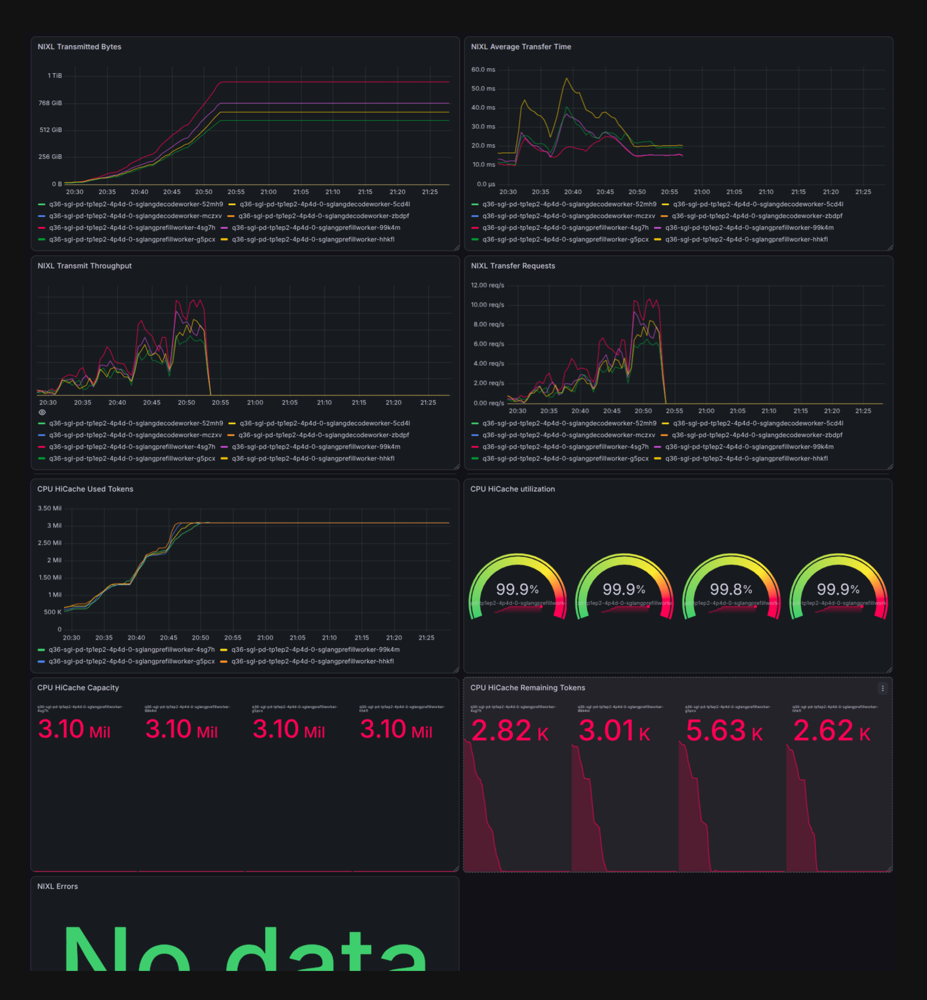

# NIXL Telemetry with Prometheus and Grafana

This runbook exposes NIXL transfer metrics from Dynamo workers, scrapes them
with Prometheus, and visualizes them in Grafana. It is reusable across the
disaggregated model recipes in this repository.

The verified worker endpoints are:

| Endpoint | Port | Purpose |
| --- | ---: | --- |
| `system` | `9090` | Dynamo/SGLang metrics, including HiCache metrics |
| `nixl` | `19090` | NIXL transfer telemetry |



### Dashboard Panel Breakdown

* **NIXL Transmitted Bytes**: Total KV-cache data transferred over RoCE v2 (scales up to ~1 TiB).
* **NIXL Average Transfer Time**: RDMA transfer latency per call (10 ms baseline, ~55 ms peak).
* **NIXL Transmit Throughput**: Active KV-cache transfer bandwidth across workers.
* **NIXL Transfer Requests**: KV transfer throughput in requests/sec (peaks at ~10–12 req/s).
* **CPU HiCache Used Tokens**: Total KV tokens offloaded to host CPU RAM (~3.10M tokens).
* **CPU HiCache Utilization**: Host CPU RAM pool occupancy (~99.9% usage across prefill workers).
* **CPU HiCache Capacity & Headroom**: Allocated CPU token limits (3.10M/pod) and remaining free token slots.
* **NIXL Errors**: Transfer health indicator confirming zero RDMA/UCX errors (`No data`).

## 1. Configure the deployment

Adding these environment variables to both SGLang and vLLM worker containers is critical. Enabling them activates internal NIXL transfer telemetry and exposes RoCE metrics directly over Prometheus.

```yaml
- name: DYN_SYSTEM_PORT
  value: "9090"
- name: NIXL_TELEMETRY_ENABLE
  value: "y"
- name: NIXL_TELEMETRY_EXPORTER
  value: prometheus
- name: NIXL_TELEMETRY_PROMETHEUS_PORT
  value: "19090"
```

The generated worker Pods must expose named ports `system` and `nixl`.
Dynamo's operator creates these ports from the environment above. Confirm the
live Pod specification instead of assuming they exist:

```bash
export NAMESPACE=qwen32-bench
export DEPLOYMENT=REPLACE_WITH_DGD_NAME
export GRAPH_LABEL="nvidia.com/dynamo-graph-deployment-name=${DEPLOYMENT}"
export MONITOR_NAMESPACE=monitoring
export PROMETHEUS_NAME=monitoring-kube-prometheus-prometheus
export PROMETHEUS_SERVICE=monitoring-kube-prometheus-prometheus
export GRAFANA_SERVICE=monitoring-grafana
export EXP_DIR=/ephemeral/shared/monitoring/nixl-grafana

mkdir -p "$EXP_DIR"

kubectl get pods -n "$NAMESPACE" -l "$GRAPH_LABEL" \
  -o jsonpath='{range .items[*]}{.metadata.name}{"\n"}{range .spec.containers[*].ports[*]}{"  "}{.name}{"="}{.containerPort}{"\n"}{end}{end}'
```

Each worker must list `system=9090` and `nixl=19090`. With
`hostNetwork: false`, replicas can reuse these ports because every Pod has its
own network namespace.

## 2. Install or verify the monitoring stack

First check whether Prometheus Operator, Prometheus, and Grafana already
exist:

```bash
kubectl get crd podmonitors.monitoring.coreos.com
kubectl get prometheus -A
kubectl get service -n "$MONITOR_NAMESPACE" \
  "$PROMETHEUS_SERVICE" "$GRAFANA_SERVICE"
```

If all commands succeed, keep the existing stack and continue to section 3.
Do not install a duplicate stack.

If monitoring is absent, install it once. This configuration permits
Prometheus to discover `PodMonitor` resources in workload namespaces:

```bash
helm repo add prometheus-community \
  https://prometheus-community.github.io/helm-charts
helm repo update

helm upgrade --install monitoring \
  prometheus-community/kube-prometheus-stack \
  --namespace "$MONITOR_NAMESPACE" \
  --create-namespace \
  --set prometheus.prometheusSpec.podMonitorSelectorNilUsesHelmValues=false \
  --set-json 'prometheus.prometheusSpec.podMonitorNamespaceSelector={}' \
  --wait \
  --timeout 20m
```

Wait for the stack and inspect the selectors used by Prometheus:

```bash
kubectl wait -n "$MONITOR_NAMESPACE" --for=condition=Ready pod \
  -l app.kubernetes.io/instance=monitoring --timeout=10m

kubectl get prometheus -n "$MONITOR_NAMESPACE" "$PROMETHEUS_NAME" \
  -o json | jq '{
    podMonitorSelector: .spec.podMonitorSelector,
    podMonitorNamespaceSelector: .spec.podMonitorNamespaceSelector
  }'
```

## 3. Create the worker PodMonitor

Check for an existing monitor first:

```bash
kubectl get podmonitor -A
```

If no existing `PodMonitor` selects this deployment, create one. The
`release: monitoring` label matches the stack installed in section 2; change
it if the selector shown by the previous command requires a different label.

```bash
tee "$EXP_DIR/nixl-podmonitor.yaml" >/dev/null <<EOF
apiVersion: monitoring.coreos.com/v1
kind: PodMonitor
metadata:
  name: ${DEPLOYMENT}-worker-metrics
  namespace: ${MONITOR_NAMESPACE}
  labels:
    release: monitoring
spec:
  namespaceSelector:
    matchNames:
      - ${NAMESPACE}
  selector:
    matchExpressions:
      - key: nvidia.com/dynamo-graph-deployment-name
        operator: In
        values:
          - ${DEPLOYMENT}
      - key: nvidia.com/dynamo-sub-component-type
        operator: In
        values:
          - prefill
          - decode
  podMetricsEndpoints:
    - port: nixl
      path: /metrics
      interval: 5s
      scrapeTimeout: 4s
    - port: system
      path: /metrics
      interval: 5s
      scrapeTimeout: 4s
EOF

kubectl apply --dry-run=server \
  -f "$EXP_DIR/nixl-podmonitor.yaml"
kubectl apply -f "$EXP_DIR/nixl-podmonitor.yaml"
```

## 4. Verify metrics before opening Grafana

Resolve the worker Pods and test the NIXL endpoint directly:

```bash
worker_pods="$(kubectl get pods -n "$NAMESPACE" \
  -l "$GRAPH_LABEL,nvidia.com/dynamo-component-type=worker" \
  -o jsonpath='{range .items[*]}{.metadata.name}{"\n"}{end}')"

test -n "$worker_pods"

for pod in $worker_pods; do
  echo "===== $pod ====="
  kubectl exec -n "$NAMESPACE" "$pod" -- python3 -c '
import urllib.request
metrics = urllib.request.urlopen(
    "http://127.0.0.1:19090/metrics", timeout=10
).read().decode()
names = (
    "agent_tx_bytes", "agent_rx_bytes",
    "agent_tx_requests_num", "agent_rx_requests_num",
    "agent_xfer_time", "agent_xfer_post_time", "agent_errors",
)
print("\n".join(
    line for line in metrics.splitlines()
    if line and not line.startswith("#") and line.startswith(names)
) or "NO_NIXL_METRICS")
'
done
```

Generate at least one long-prompt request through the deployment before
expecting transfer counters to increase. A healthy transfer has nonzero
`agent_tx_bytes_total` and `agent_tx_requests_num_total`, while
`agent_errors_total` remains zero.

Next verify Prometheus discovery. Keep the port-forward running in a separate
terminal:

```bash
export PROMETHEUS_SERVICE_PORT="$(kubectl get service \
  -n "$MONITOR_NAMESPACE" "$PROMETHEUS_SERVICE" \
  -o jsonpath='{.spec.ports[0].port}')"

kubectl port-forward -n "$MONITOR_NAMESPACE" \
  "service/$PROMETHEUS_SERVICE" "9095:$PROMETHEUS_SERVICE_PORT" \
  --address 127.0.0.1
```

In another terminal, restore the variables from section 1 and run:

```bash
export PROM=http://127.0.0.1:9095

curl -fsS "$PROM/-/ready"

curl -fsS "$PROM/api/v1/targets?state=active" |
jq -r --arg deployment "$DEPLOYMENT" '
  .data.activeTargets[]
  | select((.labels.pod // "") | contains($deployment))
  | [
      .health,
      (.labels.pod // ""),
      (.labels.endpoint // ""),
      (.scrapeUrl // ""),
      (.lastError // "")
    ]
  | @tsv
'

curl -fsS -G "$PROM/api/v1/query" \
  --data-urlencode "query=sum by (pod) (agent_tx_bytes_total{namespace=\"${NAMESPACE}\",pod=~\"${DEPLOYMENT}.*\"})" |
jq '.data.result'
```

The target list must show healthy `nixl` and `system` targets. An empty query
result means Prometheus has not retained the series yet; it does not prove
that NIXL is idle.

## 5. Build the Grafana dashboard

Discover the Grafana service port and keep a local-only port-forward running:

```bash
export GRAFANA_SERVICE_PORT="$(kubectl get service \
  -n "$MONITOR_NAMESPACE" "$GRAFANA_SERVICE" \
  -o jsonpath='{.spec.ports[0].port}')"

kubectl port-forward -n "$MONITOR_NAMESPACE" \
  "service/$GRAFANA_SERVICE" "3000:$GRAFANA_SERVICE_PORT" \
  --address 127.0.0.1
```

Open `http://127.0.0.1:3000` and authenticate with the cluster's existing SSO
or Grafana administrator credentials. Do not expose Grafana on `0.0.0.0`.

Create a dashboard named **NIXL KV Transfer**, set the time range to **Last 15
minutes**, and set refresh to **5s**. Create dashboard variables named
`namespace` and `deployment`, or replace those variables with literal values
in the queries below.

| Panel | PromQL | Suggested display |
| --- | --- | --- |
| Transmitted bytes | `sum by (pod) (agent_tx_bytes_total{namespace="$namespace",pod=~"$deployment.*"})` | Time series, bytes IEC |
| Transmit throughput | `sum by (pod) (rate(agent_tx_bytes_total{namespace="$namespace",pod=~"$deployment.*"}[1m]))` | Time series, bytes/sec IEC |
| Transfer request rate | `sum by (pod) (rate(agent_tx_requests_num_total{namespace="$namespace",pod=~"$deployment.*"}[1m]))` | Time series, requests/sec |
| Average transfer time | `sum by (pod) (rate(agent_xfer_time_total{namespace="$namespace",pod=~"$deployment.*"}[5m])) / clamp_min(sum by (pod) (rate(agent_tx_requests_num_total{namespace="$namespace",pod=~"$deployment.*"}[5m])), 1)` | Time series, microseconds |
| NIXL errors | `sum by (pod) (agent_errors_total{namespace="$namespace",pod=~"$deployment.*"})` | Stat; threshold above zero |
| Host KV used | `sum by (pod) (sglang:hicache_host_used_tokens{namespace="$namespace",pod=~"$deployment.*"})` | Time series, tokens |
| Host KV capacity | `sum by (pod) (sglang:hicache_host_total_tokens{namespace="$namespace",pod=~"$deployment.*"})` | Stat, tokens |
| Host KV utilization | `100 * sum by (pod) (sglang:hicache_host_used_tokens{namespace="$namespace",pod=~"$deployment.*"}) / clamp_min(sum by (pod) (sglang:hicache_host_total_tokens{namespace="$namespace",pod=~"$deployment.*"}), 1)` | Gauge, percent 0-100 |

The HiCache panels apply only to SGLang workers configured for CPU KV
offload. They may be empty for vLLM or non-offload deployments.

## 6. Acceptance and troubleshooting

The dashboard is ready when:

1. Prometheus reports the `nixl` and `system` targets as healthy.
2. A long-prompt request completes successfully.
3. Prefill transmit bytes and requests increase.
4. Decode receive bytes and requests increase.
5. NIXL errors remain zero.
6. HiCache used tokens increase when CPU KV offload is enabled.

If Grafana shows no data, check in this order:

```bash
# 1. Worker endpoint and declared port names
kubectl get pods -n "$NAMESPACE" -l "$GRAPH_LABEL" \
  -o jsonpath='{range .items[*]}{.metadata.name}{"\n"}{range .spec.containers[*].ports[*]}{"  "}{.name}{"="}{.containerPort}{"\n"}{end}{end}'

# 2. PodMonitor selector and endpoints
kubectl get podmonitor -n "$MONITOR_NAMESPACE" \
  "${DEPLOYMENT}-worker-metrics" -o yaml

# 3. Prometheus target health
curl -fsS "$PROM/api/v1/targets?state=any" |
jq -r --arg deployment "$DEPLOYMENT" '
  (.data.activeTargets[]?, .data.droppedTargets[]?)
  | select(
      ((.labels.pod // "") | contains($deployment)) or
      ((.discoveredLabels.__meta_kubernetes_pod_name // "") | contains($deployment))
    )
  | [(.health // "dropped"), (.scrapeUrl // ""), (.lastError // "")]
  | @tsv
'

# 4. Worker startup and telemetry errors
kubectl logs -n "$NAMESPACE" -l "$GRAPH_LABEL" \
  --all-containers --prefix --since=15m |
grep -Ei 'nixl|telemetry|prometheus|error|failed'
```

Common causes are a missing named port, a `PodMonitor` label that does not
match Prometheus's selector, a namespace selector that excludes the workload
namespace, or no transfer traffic during the selected dashboard time range.
