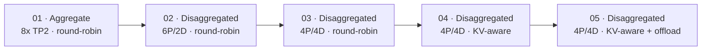

# 16x H100 LLM Inference Cluster

This repository tracks LLM deployment experiments, setup runbooks, and benchmark results on a 2-node cluster with **16x NVIDIA H100 GPUs** (8x H100 per node).

## Repository Structure

* **`models/`**: Deployment guides and setup documentation for individual models (e.g., [`models/llama-8B/setup.md`](models/llama-8B/setup.md)).
* **`progress.md`**: daily progress update on deployments.
* **`benchmarks/`**: Benchmark runs, input datasets, export metrics, and performance plots.
* **`setup.md`**: Master NVIDIA Dynamo v1.3.0 cluster setup guide.

## Qwen3-32B Experiments

Five vLLM experiments compare worker layout, routing, and CPU KV-cache offloading on 16x H100 GPUs.

See the [experiment matrix, configs, and runbook](models/qwen3-32B/experiments/README.md) and [benchmark artifacts](models/qwen3-32B/artifacts/README.md).
