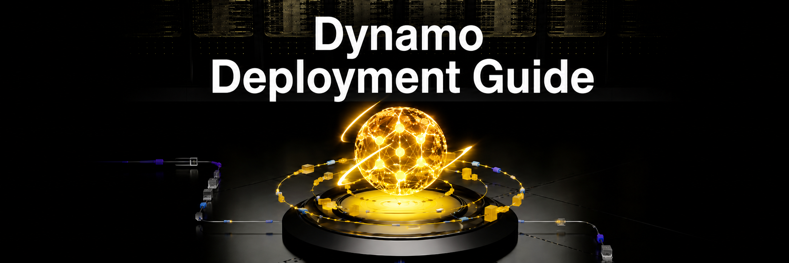
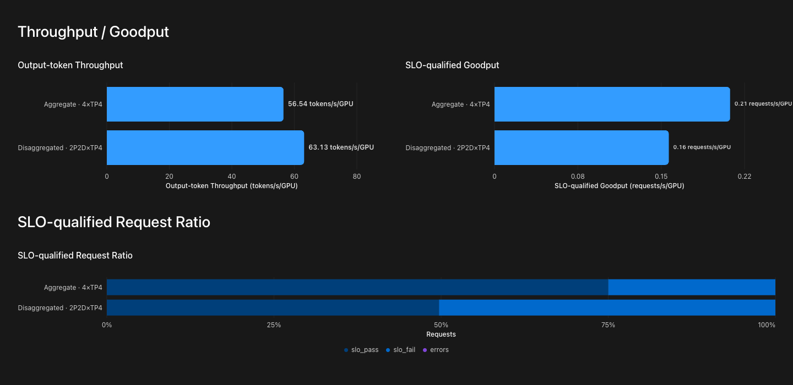
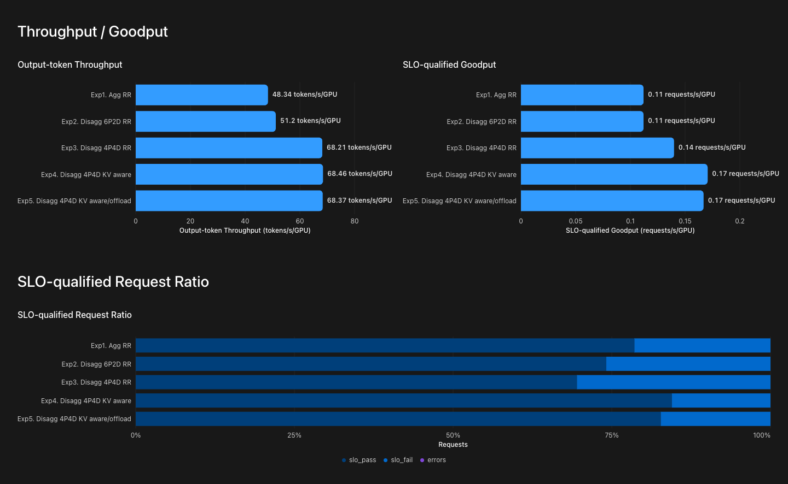
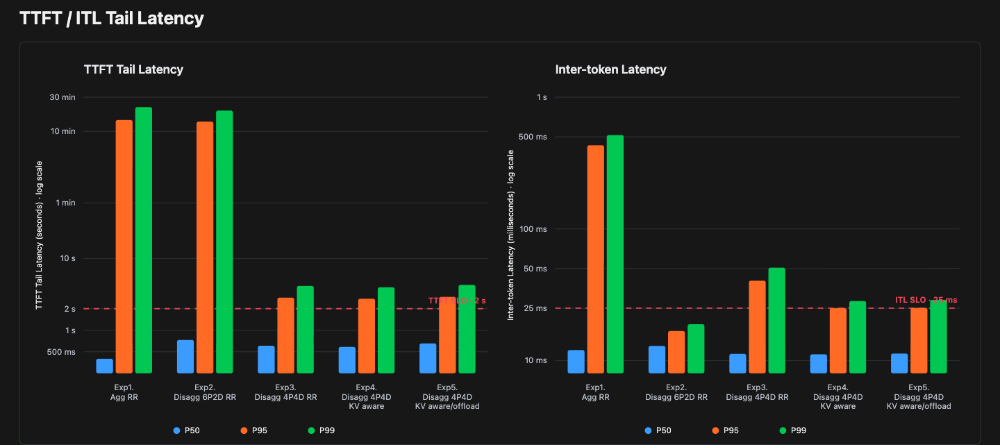
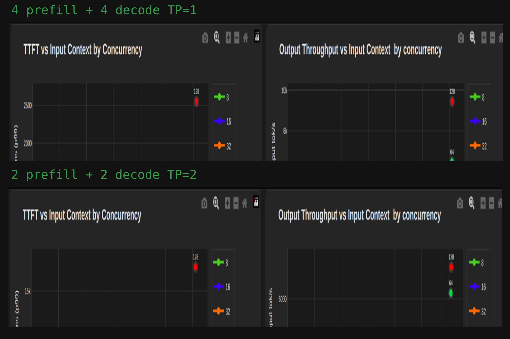
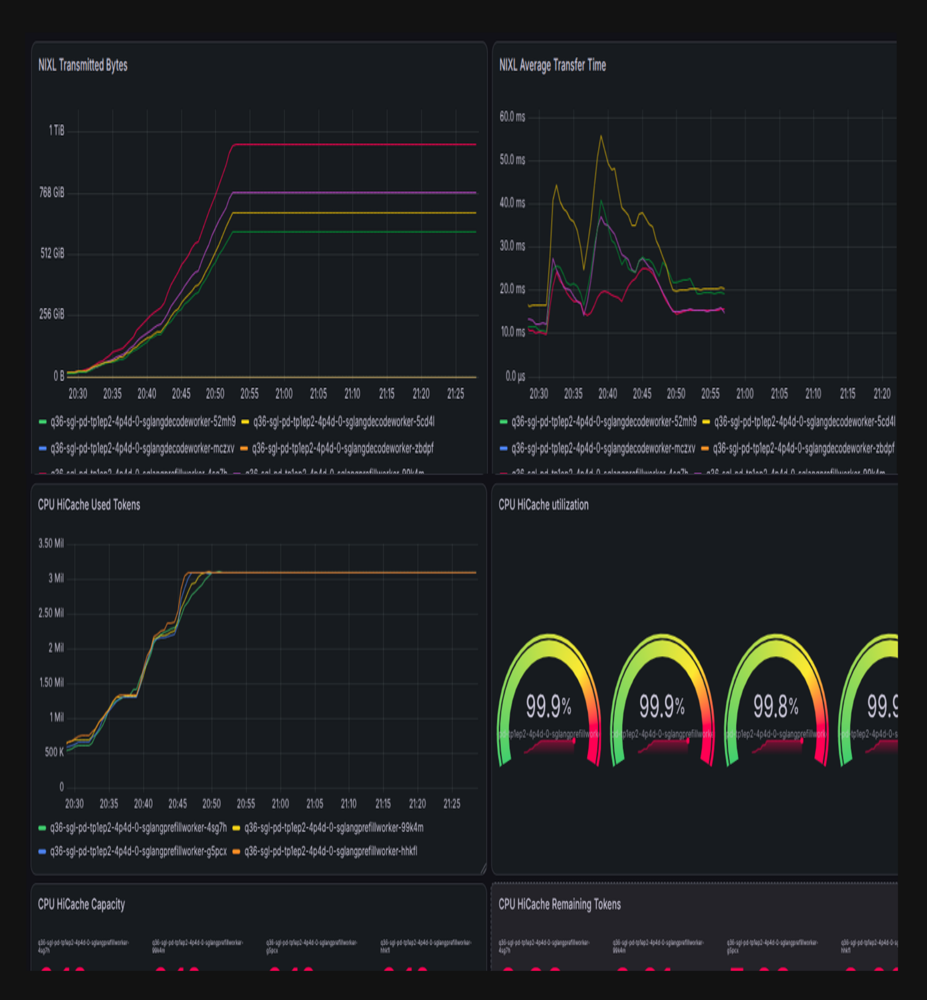
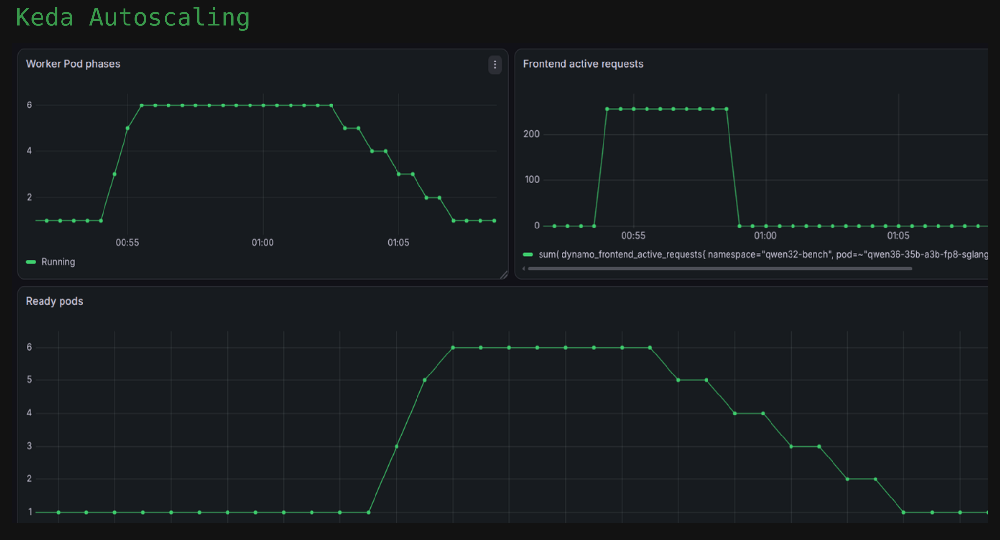

# Dynamo Deployment Guide

<p align="center">
  
</p>

<p align="center">
  
  
  
  
  
  
  
</p>

This repository tracks LLM deployment experiments, setup runbooks, and benchmark results on a 2-node cluster with **16x NVIDIA H100 GPUs** (8x H100 per node).

> **PS**: I was running an LLM inference series on X that ended up gaining a lot of traction. After posting to ask if anyone could volunteer cluster access, the team at Lambda reached out and gave us access to a 16x H100 cluster for a week which was crazy! We did a ton of speedrunning here. starting with a plain Ubuntu server, we set up all the K8s adapters and environment prerequisites from scratch for our experimentation

## Cluster Overview & Environment Specifications

| Component | Specification | Details |
| :--- | :--- | :--- |
| **Compute Nodes** | `gpu05`, `gpu06` | 2 × 8-way H100 80GB SXM5 Nodes (16 GPUs total) |
| **Orchestration** | Kubernetes & Dynamo 1.3.0 | `DynamoGraphDeployment` CRD, PodCliqueSets |
| **Serving Engines** | vLLM `0.23.0` & SGLang `0.5.14` | Docker image: `nvcr.io/nvidia/ai-dynamo/vllm-runtime:1.3.0` / `sglang-runtime:1.3.0` |
| **Networking & RDMA** | RoCE v2 over Ethernet | Network Operator, RDMA Shared Device Plugin, Multus/MacVLAN, NV-IPAM pool `qwen-roce-pool`, `mlx5_8:1` HCA, UCX/NIXL inter-pod transfer |
| **Benchmarking** | NVIDIA AIPerf `0.10.0` | Kubernetes Job template (`perf.yaml`), `/perf-cache` PVC storage |

---

## What we deployed

| Name | Engine | Status | GPUs | Topology | Recipe Link |
| :--- | :--- | :---: | :---: | :--- | :--- |
| **Llama-3.1-8B-Instruct** | vLLM | Working | 16 | Cross-node TP=16 | [Recipe](models/llama-8B/setup.md) |
| **Qwen3-32B FP8 Aggregated** | vLLM | Working | 16 | 8 workers × TP=2 | [Recipe](models/qwen3-32B/vllm/01-agg-routing/) |
| **Qwen3-32B FP8 Disaggregated (6P2D)** | vLLM | Working | 16 | 6 prefill × TP=2 + 2 decode × TP=2 | [Recipe](models/qwen3-32B/vllm/02-disagg-routing/) |
| **Qwen3-32B FP8 Disaggregated (4P4D)** | vLLM | Working | 16 | 4 prefill × TP=2 + 4 decode × TP=2 | [Recipe](models/qwen3-32B/vllm/03-disagg-routing-4p4d/) |
| **Qwen3-32B FP8 KV-Aware Disaggregated** | vLLM | Working | 16 | 4 prefill × TP=2 + 4 decode × TP=2 | [Recipe](models/qwen3-32B/vllm/04-disagg-routing-kv-aware/) |
| **Qwen3-32B FP8 KV-Aware + CPU KV Offload** | vLLM | Working | 16 | 4 prefill × TP=2 + 4 decode × TP=2, 32 GiB/engine CPU KV tier | [Recipe](models/qwen3-32B/vllm/05-disagg-routing-kv-aware-offloading/) |
| **Qwen3-32B FP8 Aggregated** | SGLang | Working | 16 | 8 workers × TP=2 (4 per node) | [Recipe](models/qwen3-32B/sglang/agg-routing/README.md) |
| **Qwen3-32B FP8 Disaggregated** | SGLang | Working | 8 | 2 prefill × TP=2 + 1 decode × TP=4 | [Recipe](models/qwen3-32B/sglang/disagg-routing/README.md) |
| **Qwen3-32B FP8 KV-Aware Disaggregated** | SGLang | Working | 16 | 6 prefill × TP=2 + 2 decode × TP=2 | [Recipe](models/qwen3-32B/sglang/disagg-routing-kv-aware/README.md) |
| **Qwen3.6-35B-A3B FP8 Aggregated** | SGLang | Working | 2–16 | 1–8 aggregated workers × TP=2 (KEDA autoscaling) | [Recipe](models/qwen3.6-35B-A3B/sglang/agg-autoscaling/README.md) |
| **Qwen3.6-35B-A3B FP8 Disaggregated** | SGLang | Working | 16 | 4P+4D, TP=2, DP=2, EP=2 (CPU KV offload) | [Recipe](models/qwen3.6-35B-A3B/sglang/disagg/tp1-ep2-4p4d/README.md) |
| **Qwen3-235B-A22B FP8 Aggregated** | vLLM | Working | 16 | 4 workers × TP=4 | [Recipe](models/qwen3-235B-fp8/vllm/agg-round-robin/) |
| **Qwen3-235B-A22B FP8 Disaggregated** | vLLM | Working | 16 | 2 prefill × TP=4 + 2 decode × TP=4 | [Recipe](models/qwen3-235B-fp8/vllm/disagg/) |
| **Qwen3-235B-A22B FP8** | SGLang | Working | 16 | 4 aggregated workers × TP=4 | [Recipe](models/qwen3-235B-A22B/sglang/agg/README.md) |
| **GLM-5.2-FP8** | vLLM | Working | 16 | 1 two-node replica, TP=16 | [Recipe](models/glm-5.2-fp8/vllm/agg/README.md) |
| **DeepSeek-V4-Flash FP8** | SGLang | Experimental | 16 | 2 aggregated workers × TP=8 | [Recipe](models/deepseek-v4-flash-fp8/sglang/agg/README.md) |

---

## What broke & How we fixed it

When we first deployed disaggregation, two separate issues blocked the workers. The RDMA Shared Device Plugin initially could not advertise `rdma/ib` until the host RDMA subsystem used shared network-namespace mode. After that was fixed, ordinary Calico Pods could see the verbs devices but still lacked a usable RoCE interface and Pod-specific GID, so UCX failed and NIXL could not transfer KV cache across prefill and decode workers. We fixed the Pod data path with a dedicated NV-IPAM pool (`qwen-roce-pool`) and pod-native RoCE interfaces using Multus and MacVLAN while keeping `hostNetwork: false`.

This was one of the hardest problem & big efforts we pulled off during the entire benchmark series. Once we cracked this, everything went smooth you can check out the full step-by-step breakdown in [`pod-native-roce.md`](pod-native-roce.md) and [`progress.md`](progress.md).

We only had one week of access to this 16x H100 cluster, so I'm incredibly glad we got this connection set up by Day 2. Resolving this early gave us the full runway to experiment with disaggregated KV offloading, KEDA autoscaling, cross-node parallelism, and a ton more.

## What we benchmarked

> **Blog Series Incoming**: Detailed technical write-ups and benchmark deep-dives for these experiments are coming soon!

* **Aggregated vs. Disaggregated Scaling**: Decoupled Prefill & Decode (P/D) vs. aggregated serving across vLLM and SGLang.
* **KV-Aware Routing & CPU Offloading**: Evaluated prompt prefix caching vs. CPU KV offloading under high concurrency.
* **Parallelism Bottlenecks (TP / DP / EP)**: Analyzed cross-node network stalls (TP=16 across nodes) vs. EP/DP scalability.
* **Event-Driven Autoscaling (KEDA)**: Dynamic pod scaling (1–8 workers) based on queue depth and GPU load metrics.
* **NIXL RDMA Latency Profiling**: Measured KV transfer latency growth over RoCE v2 as context length scales. See the reusable [NIXL Prometheus and Grafana runbook](NIXL-grafana.md).

We are currently processing and extracting all raw AIPerf benchmark artifacts, DCGM GPU utilization metrics, and Grafana performance dashboards. We'll be updating this section with full visual plots and benchmark graphs shortly!

# The results

<!-- ### 1. Aggregated vs. Disaggregated Serving

We evaluated aggregate and PD Disaggregated serving for Qwen3-235B-A22B FP8 with vLLM on 16xH100 GPUs. The aggregate configuration used four TP=4 workers, while the disaggregated configuration used two TP=4 prefill workers and two TP=4 decode workers. Both were tested at concurrency 32 with synthetic 4,000-token inputs and 200-token outputs.

<p align="center">
  
</p>

While disaggregation delivered 11.6% higher raw output-token throughput and a lower ITL tail, but its SLO-qualified request ratio fell from 75.0% to 49.7%. This was contrary to our working hypothesis since we expected separating prefill and decode to reduce interference and improve, or at least preserve, SLO-qualified throughput. 

After analyzing the worker and GPU mertrics, we've identified one GPU rank with higher temperature and reduced performance. Since each worker used TP=4, the slow rank could stall the other ranks (3 GPUs) in its worker, harming the overall performance. It is also why exactly nearly half (49.7%) qualified SLO.

We therefore treat this measurements as functional validation. In order to measure the actual performance difference, we would need to re-run compare under consistent hardware condition. -->

### 1. Disaggregation vs. KV-Aware Routing vs. CPU KV Offloading

We evaluated five Qwen3-32B FP8 configurations with vLLM using the [Mooncake conversation trace](https://github.com/kvcache-ai/Mooncake/blob/main/FAST25-release/traces/conversation_trace.jsonl). Starting from eight aggregated TP=2 workers, we compared 6P2D and 4P4D disaggregation, KV-aware routing, and CPU KV cache offloading.

<p align="center">
  
</p>

As seen in the figure, Exp 4(4P4D KV-aware configuration) delivered the strongest observed goodput and SLO request pass rate.

We expected Exp 2 (6P2D) to perform better than Exp 3 (4P4D) because the workload was input-heavy (9.3K average ISL, 339 average OSL). However Exp 3 performed better. GPU utilization showed that despite the input-heavy workload, the system was still **decode-bound** - decode GPUs were saturated, while prefill GPUs were underutilized.

Exp 5(Exp4 with KV cache offloading) didn't demonstrate a measurable benefit from CPU KV-cache offloading. While there was substantial GPU-to-CPU offload traffic, no CPU-to-GPU reloads were observed, likely because KV-cache pressure of fixed trace remained low.

<p align="center">
  
</p>

The aggregated and 6P2D round-robin configurations developed very large TTFT tails compared to other experiments. Exp 2 has high TTFT because Dynamo measures TTFT until the first token is streamed from a **decode worker**.


### 2. Baseline KV-Aware vs. KV-Aware + Offloading

We found that offloading really helps with improving overall performance it also handles significantly higher prefill KV transfer throughput (GB/s) than the baseline.

For the setup below, we ran CPU offloading with a HiCache ratio of 1.2 and up to 3.10 million tokens across 4 replicas (with each replica holding up to 3.10 million tokens). We tried with the `write_back` policy, which is much more efficient at handling CPU offloading than naive `write_through`.

We benchmarked this on sequence distribution `1024,256:35;4096,512:30;8192,1024:20;16384,512:10;32768,256:5` with a concurrency sweep of `8 16 32 64 96 128` and offloading GPU pressure to the CPU allows the GPU to focus more on compute intensive work instead of worrying about memory pressure, so it's clear that offloading helps you improve your throughput & overall performance!

You can see the results below:


### 3. Non-Parallelism (TP=1, 4P+4D) vs. Parallelism (TP=2, 2P+2D) on 8 GPUs

We found a really interesting take on Tensor Parallelism (`TP=1` vs. `TP=2`) when analyzing the AIPerf benchmark exports across concurrencies 1 to 128:

* **Low Concurrency (`c1`–`c8`) TP=2 wins on ITL**: at low loads, TP=2 performs better because splitting matrix operations across 2 GPUs speeds up per-token decode generation. At `c1`, TP=2 hits an ITL of **3.52ms** and **247.8 tok/s** throughput compared to TP=1 at **4.11ms** and **214.6 tok/s**.
* **The Tipping Point (`c16`)**: right around concurrency 16, TP=1 starts winning on prefill latency (TTFT of **228.7ms** vs **317.1ms** for TP=2), even though TP=2 still holds a tiny edge in total output throughput (**2,709.5 tok/s** vs **2,573.5 tok/s**).
* **High Concurrency (`c32`–`c128`) — TP=1 completely dominates**: under heavy load, TP=1 (4P+4D) scales way better because having 4 independent prefill workers avoids queuing delays and gets rid of inter-GPU All-Reduce communication overhead. By concurrency 128, TP=1 delivers **5x faster TTFT** (**604.5ms** vs **3,024.6ms**) and **31% higher overall throughput** (**9,435.7 tok/s** vs **7,201.8 tok/s**)!

So the trade-off is clear: `TP=2` gives lower streaming latency for individual requests under light load, but `TP=1 (4P+4D)` is far superior for high-concurrency throughput & prefill responsiveness! If your model fits on a single GPU and has enough room for KV cache, consider deploying it with `TP=1` to unlock significantly higher overall throughput!

You can see the benchmark comparison below:



### 4. NIXL KV Transfer Profiling & HiCache Offloading

We ran a 1,500-second prefill-heavy experiment sweep across concurrencies 1–32 (300s per point, 16 warmup requests per point) on **Qwen3.6-35B-A3B FP8** deployed across 16 H100 GPUs (4P+4D disaggregated, `DP=2`, `EP=2`). Each request used a 32K context window with OSL 256 and **75% prefix reuse** (64 prefix groups) to stress KV locality and host-cache offloading.

* **KV Locality Routing**: Dynamo dynamically routed full requests to prefill workers based on prompt prefix affinity, running `DP=2` & `EP=2` across 2 GPU ranks per worker.
* **NIXL RDMA Transfer Latency & Throughput**: Each prefill worker transferred **~1 TB cumulative KV & recurrent state** to decoders at **~1.5 GB/s** upload bandwidth, keeping cross-node P-to-D transfer latencies **under 60 ms** with zero RDMA errors across 16 GPUs.
* **CPU HiCache Sizing (`--hicache-ratio 1.2`)**: SGLang provisioned CPU host KV capacity per rank at `1.2 × GPU capacity` (~120K CPU tokens per rank for a 100K GPU pool).
* **Cache Saturation & CPU Load**: CPU usage peaked at **99%** as the `write_through` policy continuously streamed GPU KV pages into host RAM, pushing host cache utilization to **95%** (`hicache_host_used_tokens` / `total_tokens`).

> **HiCache Policy Takeaway**: Be cautious when using `--hicache-write-policy write_through`. Unless you explicitly need to stream every generated KV page into host memory, it causes heavy CPU churn and unnecessary host-page evictions. For most production workloads, safer and far more performant choices are `write_back` (delays host writes until GPU cache eviction) or `write_selective`.



### 5. Event-Driven Autoscaling using KEDA

We tried baseline event-driven autoscaling with KEDA on the **Qwen3.6-35B-A3B FP8** model (aggregated SGLang workers, TP=2), triggering scale-out based on the `dynamo_frontend_active_requests` metric (target threshold of 16 active requests per worker).

In our Grafana dashboard below, you can clearly see the classic startup gap during scale-out `HPA Desired` spikes first as load rises, `HPA Current` follows as KEDA requests new pods, and `Ready Pods` catches up once the engine finishes initializing even with a shared model-cache across nodes to avoid downloading weights from scratch, the SGLang engine still took its own time to load and warm up.

While we ran out of time to test separate autoscaling for disaggregated Prefill/Decode workers during our 1-week cluster window, the aggregated setup showed great event-driven scaling behavior!



## Repository Structure

```text
├── README.md             # Master repository overview (this file)
├── cluster.md            # Base environment & K8s deployment runbook
├── pod-native-roce.md     # Multus/MacVLAN & NV-IPAM RoCE networking guide
├── NIXL-grafana.md       # NIXL Prometheus telemetry & Grafana dashboard guide
├── benchmark.md          # Kubernetes-native AIPerf benchmark runbook
├── progress.md           # Experiment tracking logs & active status
├── setup.md              # Master environment & operations guide
├── assets/               # Performance plots, diagrams, and Grafana exports
└── models/               # Individual model recipes, manifests, and runbooks
    ├── deepseek-v4-flash-fp8/
    ├── glm-5.2-fp8/
    ├── llama-8B/
    ├── qwen3-32B/
    ├── qwen3-235B-A22B/
    ├── qwen3.6-35B-A3B/
    └── qwen3.8-27B/
```
