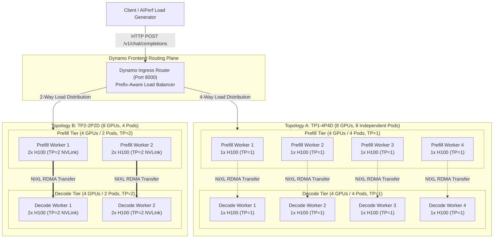
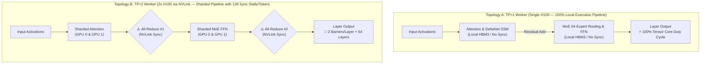
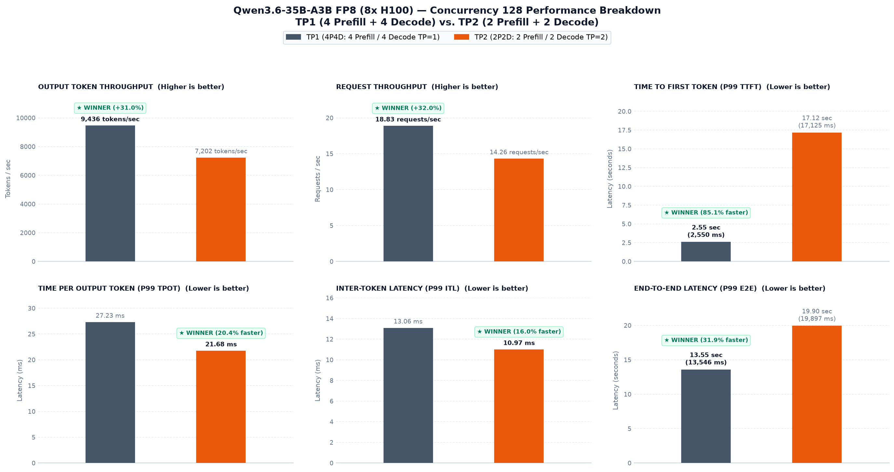
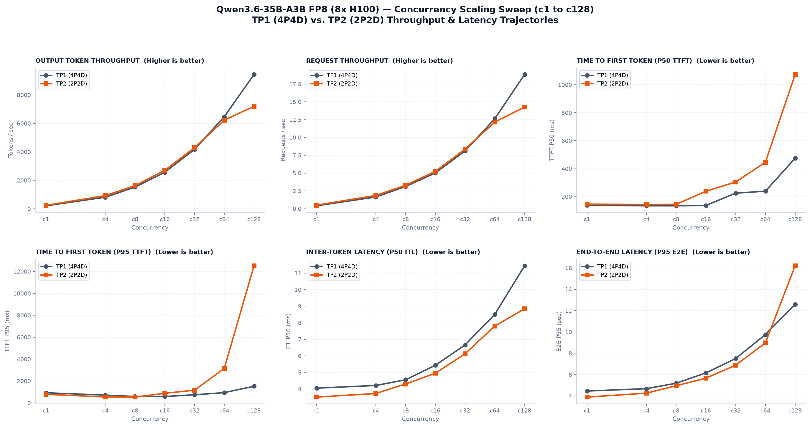
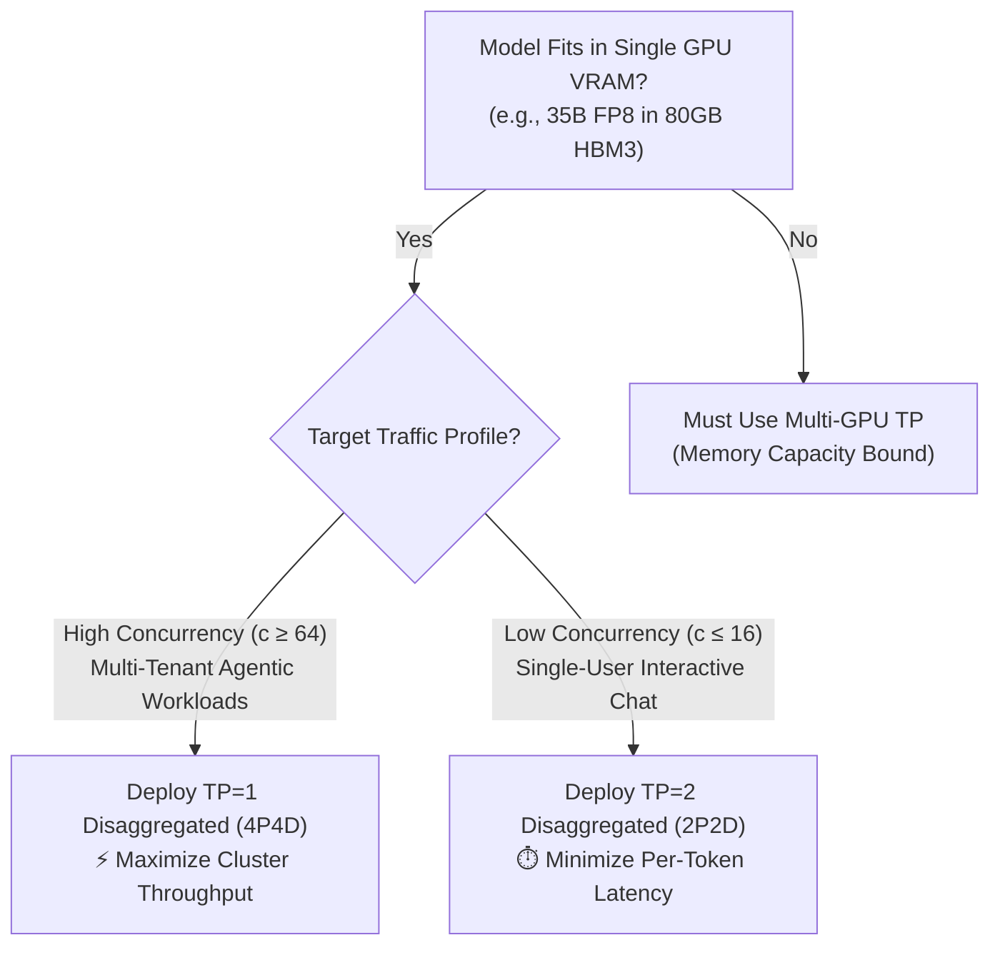

# Why Tensor Parallelism Can Kill LLM Serving Throughput at Scale: SGLang Disaggregated TP1 (4P4D) vs. TP2 (2P2D) on 8x NVIDIA H100

Tensor Parallelism (TP) is often treated as the default scaling strategy in distributed Large Language Model (LLM) inference—engineers instinctively scale up TP degrees whenever more GPUs become available. However, in high-concurrency production environments, increasing Tensor Parallelism without analyzing workload dynamics can severely penalize throughput, introduce costly communication synchronization, and trigger catastrophic prefill head-of-line blocking.

In this deep-dive engineering post, we compare **SGLang Disaggregated TP1 (4 Prefill + 4 Decode pods)** versus **SGLang Disaggregated TP2 (2 Prefill + 2 Decode pods)** on the exact same fixed hardware budget: an **8x NVIDIA H100 SXM5 GPU cluster**. Both topologies serve `Qwen/Qwen3.6-35B-A3B-FP8` with a full **131,072-token (~132K) context window**, `--page-size 64`, static VRAM allocation of `0.85`, and zero-copy NIXL UCX RoCE RDMA state transfer.

By tracing performance across a complete concurrency scaling sweep (c=1 to c=128) using AIPerf, we analyze the architectural trade-offs between intra-pod Tensor Parallelism and inter-pod replica parallelism, identifying the exact tipping point where TP=1 outperforms TP=2 by **+31.0% higher output throughput** and delivers an **8.2x faster Time-to-First-Token (P95 TTFT)**.

---

## The Goal

Evaluate the performance trade-offs between intra-pod Tensor Parallelism (TP2-2P2D) and inter-pod replica parallelism (TP1-4P4D) across an 8x NVIDIA H100 cluster when serving `Qwen3.6-35B-A3B-FP8` under scaling concurrency.

Specifically, this study answers four architectural questions:
- How does increasing independent prefill workers impact queueing delays and Time-to-First-Token (TTFT) under heavy load?
- At what concurrency threshold do intra-pod TP latency gains get overtaken by prefill head-of-line blocking?
- How does single-stream generation latency trade off against aggregate cluster throughput under peak saturation?
- When should teams choose Tensor Parallelism over replica scaling for dense and MoE models that fit within single-GPU VRAM?

---

## 1. Hardware, Model & Runtime Specifications

Before diving into the system architecture and benchmark results, the table below details the exact bare-metal cluster hardware, model architecture, interconnect configuration, and runtime parameters used across both topologies:

| Parameter | TP1-4P4D Topology | TP2-2P2D Topology | Architectural Details |
| :--- | :--- | :--- | :--- |
| **Model** | `Qwen/Qwen3.6-35B-A3B-FP8` | `Qwen/Qwen3.6-35B-A3B-FP8` | Hybrid Gated DeltaNet / MoE in native FP8 (35B total, ~3B active/token) |
| **Supported Context Window** | **131,072 tokens (~132K context)** | **131,072 tokens (~132K context)** | Full enterprise context length configured via `--context-length 131072` |
| **Page Size & KV Staging** | **64 tokens per page** | **64 tokens per page** | Unified attention & recurrent linear state paging (`--page-size 64`) |
| **Static VRAM Allocation** | **85% GPU Memory Fraction** | **85% GPU Memory Fraction** | `--mem-fraction-static 0.85` (~68 GB of 80 GB VRAM per GPU dedicated to KV) |
| **Total Accelerators** | **8 × NVIDIA H100 SXM5 GPUs** | **8 × NVIDIA H100 SXM5 GPUs** | 80 GB HBM3 VRAM per GPU (640 GB cluster aggregate) |
| **Cluster Nodes** | 1 × Bare-Metal Node (8x H100) | 1 × Bare-Metal Node (8x H100) | 8 × H100 SXM5 connected via 900 GB/s NVLink Switch |
| **Prefill Workers** | **4 Pods (1 GPU each, TP=1)** | **2 Pods (2 GPUs each, TP=2)** | Dedicated to prompt ingestion and attention prefill compute |
| **Decode Workers** | **4 Pods (1 GPU each, TP=1)** | **2 Pods (2 GPUs each, TP=2)** | Dedicated to autoregressive token generation |
| **Tensor Parallelism (TP)** | **TP = 1 (Zero NVLink All-Reduce)** | **TP = 2 (Intra-pod NVLink Sharding)** | TP degree applied across attention and MoE dense projections |
| **Inter-Worker State Transfer** | High-Speed RoCE RDMA Network | High-Speed RoCE RDMA Network | NVIDIA NIXL / UCX zero-copy transfer (`--disaggregation-transfer-backend nixl`) |
| **Reasoning & Tool Parsing** | Native Qwen3 Reasoning + Coder | Native Qwen3 Reasoning + Coder | `--reasoning-parser qwen3` and `--dyn-tool-call-parser qwen3_coder` |
| **Routing & Control Plane** | **NVIDIA Dynamo v1.3.0** | **NVIDIA Dynamo v1.3.0** | Prefix-aware KV router with Prometheus telemetry |
| **LLM Engine & Version** | **SGLang v0.5.14** | **SGLang v0.5.14** | High-throughput disaggregated Prefill/Decode runtime |

### Model Architecture & Memory Sizing Considerations

Serving `Qwen/Qwen3.6-35B-A3B-FP8` efficiently requires tailoring the inference engine to its hybrid architecture. Out of its 35 billion total parameters, only approximately 3 billion parameters are actively routed per token via its Sparse Mixture-of-Experts (MoE) layers, combined with Gated DeltaNet recurrent linear attention states (`HybridLinearKVPool`). In native FP8 precision, the model weights consume approximately 35 GB of VRAM.

Because each NVIDIA H100 GPU provides 80 GB of high-bandwidth memory (HBM3), a single GPU easily holds the entire 35 GB model weight footprint while still leaving over 40 GB of unallocated VRAM. By setting `--mem-fraction-static 0.85`, SGLang dedicates 85% of total VRAM (~68 GB per GPU) to the static KV cache and Mamba linear recurrent state pool. After subtracting model weights and CUDA execution buffers, each individual GPU maintains an in-VRAM capacity of approximately 380,000 to 450,000 active context tokens. Because the entire model and substantial KV cache fit comfortably on a single device, Tensor Parallelism is not required for memory capacity, allowing us to evaluate TP=1 against TP=2 purely as an architectural choice.

---

## 2. Architecture & Parallelism Design

To understand why the two configurations behave so differently under load, let us examine their topological layouts and execution mechanics across the 8-GPU cluster:



### Intra-Pod Tensor Parallelism vs. Inter-Pod Replica Parallelism

The fundamental distinction between these two architectures lies in how GPU compute resources are organized between intra-pod synchronization and inter-pod replication:

In **TP2-2P2D**, each worker pod binds two physical H100 GPUs joined by high-speed NVLink. Attention projection matrices, feed-forward layers, and MoE routing matrices are split across the two devices. During every single transformer layer, intermediate activation tensors must be synchronized across GPUs using `all-reduce` operations over NVLink. While this sharding reduces the arithmetic workload per GPU and accelerates the forward pass for an isolated single request, it imposes continuous synchronization barriers throughout the execution graph. More critically, clustering 8 GPUs into 2-GPU pods reduces the cluster's replica count to only **2 prefill workers** and **2 decode workers**.

In **TP1-4P4D**, each worker pod operates entirely on a single H100 GPU with zero intra-pod communication overhead. Attention computation, linear state updates, and MoE routing execute completely within local GPU registers and HBM3 memory. Because there are no `all-reduce` communication barriers, the GPU compute engines run at 100% duty cycle. Most importantly, running at TP=1 doubles the cluster's concurrency capacity, provisioning **4 independent prefill workers** and **4 independent decode workers**.



### Prefill Queueing Dynamics Under Concurrency

The Dynamo Frontend dynamically distributes incoming requests across healthy prefill endpoints. In the TP1 topology, the router dispatches across 4 distinct prefill endpoints, whereas in the TP2 topology, traffic must be concentrated onto only 2 prefill endpoints. 

When client concurrency reaches 128 simultaneous streams, each prefill worker in TP1 handles an average queue depth of **32 concurrent requests**, whereas each prefill worker in TP2 is forced to absorb a crushing queue depth of **64 concurrent requests**. Once prefill completes, the initialized KV cache and Mamba linear recurrent states are transferred directly to an assigned decode worker over high-speed RoCE RDMA via NVIDIA NIXL (`--disaggregation-transfer-backend nixl`) using one-sided zero-copy transfers (`UCX_RNDV_SCHEME=get_zcopy`) in under 5 milliseconds.
 
---

## 3. Production Manifests & Deployment

The complete deployment manifests are structured as runnable Kubernetes recipes:

- **TP1-4P4D Deployment Manifest:** [`deploy.yaml`](https://github.com/Prasannajaga/deployment-guide/blob/main/models/qwen3.6-35B-A3B/sglang/disagg/tp1-4p4d/deploy.yaml) — 4 Prefill + 4 Decode pods with TP=1.
- **TP2-2P2D Deployment Manifest:** [`deploy.yaml`](https://github.com/Prasannajaga/deployment-guide/blob/main/models/qwen3.6-35B-A3B/sglang/disagg/tp2-2p2d/deploy.yaml) — 2 Prefill + 2 Decode pods with TP=2.
- **AIPerf Benchmark Suite:** [`perf.yaml`](https://github.com/Prasannajaga/deployment-guide/blob/main/models/qwen3.6-35B-A3B/sglang/disagg/tp1-4p4d/perf.yaml).

### Cluster Deployment Workflow

```bash
# 1. Configure deployment environment variables
export NAMESPACE=qwen32-bench
export EXP_DIR=/ephemeral/shared/qwen3.6-35b-a3b/sglang/disagg/tp1-4p4d
export DEPLOYMENT=q36-sgl-pd-tp1-4p4d
export GRAPH_LABEL="nvidia.com/dynamo-graph-deployment-name=${DEPLOYMENT}"

# 2. Deploy TP1-4P4D serving graph (4 Prefill + 4 Decode across 8 GPUs)
kubectl apply -n "$NAMESPACE" -f "$EXP_DIR/deploy.yaml"

# 3. Monitor rollout & readiness across all 8 worker pods
kubectl get pods -n "$NAMESPACE" -l "$GRAPH_LABEL" -o wide -w

# 4. Teardown & release cluster resources when switching topologies
kubectl delete dynamographdeployment.nvidia.com "$DEPLOYMENT" \
  -n "$NAMESPACE" --wait=true --ignore-not-found
```

---

## 4. Benchmarking & Empirical Performance Analysis

To evaluate how both topologies scale from single-user execution up to extreme cluster saturation, we execute benchmarks using AIPerf (`aiperf==0.10.0`) configured with a production-grade mixed sequence distribution:

- **Model & Tokenizer:** `Qwen/Qwen3.6-35B-A3B-FP8` using official tokenizer weights
- **Workload Ladder:** 5-tier mixed sequence distribution (1K to 32K context lengths) modeling realistic agentic traffic
- **Prefix Reuse & Partitioning:** 8 prefix groups with **75% target prefix token reuse** (`target_prefix_token_percent: 75`)
- **Concurrency Ladder:** $c \in \{1, 4, 8, 16, 32, 64, 128\}$ concurrent client streams
- **Execution Controls:** Deterministic random seed (`random_seed: 42`), 16 warmup requests, and a 3,600-second timeout ceiling

### Workload & Sequence Distribution Breakdown

The mixed sequence distribution is specifically designed to stress both compute intensity and memory footprint across the cluster:

| Traffic Weight | Input Sequence (ISL) | Output Sequence (OSL) | Total Sequence | Target Workload Profile |
| :---: | :---: | :---: | :---: | :--- |
| **35%** | **1,024 tokens** | **256 tokens** | 1,280 tokens | Standard interactive chat, lightweight tool-calling, and single-turn agentic queries. |
| **30%** | **4,096 tokens** | **512 tokens** | 4,608 tokens | Multi-turn customer support, document question-answering, and medium context summaries. |
| **20%** | **8,192 tokens** | **1,024 tokens** | 9,216 tokens | Complex software engineering tasks, multi-file code generation, and structured reasoning. |
| **10%** | **16,384 tokens** | **512 tokens** | 16,896 tokens | Full-module codebase ingestion, legal contract analysis, and deep analytical reasoning. |
| **5%** | **32,768 tokens** | **256 tokens** | 33,024 tokens | Massive multi-document synthesis, book-length document ingestion, and enterprise knowledge extraction. |

By blending shorter high-frequency requests (1K–4K) with heavy long-context payloads (8K–32K) and a 75% prefix reuse pattern across 8 prefix groups, the benchmark replicates production agentic traffic where prefix caching, prefill compute queuing, and autoregressive generation happen concurrently.

---

### Peak Saturation Scorecard (Concurrency 128)

Under peak multi-user saturation ($c=128$), the performance divergence between TP1-4P4D and TP2-2P2D becomes stark. The performance dashboard and empirical scorecard below summarize aggregate throughput, queueing latency, and per-token generation speeds:

<p align="center">
  
  <br />
  <sub><b>Figure 1:</b> Empirical performance scorecard at peak Concurrency 128 comparing SGLang Disaggregated TP1-4P4D (Slate Gray) versus TP2-2P2D (Vibrant Orange) across throughput, TTFT tail latency, decode speed, and end-to-end turnaround time.</sub>
</p>

| Performance Metric | TP1-4P4D (4P + 4D, TP=1) | TP2-2P2D (2P + 2D, TP=2) | Delta / Speedup | Winning Architecture |
| :--- | :--- | :--- | :--- | :--- |
| **Output Token Throughput** | **9,435.67 tok/s** | 7,201.80 tok/s | **+31.0% Higher** (+2,233.87 tok/s) | **TP1-4P4D** |
| **Request Throughput** | **18.83 req/s** | 14.26 req/s | **+32.0% Higher** (+4.57 req/s) | **TP1-4P4D** |
| **Completed Workflows (5 min)** | **5,649 requests** | 4,278 requests | **+1,371 More Workflows** | **TP1-4P4D** |
| **Median Time-to-First-Token (P50)** | **474.9 ms** (0.47 s) | 1,073.3 ms (1.07 s) | **55.8% Lower** (2.3x Faster) | **TP1-4P4D** |
| **Tail Time-to-First-Token (P95)** | **1,529.3 ms** (1.53 s) | 12,520.0 ms (12.52 s) | **87.8% Lower** (**8.2x Faster**) | **TP1-4P4D** |
| **Worst-Case TTFT (P99)** | **2,549.7 ms** (2.55 s) | 17,124.7 ms (17.12 s) | **85.1% Lower** (**6.7x Faster**) | **TP1-4P4D** |
| **Median Inter-Token Latency (P50 ITL / TPOT)** | 11.44 ms / token | **8.85 ms / token** | **22.6% Faster** (-2.59 ms/tok) | **TP2-2P2D** |
| **Tail Inter-Token Latency (P99 ITL / TPOT)** | 13.06 ms / token | **10.97 ms / token** | **16.0% Faster** (-2.09 ms/tok) | **TP2-2P2D** |
| **End-to-End Latency (P95)** | **12.60 s** | 16.20 s | **22.2% Lower** (3.60s Faster) | **TP1-4P4D** |

---

### Concurrency Scaling Sweep (c=1 to c=128)

To understand where the performance crossover occurs, we trace the full scaling trajectories across concurrency levels from $c=1$ up to $c=128$:

<p align="center">
  
  <br />
  <sub><b>Figure 2:</b> Concurrency scaling sweep from c1 to c128 tracing Output Token Throughput, Request Throughput, P50/P95 TTFT, P50 ITL, and P95 E2E Latency trajectories for TP1-4P4D vs. TP2-2P2D.</sub>
</p>

---

### Why This Happens: The Root Cause

To understand why TP1 outperforms TP2 at scale, look at how GPUs execute prefill versus decode.

#### 1. Prefill is Compute-Heavy, Decode is Memory-Bandwidth-Bound

Prefill ingests the entire prompt in parallel through large matrix multiplications, heavily utilizing the H100 Tensor Cores. While a prefill worker processes a prompt, its compute engine is fully occupied, forcing subsequent requests to wait in line. In contrast, autoregressive decode generates one token per step per stream. Because the arithmetic per token is small, decode execution is bounded by HBM3 memory bandwidth as the GPU reads the 35 GB model weights from memory on every step.

#### 2. Why TP2 Wins at Low Concurrency (c <= 32)

When traffic is light, GPU compute capacity sits largely idle. Sharding the model across two GPUs in TP2 cuts the weight data each GPU must read in half (~17.5 GB), dropping per-token generation latency from 11.44 ms down to 8.85 ms (a 22.6% speedup). With low arrival rates, TP2's two prefill pods are rarely occupied at the same time, keeping queue delays near zero (P95 TTFT is 16–21 ms). In this under-saturated regime, faster per-token decode directly translates into higher aggregate throughput and 1.3 seconds faster end-to-end turnaround.

#### 3. The Crossover and Collapse at High Concurrency (c >= 64)

As concurrency ramps up, prefill ingress capacity becomes the hard bottleneck. In TP2-2P2D, the entire incoming stream must funnel through only two prefill pods. Long prompts (up to 32K tokens) monopolize the Tensor Cores, causing severe head-of-line blocking where shorter requests queue behind them. At c=64, TP2's P95 TTFT surges 40x to 842 ms, and at c=128 it balloons to 12.52 seconds.

This prefill queueing triggers a decode starvation paradox: because prefill workers cannot process and hand off KV caches fast enough, decode workers finish active jobs and sit idle waiting for state transfers over RDMA, capping TP2 throughput at 7,202 tok/s. TP1-4P4D provisions four independent prefill pods, halving queue depths, keeping P95 TTFT at 1.53 seconds (8.2x faster), and keeping all four decode workers continuously fed at 9,436 tok/s (+31.0%). Furthermore, TP1 eliminates the 128 NVLink all-reduce synchronization barriers per token required by TP2, allowing each GPU to run at maximum local efficiency.


--- 

## 5. Architectural Takeaways & Decision Guide

The empirical data from this experiment demonstrates that **higher Tensor Parallelism is not inherently better for cluster throughput**. When architecting production LLM serving clusters, platform teams should apply the following decision framework:



### Key Engineering Takeaways

This memory footprint fundamentally decouples Tensor Parallelism from physical hardware necessity. In distributed LLM serving, engineers frequently default to Tensor Parallelism because massive model weights (such as 70B models in FP16) exceed single-GPU memory limits, making multi-GPU sharding an unavoidable capacity constraint. When weights fit comfortably within a single accelerator, however, Tensor Parallelism ceases to be a capacity requirement and transforms into an explicit architectural trade-off between per-token compute latency and cluster-wide replica throughput.

Choosing TP=2 shards linear projections across two GPUs joined by NVLink, halving the arithmetic workload per device and accelerating individual layer forward passes for isolated requests. Yet this compute speedup comes at a steep infrastructural cost: it introduces synchronous `all-reduce` communication barriers at every transformer layer, and on a fixed 8-GPU budget, it halves total cluster replicas from 4 Prefill and 4 Decode pods down to just 2 of each. Conversely, TP=1 completely eliminates inter-GPU communication overhead, runs compute engines at full local hardware efficiency, and doubles prefill dispatch capacity across the cluster. Consequently, when VRAM is non-constraining, Tensor Parallelism operates purely as a latency optimizer for under-subscribed environments, whereas Replica Parallelism (TP=1) maximizes concurrency resilience and aggregate cluster throughput under production load.

For ultra-large models that genuinely exceed single-GPU memory limits (such as 70B or 405B dense models), multi-GPU Tensor Parallelism remains mandatory to aggregate VRAM. However, platform teams must account for the replica penalty: every additional GPU bound to a TP group reduces the cluster's replica count, making prefill queue bottlenecks manifest much earlier under concurrent traffic.

---

## 6. Conclusion & Personal Reflections

This benchmark study proves that **Disaggregated TP1 (4P4D)** is the superior production serving architecture for `Qwen3.6-35B-A3B-FP8` on an 8x NVIDIA H100 GPU cluster when serving concurrent multi-user traffic.

By eliminating NVLink all-reduce synchronization barriers and provisioning 4 independent prefill and decode workers, TP1 delivers:
- **+31.0% Higher Output Token Throughput** (9,436 tok/s vs. 7,202 tok/s at c=128).
- **+32.0% Higher Request Throughput** (18.83 req/s vs. 14.26 req/s).
- **8.2x Faster Time-to-First-Token** (P95 TTFT of 1.53s vs. 12.52s).
- **22.2% Faster End-to-End Latency** (12.60s vs. 16.20s).

Say you have a model that only takes ~30–35 GB for weights on an 80 GB NVIDIA H100. You already have ~45–50 GB of free VRAM sitting on each GPU ready for KV cache! If you split that model across GPUs with TP=2 just because you have multiple GPUs, it's a bad trade-off—you cut your total replica pods in half and add hundreds of NVLink all-reduce sync stalls. Keeping each worker at TP=1 gives you double the worker pods, zero communication overhead, and the maximum throughput needed to serve high-concurrency production workloads.

This architectural efficiency compounds when integrated with hierarchical memory tiers. As demonstrated in our previous experiment on [Hierarchical CPU KV Offloading (HiCache)](https://x.com/jaga_prasanna/status/2093217133841064233?s=20), offloading evicted prefix states to host DDR5 RAM unlocks massive effective context capacity and drives higher sustained throughput without requiring additional accelerator hardware. Combining TP=1 replica parallelism with host RAM offloading maximizes overall **token-per-watt efficiency**: single-GPU workers eliminate inter-device synchronization stalls to keep Tensor Cores saturated at maximum duty cycle, while CPU offloading prevents redundant prefill recomputations, extracting peak serving throughput per watt across the cluster!

A huge thank you once again to **@TheZachMueller** and **@LambdaAPI** for providing the bare-metal GPU compute that makes this deep-dive research possible.

For our next writeup, we will dive deep into profiling NVIDIA NIXL for KV cache over RoCE v2 RDMA, showing how to instrument Prometheus telemetry on Dynamo workers and build a production Grafana dashboard to track real-time transfer latency, bandwidth, and CPU host memory caching at scale!

Thanks for reading until here 🙏

---

## 7. Sources & References

- **NIXL Telemetry & Grafana Guide:** [NIXL Grafana Runbook](https://github.com/Prasannajaga/deployment-guide/blob/main/NIXL-grafana.md)
- **SGLang Inference Engine:** [SGLang GitHub Repository & Documentation](https://github.com/sgl-project/sglang)
- **NVIDIA Dynamo Platform:** [Dynamo Graph Deployment Specifications](https://github.com/NVIDIA/ai-dynamo)
- **NVIDIA NIXL State Transfer:** [NIXL UCX Backend Documentation](https://github.com/NVIDIA/nixl)
- **Qwen 3.6 Model Family:** [Qwen/Qwen3.6-35B-A3B-FP8 HuggingFace Repository](https://huggingface.co/Qwen/Qwen3.6-35B-A3B-FP8)
- **TP1-4P4D Recipe & Manifests:** [`deploy.yaml`](https://github.com/Prasannajaga/deployment-guide/blob/main/models/qwen3.6-35B-A3B/sglang/disagg/tp1-4p4d/deploy.yaml)
- **TP2-2P2D Recipe & Manifests:** [`deploy.yaml`](https://github.com/Prasannajaga/deployment-guide/blob/main/models/qwen3.6-35B-A3B/sglang/disagg/tp2-2p2d/deploy.yaml)
- **Interactive Jupyter Notebook:** [`play.ipynb`](https://github.com/Prasannajaga/deployment-guide/blob/main/models/qwen3.6-35B-A3B/sglang/disagg/tp1-4p4d/play.ipynb)