# Comparing Round-Robin Routing vs KV-Aware Routing on Nemotron-3-Nano

When you serve an LLM across multiple workers, you need to decide which worker each request should go to. Almost any routing decision is fine when the load is light. However, as concurrent requests pile up or KV prefix sharing increases, inefficient routing can leave requests queued, resulting in suboptimal performance.

In this post, we walk through how Dynamo's Frontend routes, how its KV-aware cost function scores workers, and then compare the two routers head-to-head on an agentic workload.

## Frontend

**Frontend** is one of the first things worth understanding about Dynamo. According to the [Dynamo documentation](https://docs.nvidia.com/dynamo/dev/knowledge-base/modular-components/frontend/overview), Dynamo Frontend is the API gateway for serving LLM inference requests. It provides OpenAI-compatible HTTP endpoints that handle request preprocessing, routing, and response formatting. Among Frontend's many responsibilities, we will especially focus on _routing_ in this post.

A large, multi-tenant deployment rarely runs on a single worker. Instead, it usually runs several replicas, where a _replica_ matches one DP worker. This is because with multiple users, a single replica quickly saturates and may fail to meet SLOs, degrading the user experience. The Dynamo Frontend is responsible for taking in all requests and routing them to DP workers. When there are multiple workers, routing behavior can significantly influence overall performance (throughput, goodput, and latency).

So what makes routing help achieve better performance? Let's talk about two prerequisites here.

**Load balancing** is a classical term in multicore and distributed systems that refers to how evenly requests are spread across workers. For example, if one worker is saturated and requests are waiting while other workers sit idle (underutilized), that's poor load balancing. It becomes especially important as the concurrency of the workload increases, since any given worker has a higher chance of becoming saturated.

**KV awareness** refers to whether routing accounts for the KV cache a worker already holds, so a request that can reuse a cached prefix is sent to where that prefix lives instead of being recomputed elsewhere. [Prefix caching](https://docs.vllm.ai/en/latest/design/prefix_caching/) refers to a method of hashing prefixes of the prefill prompt at the granularity of a KV block. When a block's contents haven't changed or been evicted and a later prompt matches that hash, we can load the cached blocks instead of recomputing them, reducing prefill computation. For a detailed explanation, consider reading the [vLLM documentation](https://docs.vllm.ai/en/latest/design/prefix_caching/) or [this section](https://github.com/junuxyz/mlsys-notes/blob/main/notes/vllm/inside-nano-vllm.md#schedule) of [Inside nano-vllm](https://github.com/junuxyz/mlsys-notes/blob/main/notes/vllm/inside-nano-vllm.md).

## Routing

Now let's look at the two routing methods we'll compare: round-robin routing and KV-aware routing.

<table>
  <tr>
    <th width="50%" align="center">Round-robin routing</th>
    <th width="50%" align="center">KV-aware routing</th>
  </tr>
  <tr>
    <td width="50%" align="center">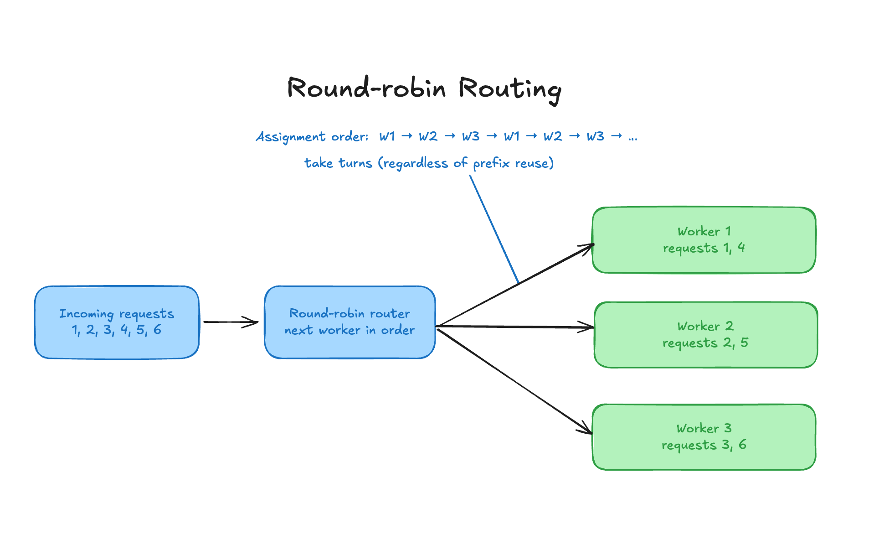</td>
    <td width="50%" align="center">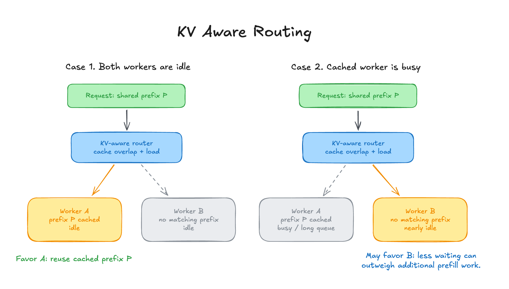</td>
  </tr>
</table>

**Round-robin (RR) routing** is a routing method which cycles through workers in order: with n workers, request 1 goes to worker 1, request 2 to worker 2, and request n+1 wraps back to worker 1. It is trivial to implement and never asks whether some worker already holds a usable prefix for the request. In this post, we will use the term RR routing interchangeably for convenience.

**KV-aware routing** weighs both things we've mentioned earlier at once, reusable KV state and current load.

For example, say there are two workers, A and B. Both are idle, and A already holds an overlapping prefix cache for the incoming request. Sending it to A sounds obvious since we can reduce prefill computation. However, consider another scenario where A still has the prefix but is slammed with work while B is nearly idle. In this case, sending to B may be more reasonable. The router has to weigh those two options against each other depending on each worker's state.

## How Dynamo's KV Caching Router Works

In practice, the Dynamo Frontend estimates how much of the incoming prompt still needs computing once cached prefixes are accounted for, folds in its model of each worker's active load, scores the candidates, and routes on that score.

<p align="center">
  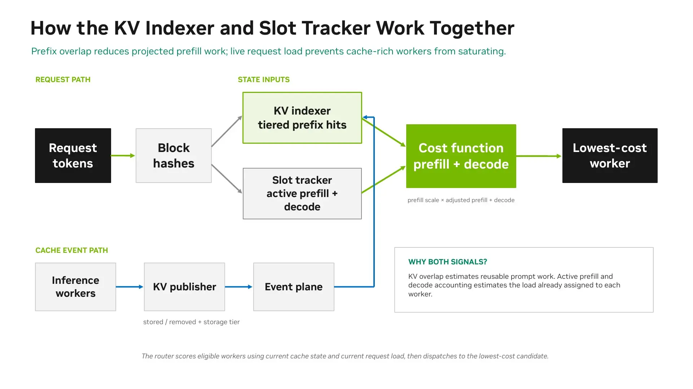
</p>

At a high level the cost function is:

$$C = \alpha P + D + \beta N$$

where
- $P$ is prefill cost, with the KV cache reuse effect already baked in.
- $D$ is the total KV block load of the worker's active requests, counting the incoming one.
- $N$ is the number of requests already active on that worker.
- $\alpha, \beta$ weight $P$ and $N$. $\beta$ defaults to 0, and the $N$ term is optional and stands in for batch size.

Each worker's (or engine's) [KV events](https://github.com/ai-dynamo/dynamo/blob/main/docs/fern/pages/developer-guide/advanced-customizations/writing-custom-backends/publish-kv-events.md) keep the router informed of the prefix-cache state, whether blocks are created or evicted. The router then deterministically picks the eligible worker with the lowest estimated cost based on the cost function. While prefix reuse pulls $P$ down significantly, there are other factors in the equation, and if a worker's other terms are large enough, a less-loaded worker can still win.

> [!NOTE]
> This may be obvious, but make sure to use enough distinct prefixes when testing with a synthetic workload.
> 
> In an earlier synthetic experiment comparing several kinds of routers (round-robin, KV-aware, power-of-two, least-loaded, etc., with the full list found [here](https://docs.nvidia.com/dynamo/v1.4.2/knowledge-base/modular-components/router/router-guide#deployment-modes)), we accidentally gave every request the same shared prefix.
>
> Once that prefix was cached on every worker, KV-aware routing had little opportunity to improve cache reuse over anything else, since sending it to any worker didn't matter.
> 
> To evaluate prefix-aware routing, use a diverse pool (e.g., 20) of prefixes with repeated requests for each, so cache placement can differ across workers. We didn't have to consider this in this experiment, since our workload uses real conversational traces rather than a single repeated prefix.

## Workload: AgentX MVP

When optimizing performance, it is essential to understand **what your workload is**. This is because the workload is what decides which inference optimizations are worth turning on. For example, the priorities and optimization techniques drastically differ between reducing ITL on a decode-heavy workload and reducing TTFT on a prefill-heavy workload with low KV overlap.

In this experiment, we used the [InferenceX AgentX MVP Benchmark](https://docs.nvidia.com/aiperf/dev/tutorials/datasets-inputs/inference-x-agent-x-mvp-benchmark), a multi-turn agentic-coding benchmark from [SemiAnalysis](https://semianalysis.com/). It replays real Claude Code sessions (traces from [Weka agentic-coding corpus](https://docs.nvidia.com/aiperf/dev/tutorials/datasets-inputs/replay-weka-agentic-coding-traces)) turn by turn and preserves the original wait time between turns.

<p align="center">
  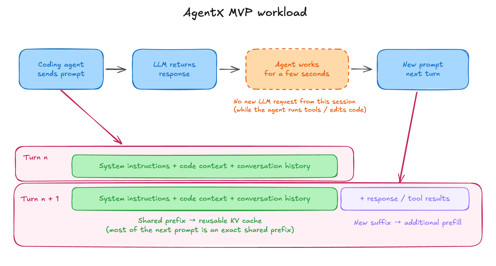
</p>

A coding agent receives a response, works for a few seconds, then comes back with a new prompt that shares most of its prefix with the previous one. This substantially increases the probability of prefix reuse compared to single-turn chat sessions, and thus routing that considers KV reuse will likely have a clear advantage.

It's also worth noting AgentX is more than just an agent trace. It uses the same agent trace (the Weka trace) but also decides _how_ to replay it. While the user can choose the server, model, and concurrency, some configurations are **hard-locked**. Just by adding one configuration (`--scenario inferencex-agentx-mvp`), AIPerf automatically sets these hard locks:

| Command | Description |
|---|---|
| `--extra-inputs ignore_eos:true` | Generate the full requested output length without stopping at EOS. |
| `--streaming` | Enable streaming for TTFT and ITL measurements. |
| `--cache-bust first_turn_prefix` | Prevent cache reuse across separate plays while preserving reuse within each play. |
| `--system-idle-gap-cap-seconds 10` | Limit system-wide idle gaps to 10 seconds. |
| `--benchmark-duration 900` | Profile for 15 minutes, the minimum allowed duration. |
| `--public-dataset semianalysis_cc_traces_weka_062126` | Select a date-pinned dataset for consistent comparisons. |

In our benchmark, we configured it as follows:

```yaml
              aiperf profile \
                --scenario inferencex-agentx-mvp \
                --url "http://${ENDPOINT}" \
                --model "${TARGET_MODEL}" \
                --tokenizer "${MODEL_PATH}" \
                --max-context-length 131072 \
                --endpoint-type chat \
                --public-dataset semianalysis_cc_traces_weka_062126 \
                --concurrency 32 \
                --use-server-token-count \
                --streaming \
                --extra-inputs ignore_eos:true \
                --cache-bust first_turn_prefix \
                --system-idle-gap-cap-seconds 10 \
                --benchmark-duration 900 \
                --random-seed 20260707 \
                --artifact-dir "${run_dir}"
```

### Concurrency and Effective Concurrency

It's important to understand what concurrency means in this specific benchmark, since our experiment compares the routing methods across different concurrency levels.

In AgentX MVP, concurrency is used differently than how we would normally use [it](https://en.wikipedia.org/wiki/Concurrency_(computer_science)). Concurrency here is measured in _trajectories_: exactly `--concurrency` (e.g. 32) session trees are live at any moment.

One session tree contains the root conversation plus every subagent worker stream it spawns. A new tree cannot start until a running one finishes, and a tree finishes only after its root conversation and all of its subagent streams complete. As a result, the number of in-flight requests may actually rise above the concurrency setting during subagent fan-out (branching) or fall below it between turns while the agent or user is thinking.

[AIPerf](https://github.com/ai-dynamo/aiperf)’s [Effective Concurrency](https://docs.nvidia.com/aiperf/reference/effective-vs-active-metrics), reported as `effective_concurrency.avg` in the exports, is the time-weighted average number of [in-flight requests](https://llm-d.ai/docs/operations/async-processor#1-throughput-model) over the full run window. It captures both the additional requests from subagent fan-out and the reduced activity between turns, showing how much request concurrency the configured session trees actually produce.

## Model

[NVIDIA Nemotron 3 Nano 30B-A3B](https://huggingface.co/nvidia/NVIDIA-Nemotron-3-Nano-30B-A3B-FP8) is a model designed for efficient agentic workloads, including reasoning, coding, and tool use.

Its hybrid architecture combines Mamba-2, attention, and Mixture-of-Experts layers, with approximately 30 billion total parameters and 3.5 billion active per token. We used NVIDIA’s FP8 checkpoint for our experiments.

## Configuration

| Setting | Value established by the retained artifacts |
|---|---|
| Hardware | 8 x H100 SXM5, single node |
| Model | [`nvidia/NVIDIA-Nemotron-3-Nano-30B-A3B-FP8`](https://huggingface.co/nvidia/NVIDIA-Nemotron-3-Nano-30B-A3B-FP8) |
| Serving framework | Dynamo 1.4.0 |
| Backend framework | vLLM 0.26.0 |
| Benchmark framework | AIPerf 0.13.0 |
| Worker layout | TP1DP8, eight TP1 worker Pods |
| Serving topology | Aggregated |
| Routing policies | Round-robin vs KV-aware |

## Experiments

We conducted six experiments, comparing round-robin (RR) and KV-aware routing at concurrency levels of 32, 64, and 128. Within each pair, we kept other configurations (model, hardware, worker config, etc.), changing only the routing policy.

| Concurrency | RR | KV-aware |
| ----------- | -- | -------- |
| 32          | ✓  | ✓        |
| 64          | ✓  | ✓        |
| 128         | ✓  | ✓        |

As explained above, concurrency here refers to **active session trees**, including their subagents.

As AgentX MVP benchmark [suggests](https://github.com/ai-dynamo/aiperf/blob/e10d53b1d30b5845f56cbea63d0560f10ff5aa4e/docs/tutorials/agentx-mvp.md#profiling-phase-faithful-replay-recycle-global-idle-guard), we used a fixed-time benchmark instead of fixed requests. Each run used a 900-second profiling window, following the [AgentX trajectory warmup](https://docs.nvidia.com/aiperf/dev/tutorials/datasets-inputs/inference-x-agent-x-mvp-benchmark#warmup-phase-trajectories-and-k_i).

We ran all three RR conditions first, followed by all three KV-aware conditions, with one measurement per condition. To prevent earlier runs from warming the same replayed prefixes and contaminating the results, all six runs used `--cache-bust first_turn_prefix` to isolate the prefix cache for each replay. This config inserts a marker keyed by a distinct benchmark ID into the first user turn. The marker stays consistent within a session tree, preserving the prefix reuse we want to measure, while changing across runs and recycled plays.

### Prediction

Before seeing the results, we expected more prompt-cache reads along with lower TTFT and E2E latency. Since KV-aware routing also factors in load balancing, we expected higher (or at least the same) throughput within the same fixed duration.

## Results

<p align="center">
  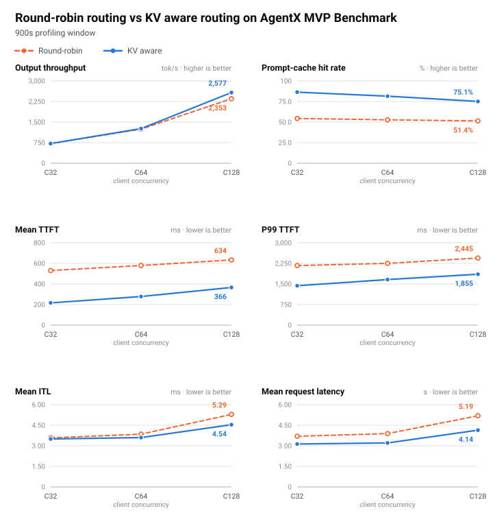
</p>

Exact metrics in numbers can be found in [the Appendix](#appendix-results) or the [raw performance logs](../benchmarks/nemotron-3-nano-30b-a3b-fp8/).

Across all three concurrency levels, KV-aware routing achieved higher prompt-cache reuse and lower mean TTFT, mean ITL, and mean request latency. Throughput gains were comparatively modest: request throughput was unchanged at C32 and increased by 1.3% at C64 and 2.5% at C128.

The results for each concurrency level are detailed below.

<p align="center">
  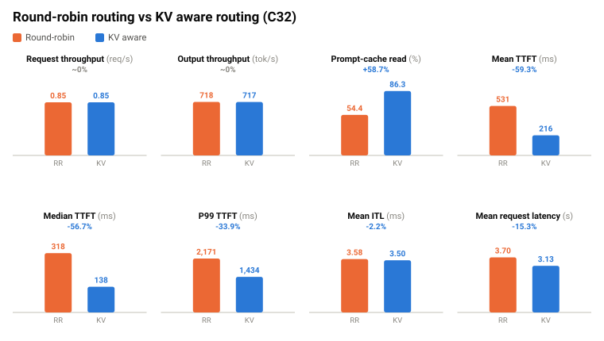
</p>

At C32, both policies completed 795 requests at 0.855 req/s, with nearly identical output lengths and output throughput.

Prompt-cache reads rose from 54.39% to 86.33%, while mean TTFT fell from 530.87 to 216.02 ms (≈ 59.3% reduction). Median and P95 TTFT also decreased by more than half. Mean ITL changed only slightly, from 3.58 to 3.50 ms.

<p align="center">
  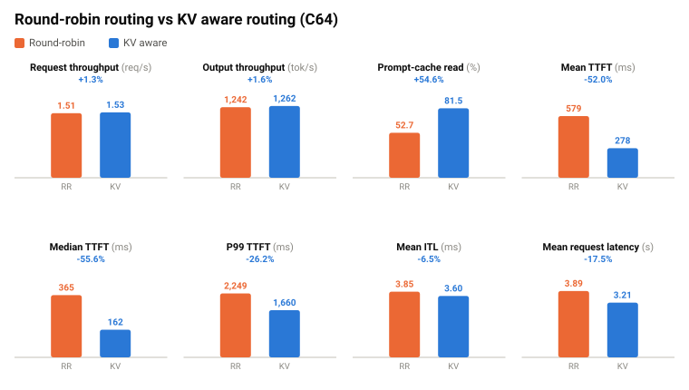
</p>

C64 showed a 1.3% increase in request throughput, while prompt-cache reads rose from 52.73% to 81.51%.

Mean TTFT was more than halved, falling from 579.06 to 277.67 ms (≈ 52.1% reduction), and P95 TTFT improved by ≈ 46.7%. These improvements also translated into lower end-to-end latency, with mean request latency dropping from 3.890 to 3.208 seconds (≈ 17.5% reduction).

<p align="center">
  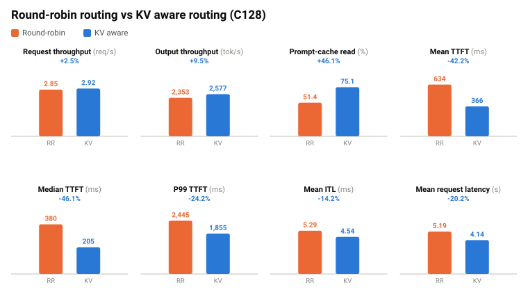
</p>

At C128, mean TTFT decreased by ≈ 42.2%, while mean ITL improved by ≈ 14.2%. Mean end-to-end request latency fell from 5.188 to 4.142 seconds (≈ 20.2% reduction).

The gains also reached the slowest requests. P95 and P99 TTFT decreased by ≈ 37.4% and ≈ 24.1%, respectively, while P99 ITL improved by ≈ 29.9%.

Request throughput increased by ≈ 2.5%, while output throughput rose by ≈ 9.5%.

## Understanding the Result

Now let's take a closer look at the results and revisit our earlier [predictions](#prediction). Where did the results match what we expected, and what surprised us?

The comparison below shows how the gains from KV-aware routing changed as concurrency increased.

<p align="center">
  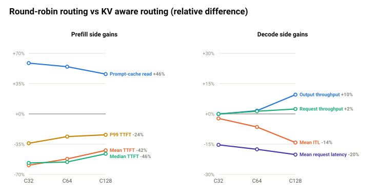
</p>

Three things stood out: throughput improved much less than latency, ITL benefited more at higher concurrency, and cache reuse declined even with KV-aware routing. Let's go through each.

### 1. Why Didn't Throughput Improve that much?

#### Yes, KV-aware routing can affect throughput

KV-aware routing primarily reduces prefill work through prefix-cache reuse, which is consistent with the large TTFT reductions and the much smaller ITL change observed at C32.

However, its effect isn't limited to latency: skipping redundant prompt computation frees up resources, while better load distribution reduces the time requests spend queued behind a busy worker.

<p align="center">
  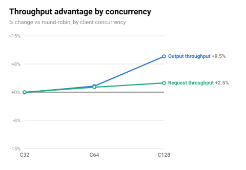
</p>

As a result, we do see throughput grow as concurrency doubles. Since the gap kept widening across all three concurrency points, this suggests we haven't hit the concurrency ceiling **yet**. More sessions would be needed to saturate all the workers.

#### Configured concurrency was much higher than effective concurrency

As discussed above, **concurrency** in AgentX MVP refers to the number of live session trees, including those waiting between turns. **Effective concurrency** is the time-weighted average number of in-flight requests over the benchmark window.

We had expected the configured concurrency, especially at C128, to saturate the GPUs. However, effective concurrency turned out to be much lower than what we configured. If we look at the measured effective concurrency:

<p align="center">
  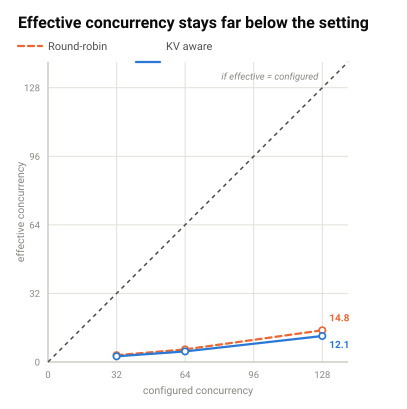
</p>


At C128, dividing the mean effective concurrency by eight workers (DP=8) gives average 1.85 in-flight requests per worker for RR and average 1.52 for KV-aware.

Throughput continued to increase across the tested concurrency levels. Thus, we would likely see higher concurrency (e.g., 256 or 1024) helping widen the throughput gap between the routers.

#### Agent time outside inference can dilute the effect of faster inference

Now we understand why effective concurrency was much lower than the concurrency we configured, and why throughput gains became more visible as concurrency increased.

But why was the throughput improvement **relatively much smaller** than the latency improvement?

This was not obvious at first, but it became clearer once we went back and looked at what AIPerf actually measures. As mentioned above, the AgentX workload consists of two parts:

1. time spent processing a request in the model, and
2. time spent calling tools or thinking before sending the next request.

It turns out [AIPerf's request latency](https://docs.nvidia.com/aiperf/reference/ai-perf-metrics-reference#request-latency) measures only the time from sending an inference request until receiving its complete response ($T_{\mathrm{model}}$). It excludes the agent, tool, and think time between consecutive requests ($T_{\mathrm{outside}}$). So the reported latency gain looks larger than the true end-to-end improvement, since it only captures the model side of the turn.

Throughput, on the other hand, is measured over the full profiling window. Although agent time is not counted as request processing time, it still delays subsequent requests and consumes wall-clock time. An illustrative model is:

$$\text{request throughput} \approx \frac{\text{active agents}}{T_{\mathrm{model}} + T_{\mathrm{outside}}}$$

This follows the same principle as [Amdahl’s Law](https://en.wikipedia.org/wiki/Amdahl%27s_law): faster inference accelerates only one part of each agent’s turn. When $T_{\mathrm{outside}}$ accounts for a large share of the turn, even a substantial reduction in $T_{\mathrm{model}}$ produces only a modest increase in throughput.

<p align="center">
  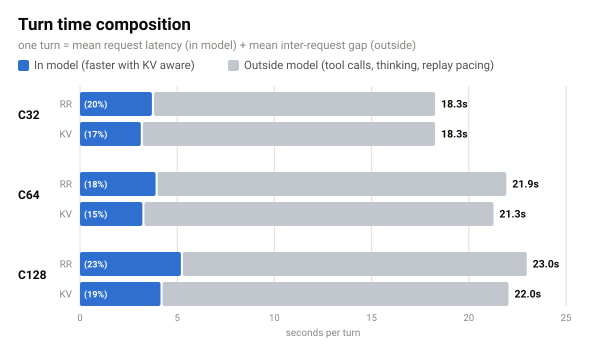
</p>

If we look at the request-level records, at C128 the long pauses raised the mean to approximately 18 seconds (77% in RR, 81% in KV-aware). These gaps were excluded from request latency, but still consumed the profiling window used to calculate throughput.

While KV-aware routing shortened model processing, it couldn't reduce the waiting time, which diluted the throughput gain.

### 2. ITL Also Benefits

KV-aware routing primarily improves TTFT, but in an aggregated deployment it also changes the environment in which decode runs.

In an [aggregated setup](https://www.nvidia.com/en-us/glossary/disaggregated-serving/), prefill and decode share the same workers and GPU execution steps. This means a long prefill isn't only responsible for one request's TTFT. It also creates interference for every request already generating tokens on that worker, so decode requests must make progress while compute-heavy prompt tokens are being processed around them.

This is the problem that [Sarathi-Serve](https://github.com/junuxyz/mlsys-notes/blob/main/notes/sarathi-serve.md#tldr) addresses with [chunked prefill](https://github.com/junuxyz/mlsys-notes/blob/main/notes/sarathi-serve.md#chunked-prefill). Chunking limits how much prefill work can enter a scheduling step, reducing the _generation stalls_ experienced by ongoing decodes.

Prefix caching mitigates the same interference but from another direction: instead of merely splitting prefill work into smaller chunks, it removes redundant prefill work altogether. When KV-aware routing sends a request to a worker that already holds its prefix, vLLM has fewer prompt tokens to schedule and execute. This produces fewer or lighter prefill-heavy steps, indirectly allowing active decode requests to advance more consistently.

This also explains why the ITL advantage grew with concurrency. Higher concurrency increases the cost of a cache miss. Under heavier contention, avoiding redundant prefill work protects not only the incoming request’s TTFT but also the decode latency of requests already in flight.

<p align="center">
  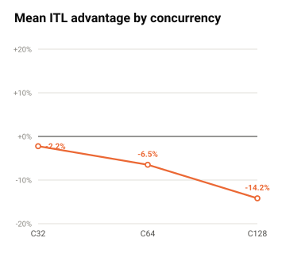
</p>

At C32, there was relatively little contention, so mean ITL changed only slightly. At C128, more prefill and decode work overlapped on each worker, making every "avoided" prefill more valuable. As a result, mean ITL improved by about 14.2%, while P99 ITL improved by about 29.9%.

### 3. Cache Reuse Declines at Higher Concurrency

<p align="center">
  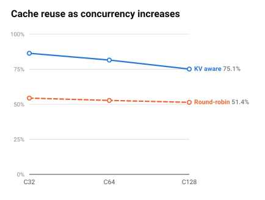
</p>

KV-aware routing maintained a much higher cache-read fraction than round-robin at every concurrency level. However, its reuse rate declined from 86.33% at C32 to 75.09% at C128. RR routing on the other hand changed much less, moving from 54.39% to 51.41%.

Why did the change rate differ?

The most likely explanation is that cache locality becomes harder to preserve as more agent trajectories run concurrently. More requests compete for finite KV-cache capacity, while the router also has to consider increasingly uneven worker load. Thus, a worker holding the best prefix match may no longer be the cheapest destination once its active KV load becomes high.

The cache-event metrics support this hypothesis.

<p align="center">
  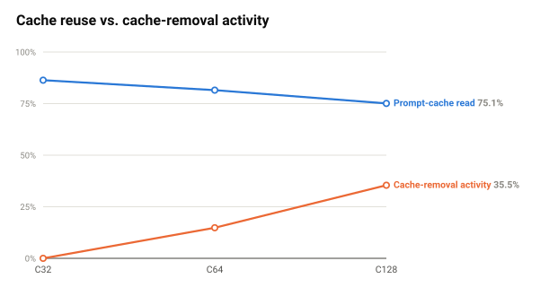
</p>

In the KV-aware runs, the ratio of `BlockRemoved` to `BlockStored` events increased from 0% at C32 to 14.82% at C64 and 35.45% at C128. This indicates that the cache state became substantially more dynamic as concurrency increased, making previously established locality less durable.

This also explains why round-robin declined only slightly. Round-robin does not actively preserve prefix locality in the first place, which also means it has less locality advantage to lose. KV-aware routing starts from a much higher reuse rate, but increasing concurrency gradually pushes it from a locality-dominated regime toward a tradeoff between cache reuse and load balance.

## Conclusion

In this post, we have compared KV-aware routing and Round-robin routing using the AgentX MVP benchmark.

Across all three pairs, we see a consistent pattern: KV-aware routing delivers more prompt-cache reuse and lower mean first-token and request latency, and the TTFT percentiles point to a tail-latency improvement, while only providing a limited increase in throughput as concurrency grows.

For future work, we could measure the concurrency-wise saturation point of the workload, where we'd expect to see an even larger throughput difference.

## Acknowledgement

Special thanks to [Prasanna](https://x.com/jaga_prasanna) for leading the whole [project](https://github.com/Prasannajaga/deployment-guide) (got carried) and giving me the opportunity to take part in it.

We also deeply appreciate [Lambda AI](https://x.com/LambdaAPI), especially [Zach](https://x.com/TheZachMueller), who provided the cluster and enough compute time for setting up the network environment and running experiments.

<a id="appendix-results"></a>

## Appendix. Result

### Summary Table

| Metric | C32 RR | C32 KV | C64 RR | C64 KV | C128 RR | C128 KV |
|---|---:|---:|---:|---:|---:|---:|
| Completed requests | 795 | 795 | 1,409 | 1,428 | 2,683 | 2,749 |
| Request throughput, req/s | 0.855 | 0.855 | 1.515 | 1.535 | 2.854 | 2.924 |
| Output throughput, tok/s | 717.95 | 717.38 | 1,242.00 | 1,261.99 | 2,353.02 | 2,577.22 |
| Prompt-cache read, % | 54.39 | 86.33 | 52.73 | 81.51 | 51.41 | 75.09 |
| Mean TTFT, ms | 530.87 | 216.02 | 579.06 | 277.67 | 633.61 | 366.27 |
| Median TTFT, ms | 318.43 | 137.84 | 364.83 | 162.04 | 379.88 | 204.76 |
| P95 TTFT, ms | 1,666.59 | 673.70 | 1,729.23 | 921.78 | 1,917.92 | 1,200.44 |
| P99 TTFT, ms | 2,171.11 | 1,434.12 | 2,249.09 | 1,659.85 | 2,445.44 | 1,854.68 |
| Mean ITL, ms | 3.58 | 3.50 | 3.85 | 3.60 | 5.29 | 4.54 |
| Mean request latency, s | 3.696 | 3.129 | 3.890 | 3.208 | 5.188 | 4.142 |


All six measurements include `profile_export_aiperf.json` files and can be found under the common root `../benchmarks/nemotron-3-nano-30b-a3b-fp8/`.

| Configuration | Profiling result directory |
|---|---|
| RR C32 | [rr/c32/](https://github.com/junuxyz/deployment-guide/tree/ac8e979e88da180daaef8929bf51019842cdac2f/benchmarks/nemotron-3-nano-30b-a3b-fp8/rr/c32/) |
| RR C64 | [rr/c64/](https://github.com/junuxyz/deployment-guide/tree/ac8e979e88da180daaef8929bf51019842cdac2f/benchmarks/nemotron-3-nano-30b-a3b-fp8/rr/c64/) |
| RR C128 | [rr/c128/](https://github.com/junuxyz/deployment-guide/tree/ac8e979e88da180daaef8929bf51019842cdac2f/benchmarks/nemotron-3-nano-30b-a3b-fp8/rr/c128/) |
| KV C32 | [kv/c32/](https://github.com/junuxyz/deployment-guide/tree/ac8e979e88da180daaef8929bf51019842cdac2f/benchmarks/nemotron-3-nano-30b-a3b-fp8/kv/c32/) |
| KV C64 | [kv/c64/](https://github.com/junuxyz/deployment-guide/tree/ac8e979e88da180daaef8929bf51019842cdac2f/benchmarks/nemotron-3-nano-30b-a3b-fp8/kv/c64/) |
| KV C128 | [kv/c128/](https://github.com/junuxyz/deployment-guide/tree/ac8e979e88da180daaef8929bf51019842cdac2f/benchmarks/nemotron-3-nano-30b-a3b-fp8/kv/c128/) |


### Configured vs Effective Concurrency

| Configured concurrency | Mean effective concurrency, RR | Mean effective concurrency, KV |
|---:|---:|---:|
| 32 | [3.16](../benchmarks/nemotron-3-nano-30b-a3b-fp8/rr/c32/profile_export_console.txt#L7) | [2.68](../benchmarks/nemotron-3-nano-30b-a3b-fp8/kv/c32/profile_export_console.txt#L7) |
| 64 | [5.89](../benchmarks/nemotron-3-nano-30b-a3b-fp8/rr/c64/profile_export_console.txt#L7) | [4.93](../benchmarks/nemotron-3-nano-30b-a3b-fp8/kv/c64/profile_export_console.txt#L7) |
| 128 | [14.81](../benchmarks/nemotron-3-nano-30b-a3b-fp8/rr/c128/profile_export_console.txt#L7) | [12.12](../benchmarks/nemotron-3-nano-30b-a3b-fp8/kv/c128/profile_export_console.txt#L7) |


## References

- **NVIDIA Dynamo Routing:** [Routing Concepts](https://docs.nvidia.com/dynamo/dev/knowledge-base/modular-components/router/routing-concepts)
- **AgentX MVP Benchmark:** [InferenceX AgentX MVP Benchmark](https://docs.nvidia.com/aiperf/dev/tutorials/datasets-inputs/inference-x-agent-x-mvp-benchmark) and the [commit-pinned benchmark specification](https://github.com/ai-dynamo/aiperf/blob/e10d53b1d30b5845f56cbea63d0560f10ff5aa4e/docs/tutorials/agentx-mvp.md)
- **Dynamo Frontend:** [Frontend Overview](https://docs.nvidia.com/dynamo/dev/knowledge-base/modular-components/frontend/overview)
- **Prefix Caching:** [vLLM Automatic Prefix Caching](https://docs.vllm.ai/en/latest/design/prefix_caching/) and [Inside nano-vLLM: Schedule](https://github.com/junuxyz/mlsys-notes/blob/main/notes/vllm/inside-nano-vllm.md#schedule)
- **KV Events:** [Publish KV Events from a Custom Backend](https://github.com/ai-dynamo/dynamo/blob/main/docs/fern/pages/developer-guide/advanced-customizations/writing-custom-backends/publish-kv-events.md)
- **Dynamo Router Configuration:** [Router Guide (v1.4.2)](https://docs.nvidia.com/dynamo/v1.4.2/knowledge-base/modular-components/router/router-guide#deployment-modes)
- **Agentic Coding Workload:** [Replay Weka Agentic Coding Traces](https://docs.nvidia.com/aiperf/dev/tutorials/datasets-inputs/replay-weka-agentic-coding-traces)
- **Concurrency Metrics:** [Effective vs. Active Metrics](https://docs.nvidia.com/aiperf/reference/effective-vs-active-metrics)
- **Request Latency:** [AIPerf Metrics Reference](https://docs.nvidia.com/aiperf/reference/ai-perf-metrics-reference#request-latency)
- **Nemotron 3 Nano Model:** [NVIDIA Nemotron 3 Nano 30B-A3B FP8 Model Card](https://huggingface.co/nvidia/NVIDIA-Nemotron-3-Nano-30B-A3B-FP8)
- **Sarathi-Serve:** [Taming Throughput-Latency Tradeoff in LLM Inference with Sarathi-Serve](https://www.usenix.org/conference/osdi24/presentation/agrawal) and the [Sarathi-Serve notes](https://github.com/junuxyz/mlsys-notes/blob/main/notes/sarathi-serve.md#chunked-prefill)
- **Dynamo Observability:** [Metric Labels](https://docs.dynamo.nvidia.com/dynamo/reference/observability/metric-labels)
- **vLLM KV Cache Management:** [Block Pool Implementation (v0.26.0)](https://github.com/vllm-project/vllm/blob/v0.26.0/vllm/v1/core/block_pool.py)
- **Benchmark Results:** [Raw Benchmark Results](../benchmarks/nemotron-3-nano-30b-a3b-fp8/)
