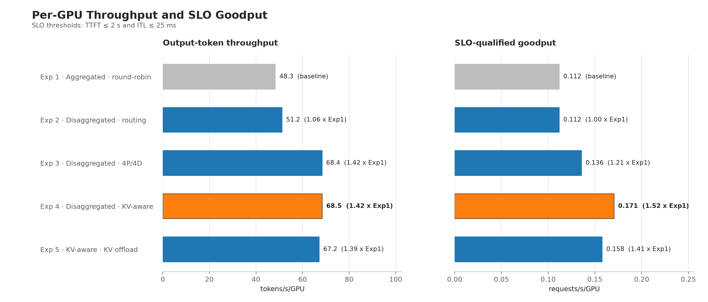
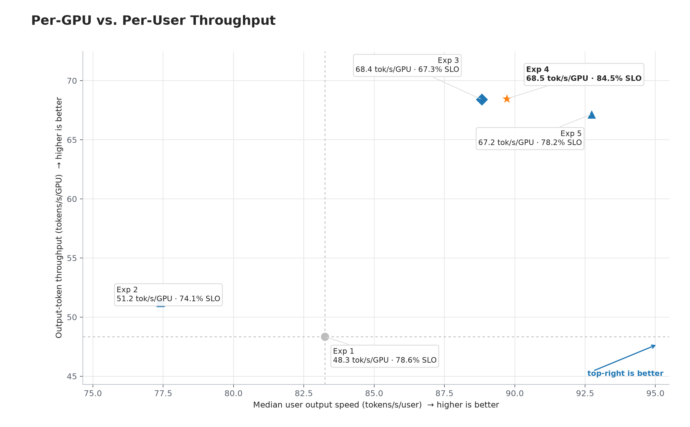
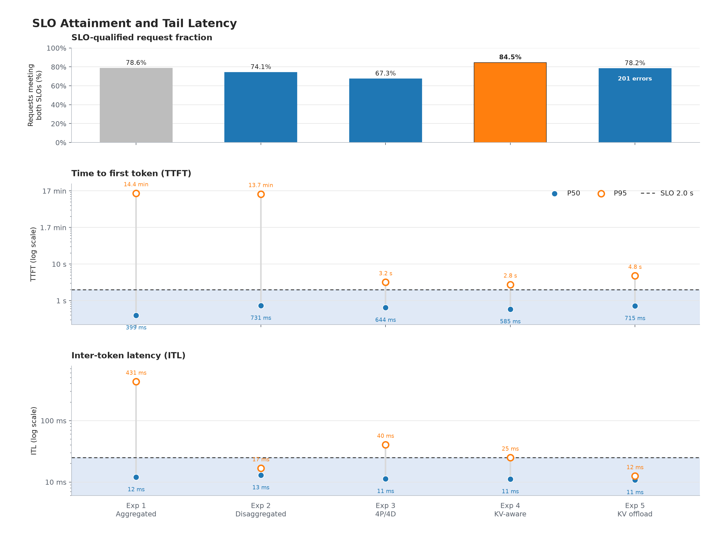

# Qwen3-32B serving experiments

Five experiments to compare worker layout, router, and CPU KV-cache offloading under the same workload ([Mooncake FAST25 fixed-schedule trace](https://github.com/kvcache-ai/Mooncake/blob/main/FAST25-release/traces/conversation_trace.jsonl)).

Every experiment uses Qwen3-32B-FP8 on 16 x H100 GPUs with a 40,960-token context limit. Goodput thresholds are 2,000 ms TTFT and 25 ms ITL. More details on the benchmark setup and experiment differences are available in the [Appendix](#appendix).


| Recipe | Worker layout | Router | CPU KV offload |
|---|---|---|---|
| [`01-agg-routing`](./vllm/01-agg-routing/) | 8 aggregate engines, TP2 | round-robin | no |
| [`02-disagg-routing`](./vllm/02-disagg-routing/) | 6 prefill + 2 decode, TP2 | round-robin | no |
| [`03-disagg-routing-4p4d`](./vllm/03-disagg-routing-4p4d/) | 4 prefill + 4 decode, TP2 | round-robin | no |
| [`04-disagg-routing-kv-aware`](./vllm/04-disagg-routing-kv-aware/) | 4 prefill + 4 decode, TP2 | KV-aware | no |
| [`05-disagg-routing-kv-aware-offloading`](./vllm/05-disagg-routing-kv-aware-offloading/) | 4 prefill + 4 decode, TP2 | KV-aware | 32 GiB/engine |

## Results

The following figures compare the latest artifacts for Experiments 1-5. Exp 4 (4P4D, KV-aware routing) recorded the highest observed output throughput and SLO-qualified goodput in these runs.

> [!NOTE]
>
> **The current Exp 5 result is provisional and not a clean comparison.**
> During the first 147 seconds, 201 of 11,457 requests (1.75%) completed without any generated content. See the [Exp 5 AIPerf log and error summary](../artifacts/exp5-disagg-kv-aware-offload/2026-08-14T01-15-51Z/aiperf/aiperf.log) for details.

| Metric | Exp 1. Agg TP2 RR | Exp 2. 6P + 2D TP2 RR | Exp 3. 4P + 4D TP2 RR | Exp 4. 4P + 4D TP2 KV | Exp 5. 4P + 4D TP2 KV + KV Cache offload |
|---|---:|---:|---:|---:|---:|
| Request throughput | 2.281 req/s | 2.417 req/s | 3.228 req/s | **3.231 req/s** | 3.173 req/s |
| Goodput | 1.792 req/s | 1.792 req/s | 2.172 req/s | **2.729 req/s** | 2.527 req/s |
| SLO pass rate | 78.56% | 74.14% | 67.28% | **84.46%** | 78.23% |
| Total token throughput | 21,955.31 tok/s | 23,254.83 tok/s | 31,067.66 tok/s | **31,096.72 tok/s** | 30,476.50 tok/s |
| Output token throughput | 773.39 tok/s | 819.17 tok/s | 1,094.38 tok/s | **1,095.40 tok/s** | 1,074.59 tok/s |
| Mean TTFT | 86,776.14 ms | 96,244.37 ms | 1,031.63 ms | **887.99 ms** | 1,441.35 ms |
| TTFT p50 | **398.50 ms** | 730.65 ms | 644.28 ms | 584.58 ms | 715.49 ms |
| TTFT p95 | 865,295.64 ms | 820,579.94 ms | 3,185.51 ms | **2,759.38 ms** | 4,792.80 ms |
| Mean ITL | 66.06 ms | 13.15 ms | 16.67 ms | 13.07 ms | **10.99 ms** |
| Mean request latency | 107.92 s | 100.70 s | 6.65 s | 5.33 s | **5.13 s** |
| Errors | 0 | 0 | 0 | 0 | 201 |

<p align="center">
  
  <br />
  <sub>Figure 1. Per-GPU output-token throughput and SLO-qualified goodput</sub>
</p>

<p align="center">
  
  <br />
  <sub>Figure 2. Median per-user output speed versus per-GPU output-token throughput at each observed operating point.</sub>
</p>

<p align="center">
  
  <br />
  <sub>Figure 3. SLO-qualified requests and P50/P95 TTFT and ITL. Exp 5 includes 201 empty inference responses.</sub>
</p>

## How to run the experiment

### one time cache setup

[`vllm/setup/cache.yaml`](./vllm/setup/cache.yaml) creates the shared model, vLLM compilation, and benchmark artifact PV/PVC pairs. Apply it only during initial setup or after namespace (we use `qwen32-bench` as namespace in this experiment) is created:

```bash
kubectl apply -f /ephemeral/shared/qwen3-32b/experiments/vllm/setup/cache.yaml
kubectl get pvc -n qwen32-bench model-cache compilation-cache perf-cache
```

All three PVCs must become `Bound`. The PVs use the `Retain` policy, so deleting the namespace preserves their data but can leave a PV in `Released`. Before
reusing PV, verify that it belongs to the deleted cache PVC, remove its stale claim reference, and apply the setup manifest again:

```bash
kubectl get pv
export RELEASED_PV=qwen32-vllm-compilation-cache-pv
kubectl get pv "$RELEASED_PV" -o jsonpath='{.status.phase}{"\n"}{.spec.claimRef.namespace}{"/"}{.spec.claimRef.name}{"\n"}'
kubectl patch pv "$RELEASED_PV" --type=json \
  -p='[{"op":"remove","path":"/spec/claimRef"}]'
kubectl apply -f /ephemeral/shared/qwen3-32b/experiments/vllm/setup/cache.yaml
```

Run the following commands on the cluster host. Change only `RECIPE` when moving to another experiment.

e.g.
```bash
export NAMESPACE=qwen32-bench
export VLLM_EXP=/ephemeral/shared/qwen3-32b/experiments/vllm
export RECIPE=04-disagg-routing-kv-aware

export EXP_DIR="$VLLM_EXP/$RECIPE"
export DGD=$(awk '/^metadata:/{m=1; next} m && /^  name:/{print $2; exit}' "$EXP_DIR/deploy.yaml")
export PERF_JOB=$(awk '/^metadata:/{m=1; next} m && /^  name:/{print $2; exit}' "$EXP_DIR/perf.yaml")
export GRAPH_LABEL="nvidia.com/dynamo-graph-deployment-name=$DGD"

printf 'recipe=%s\ndeployment=%s\nbenchmark=%s\n' "$RECIPE" "$DGD" "$PERF_JOB"
```

These variables are local to the current shell, so you should run this block again after opening a terminal window.

### 1. Preflight

```bash
kubectl get pvc -n "$NAMESPACE" model-cache compilation-cache perf-cache
kubectl get secret -n "$NAMESPACE" hf-token-secret
kubectl get dynamographdeployments -A
```

All three PVCs must be `Bound`, hf secret must exist, and no other experiment should be using the 16 GPUs.

Since Experiments 2-5 use P/D disaggregation, verify the RDMA network attachment and node resources:

```bash
if [[ "$RECIPE" != "01-agg-routing" ]]; then
  kubectl get network-attachment-definition qwen-roce -n "$NAMESPACE"
  kubectl get nodes \
    -o custom-columns='NODE:.metadata.name,GPU:.status.allocatable.nvidia\.com/gpu,RDMA:.status.allocatable.rdma/ib'
fi
```

### 2. Deploy

```bash
kubectl apply --dry-run=server -n "$NAMESPACE" -f "$EXP_DIR/deploy.yaml"
kubectl apply --dry-run=server -n "$NAMESPACE" -f "$EXP_DIR/perf.yaml"
kubectl apply -n "$NAMESPACE" -f "$EXP_DIR/deploy.yaml"

kubectl wait -n "$NAMESPACE" \
  --for=jsonpath='{.status.state}'=successful \
  "dynamographdeployment/$DGD" --timeout=45m
```

Verify every Pod is running and ready with no unexpected restart:

```bash
kubectl get pods -n "$NAMESPACE" -l "$GRAPH_LABEL" \
  -o custom-columns='POD:.metadata.name,NODE:.spec.nodeName,PHASE:.status.phase,READY:.status.containerStatuses[*].ready,RESTARTS:.status.containerStatuses[*].restartCount'
```

If the deployment remains `False`, print the controller's reason:

```bash
kubectl get dynamographdeployment "$DGD" -n "$NAMESPACE" \
  -o jsonpath='state={.status.state}{"\n"}message={.status.conditions[0].message}{"\n"}'
```

### 3. Benchmark

```bash
kubectl delete job "$PERF_JOB" -n "$NAMESPACE" --ignore-not-found
kubectl apply -n "$NAMESPACE" -f "$EXP_DIR/perf.yaml"

kubectl wait -n "$NAMESPACE" --for=condition=Ready \
  pod -l "app=$PERF_JOB" --timeout=5m
kubectl logs -n "$NAMESPACE" -f --tail=30 "job/$PERF_JOB"
```

The benchmark takes about an hour (Mooncake fixed trace).

After it finishes:

```bash
kubectl wait -n "$NAMESPACE" --for=condition=Complete \
  "job/$PERF_JOB" --timeout=3h

export RUN_DIR=$(kubectl logs -n "$NAMESPACE" "job/$PERF_JOB" |
  sed -n 's/^Run artifacts: //p' | tail -1)
export HOST_RUN_DIR="/ephemeral/shared/qwen3-32b/perf-cache/${RUN_DIR#/perf-cache/}"

gzip -t "$HOST_RUN_DIR/aiperf/profile_export.jsonl.gz"
printf 'artifacts=%s\n' "$HOST_RUN_DIR"
```

### 4. Release the GPUs

Delete the benchmark Job and its Dynamo deployment.

```bash
kubectl delete job "$PERF_JOB" -n "$NAMESPACE" --ignore-not-found
kubectl delete dynamographdeployment "$DGD" -n "$NAMESPACE" --ignore-not-found
kubectl wait -n "$NAMESPACE" --for=delete \
  pod -l "$GRAPH_LABEL" --timeout=15m
```

Final check:

```bash
kubectl get dynamographdeployments -A
kubectl get pods -n "$NAMESPACE"
```


# Appendix

## Comparability

The following configurations remain aligned across all five experiments:

- 2 nodes (8 GPUs each), 16 GPUs total
- Qwen3-32B-FP8 revision `aa55da1`
- Dynamo v1.3.0
- 8 workers, TP2 per worker
- 40,960-token maximum context length
  - The original trace contains 12,031 requests. After filtering 574 over-context requests, the same 11,457 requests were used in all five manifests.
- GPU-memory utilization 0.90
- 128-token GPU blocks
- synchronous scheduling
- Mooncake FAST25 fixed schedule, streaming, `ignore_eos: true`
- Goodput thresholds: 2,000 ms TTFT / 25 ms ITL

The previous implementation split between Exp 1-3 and Exp 4-5 is deprecated. The current recipes use the same manifest conventions and benchmark wrapper, with only the experiment-specific settings below changed.

### Exp 1. Aggregate baseline

- Serves as the baseline for the disaggregated experiments.
- Runs 8x aggregate TP2 workers with round-robin routing.

### Exp 2. 6P+2D disaggregated

- Splits the 8 TP2 workers into 6 Prefill(TP2) and 2 Decode(TP2) workers.
- Uses round-robin routing and NIXL/RDMA KV transfer without CPU KV offload.

### Exp 3. 4P+4D disaggregated

- Changes Exp 2's worker balance to 4P(TP2) and 4D(TP2) workers while retaining round-robin routing and no CPU KV offload.
- **Limitation:** Exp 3 used an earlier configuration(`deploy.yaml`) and benchmark wrapper(`perf.yaml`), which has eight frontend replicas, node-pinned 2P+2D groups per node, and different UCX and prefix-cache settings. Unfortunately, I did not have time to rerun it after the manifests were normalized. However major configurations (model, GPU topology, engine settings, etc.) besides these were unchanged, so this is unlikely to alter the overall trend.

### Exp 4. 4P+4D with KV-aware routing

- Replaces round-robin routing with KV-aware routing.

### Exp 5. 4P+4D with KV-aware routing and CPU KV offload

- Extends Exp 4 with `MultiConnector` and a 32 GiB/engine CPU KV-cache tier.
- Adds host-cache-aware routing, KV events and prefix caching on both worker roles, and explicit worker memory limits.
- **Limitation:** the current run produced 201 empty inference responses during its first 147 seconds (mentioned above). Treat its plots and summary metrics as provisional.

## References

- [Dynamo Qwen3-32B vLLM recipe](https://github.com/ai-dynamo/dynamo/tree/main/recipes/qwen3-32b/vllm/disagg-kv-router)
- [Dynamo native vLLM offloading](https://docs.nvidia.com/dynamo/dev/knowledge-base/modular-components/backends/v-llm/native-kv-offloading)
