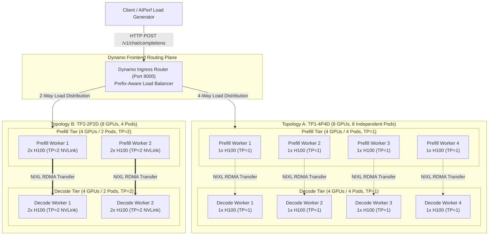
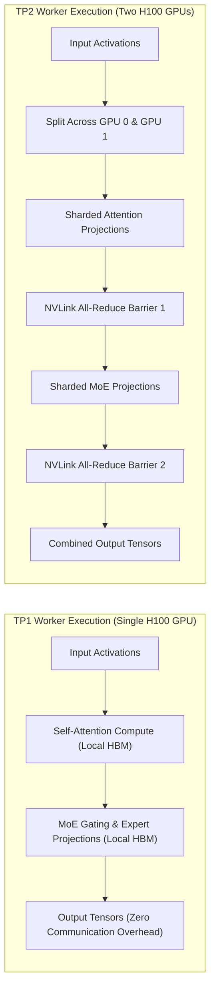
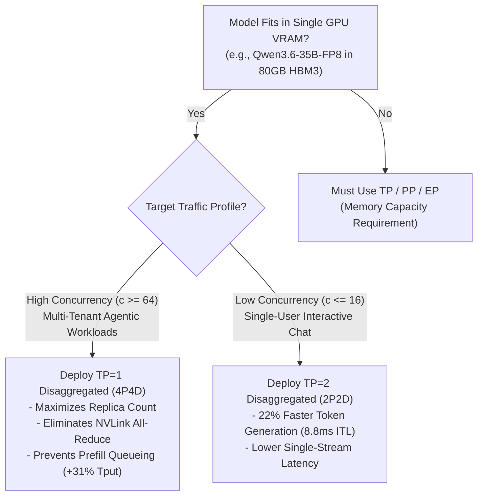

# Why Tensor Parallelism Can Kill LLM Serving Throughput at Scale: SGLang Disaggregated TP1 (4P4D) vs. TP2 (2P2D) on 8x NVIDIA H100

Tensor Parallelism (TP) is often treated as the default scaling strategy in distributed Large Language Model (LLM) inference—engineers instinctively scale up TP degrees whenever more GPUs become available. However, in high-concurrency production environments, increasing Tensor Parallelism without analyzing workload dynamics can severely penalize throughput, introduce costly communication synchronization, and trigger catastrophic prefill head-of-line blocking.

In this deep-dive engineering post, we compare **SGLang Disaggregated TP1 (4 Prefill + 4 Decode pods)** versus **SGLang Disaggregated TP2 (2 Prefill + 2 Decode pods)** on the exact same fixed hardware budget: an **8x NVIDIA H100 SXM5 GPU cluster**. Both topologies serve `Qwen/Qwen3.6-35B-A3B-FP8` with a full **131,072-token (~132K) context window**, `--page-size 64`, static VRAM allocation of `0.85`, and zero-copy NIXL UCX RoCE RDMA state transfer.

By tracing performance across a complete concurrency scaling sweep (c=1 to c=128) using AIPerf, we analyze the architectural trade-offs between intra-pod Tensor Parallelism and inter-pod replica parallelism, identifying the exact tipping point where TP=1 outperforms TP=2 by **+31.0% higher output throughput** and delivers an **8.2x faster Time-to-First-Token (P95 TTFT)**.

---

## The Goal

**The Goal:** To empirically evaluate whether increasing Tensor Parallelism from TP=1 to TP=2 improves or degrades cluster performance when serving `Qwen3.6-35B-A3B-FP8` across an **8x NVIDIA H100 GPU cluster** under varying concurrency loads.

Specifically, we answer four foundational engineering questions:
- How does doubling the number of prefill workers (4 pods on TP1 vs. 2 pods on TP2) affect prefill queueing delays and Time-to-First-Token under heavy concurrency?
- Why does TP=2 deliver lower latency at low concurrency (c <= 32) but collapse into severe head-of-line blocking at high concurrency (c >= 64)?
- Is the 22% faster per-token generation latency of TP=2 worth the 8.2x P95 TTFT blowout and 31% overall throughput penalty at peak load?
- How should inference platform teams size Tensor Parallelism versus Disaggregated Worker Replication for hybrid Mixture-of-Experts (MoE) models?

---

## 1. Hardware, Model & Runtime Specifications

Before diving into the system architecture and benchmark results, the table below details the exact bare-metal cluster hardware, model architecture, interconnect configuration, and runtime parameters used across both topologies:

| Parameter | TP1-4P4D Topology | TP2-2P2D Topology | Architectural Details |
| :--- | :--- | :--- | :--- |
| **Model** | `Qwen/Qwen3.6-35B-A3B-FP8` | `Qwen/Qwen3.6-35B-A3B-FP8` | Hybrid Gated DeltaNet / MoE in native FP8 (35B total, ~3B active/token) |
| **Supported Context Window** | **131,072 tokens (~132K context)** | **131,072 tokens (~132K context)** | Full enterprise context length configured via `--context-length 131072` |
| **Page Size & KV Staging** | **64 tokens per page** | **64 tokens per page** | Unified attention & recurrent linear state paging (`--page-size 64`) |
| **Static VRAM Allocation** | **85% GPU Memory Fraction** | **85% GPU Memory Fraction** | `--mem-fraction-static 0.85` (~68 GB of 80 GB VRAM per GPU dedicated to KV) |
| **Total Accelerators** | **8 × NVIDIA H100 SXM5 GPUs** | **8 × NVIDIA H100 SXM5 GPUs** | 80 GB HBM3 VRAM per GPU (640 GB cluster aggregate) |
| **Cluster Nodes** | 1 × Bare-Metal Node (8x H100) | 1 × Bare-Metal Node (8x H100) | 8 × H100 SXM5 connected via 900 GB/s NVLink Switch |
| **Prefill Workers** | **4 Pods (1 GPU each, TP=1)** | **2 Pods (2 GPUs each, TP=2)** | Dedicated to prompt ingestion and attention prefill compute |
| **Decode Workers** | **4 Pods (1 GPU each, TP=1)** | **2 Pods (2 GPUs each, TP=2)** | Dedicated to autoregressive token generation |
| **Tensor Parallelism (TP)** | **TP = 1 (Zero NVLink All-Reduce)** | **TP = 2 (Intra-pod NVLink Sharding)** | TP degree applied across attention and MoE dense projections |
| **Inter-Worker State Transfer** | High-Speed RoCE RDMA Network | High-Speed RoCE RDMA Network | NVIDIA NIXL / UCX zero-copy transfer (`--disaggregation-transfer-backend nixl`) |
| **Reasoning & Tool Parsing** | Native Qwen3 Reasoning + Coder | Native Qwen3 Reasoning + Coder | `--reasoning-parser qwen3` and `--dyn-tool-call-parser qwen3_coder` |
| **Routing & Control Plane** | **NVIDIA Dynamo v1.3.0** | **NVIDIA Dynamo v1.3.0** | Prefix-aware KV router with Prometheus telemetry |
| **LLM Engine & Version** | **SGLang v0.5.14** | **SGLang v0.5.14** | High-throughput disaggregated Prefill/Decode runtime |

### Model Architecture & Memory Sizing Considerations

Serving `Qwen/Qwen3.6-35B-A3B-FP8` efficiently requires tailoring the inference engine to its hybrid architecture. Out of its 35 billion total parameters, only approximately 3 billion parameters are actively routed per token via its Sparse Mixture-of-Experts (MoE) layers, combined with Gated DeltaNet recurrent linear attention states (`HybridLinearKVPool`). In native FP8 precision, the model weights consume approximately 35 GB of VRAM.

Because each NVIDIA H100 GPU provides 80 GB of high-bandwidth memory (HBM3), a single GPU easily holds the entire 35 GB model weight footprint while still leaving over 40 GB of unallocated VRAM. By setting `--mem-fraction-static 0.85`, SGLang dedicates 85% of total VRAM (~68 GB per GPU) to the static KV cache and Mamba linear recurrent state pool. After subtracting model weights and CUDA execution buffers, each individual GPU maintains an in-VRAM capacity of approximately 380,000 to 450,000 active context tokens.

This fundamental memory sizing insight makes TP=1 fully viable: because the entire model fits comfortably on a single H100 GPU, multi-GPU Tensor Parallelism is not required for memory capacity. The choice between TP=1 and TP=2 is purely an architectural trade-off between compute latency and cluster-wide parallelism.

---

## 2. Architecture & Parallelism Design

To understand why the two configurations behave so differently under load, let us examine their topological layouts and execution mechanics across the 8-GPU cluster:



### Intra-Pod Tensor Parallelism vs. Inter-Pod Replica Parallelism

The fundamental distinction between these two architectures lies in how GPU compute resources are organized between intra-pod synchronization and inter-pod replication:

In **TP2-2P2D**, each worker pod binds two physical H100 GPUs joined by high-speed NVLink. Attention projection matrices, feed-forward layers, and MoE routing matrices are split across the two devices. During every single transformer layer, intermediate activation tensors must be synchronized across GPUs using `all-reduce` operations over NVLink. While this sharding reduces the arithmetic workload per GPU and accelerates the forward pass for an isolated single request, it imposes continuous synchronization barriers throughout the execution graph. More critically, clustering 8 GPUs into 2-GPU pods reduces the cluster's replica count to only **2 prefill workers** and **2 decode workers**.

In **TP1-4P4D**, each worker pod operates entirely on a single H100 GPU with zero intra-pod communication overhead. Attention computation, linear state updates, and MoE routing execute completely within local GPU registers and HBM3 memory. Because there are no `all-reduce` communication barriers, the GPU compute engines run at 100% duty cycle. Most importantly, running at TP=1 doubles the cluster's concurrency capacity, provisioning **4 independent prefill workers** and **4 independent decode workers**.



### Prefill Queueing Dynamics Under Concurrency

The Dynamo Frontend dynamically distributes incoming requests across healthy prefill endpoints. In the TP1 topology, the router dispatches across 4 distinct prefill endpoints, whereas in the TP2 topology, traffic must be concentrated onto only 2 prefill endpoints. 

When client concurrency reaches 128 simultaneous streams, each prefill worker in TP1 handles an average queue depth of **32 concurrent requests**, whereas each prefill worker in TP2 is forced to absorb a crushing queue depth of **64 concurrent requests**. Once prefill completes, the initialized KV cache and Mamba linear recurrent states are transferred directly to an assigned decode worker over high-speed RoCE RDMA via NVIDIA NIXL (`--disaggregation-transfer-backend nixl`) using one-sided zero-copy transfers (`UCX_RNDV_SCHEME=get_zcopy`) in under 5 milliseconds.
 
---

## 3. Production Manifests & Deployment

The complete deployment manifests are structured as runnable Kubernetes recipes:

- **TP1-4P4D Deployment Manifest:** [`deploy.yaml`](https://github.com/Prasannajaga/deployment-guide/blob/main/models/qwen3.6-35B-A3B/sglang/disagg/tp1-4p4d/deploy.yaml) — 4 Prefill + 4 Decode pods with TP=1.
- **TP2-2P2D Deployment Manifest:** [`deploy.yaml`](https://github.com/Prasannajaga/deployment-guide/blob/main/models/qwen3.6-35B-A3B/sglang/disagg/tp2-2p2d/deploy.yaml) — 2 Prefill + 2 Decode pods with TP=2.
- **AIPerf Benchmark Suite:** [`perf.yaml`](https://github.com/Prasannajaga/deployment-guide/blob/main/models/qwen3.6-35B-A3B/sglang/disagg/tp1-4p4d/perf.yaml).

### Cluster Deployment Workflow

```bash
# 1. Configure deployment environment variables
export NAMESPACE=qwen32-bench
export EXP_DIR=/ephemeral/shared/qwen3.6-35b-a3b/sglang/disagg/tp1-4p4d
export DEPLOYMENT=q36-sgl-pd-tp1-4p4d
export GRAPH_LABEL="nvidia.com/dynamo-graph-deployment-name=${DEPLOYMENT}"

# 2. Deploy TP1-4P4D serving graph (4 Prefill + 4 Decode across 8 GPUs)
kubectl apply -n "$NAMESPACE" -f "$EXP_DIR/deploy.yaml"

# 3. Monitor rollout & readiness across all 8 worker pods
kubectl get pods -n "$NAMESPACE" -l "$GRAPH_LABEL" -o wide -w

# 4. Teardown & release cluster resources when switching topologies
kubectl delete dynamographdeployment.nvidia.com "$DEPLOYMENT" \
  -n "$NAMESPACE" --wait=true --ignore-not-found
```

---

## 4. Benchmarking & Empirical Performance Analysis

To evaluate how both topologies scale from single-user execution up to extreme cluster saturation, we execute rigorous benchmarks using AIPerf (`aiperf==0.10.0`) configured with a production-grade **Mixed Sequence Distribution** (`workload_mode: mixed`):

- **Model & Tokenizer:** `Qwen/Qwen3.6-35B-A3B-FP8` using official tokenizer weights
- **Sequence Distribution Ladder:** Multi-tier weighted sequence buckets reflecting realistic enterprise agentic traffic:
  - **Bucket 1 (35% Traffic):** ISL = 1,024 tokens / OSL = 256 tokens (Standard chat & single-turn agentic steps)
  - **Bucket 2 (30% Traffic):** ISL = 4,096 tokens / OSL = 512 tokens (Document QA & multi-turn conversations)
  - **Bucket 3 (20% Traffic):** ISL = 8,192 tokens / OSL = 1,024 tokens (Deep codebase synthesis & extended reasoning)
  - **Bucket 4 (10% Traffic):** ISL = 16,384 tokens / OSL = 512 tokens (Repository-scale multi-file context)
  - **Bucket 5 (5% Traffic):** ISL = 32,768 tokens / OSL = 256 tokens (Massive document synthesis & long-context extraction)
- **Prefix Reuse & Partitioning:** 8 distinct prefix groups with **75% target prefix token reuse** (`target_prefix_token_percent: 75`)
- **Concurrency Ladder:** c = 1, 4, 8, 16, 32, 64, 128 concurrent client streams
- **Execution Controls:** Deterministic random seed (`random_seed: 42`), 16 warmup requests, and a 3,600-second request timeout ceiling

### Workload & Sequence Distribution Breakdown

The mixed sequence distribution is specifically designed to stress both compute intensity and memory footprint across the cluster:

| Traffic Weight | Input Sequence (ISL) | Output Sequence (OSL) | Total Sequence | Target Workload Profile |
| :---: | :---: | :---: | :---: | :--- |
| **35%** | **1,024 tokens** | **256 tokens** | 1,280 tokens | Standard interactive chat, lightweight tool-calling, and single-turn agentic queries. |
| **30%** | **4,096 tokens** | **512 tokens** | 4,608 tokens | Multi-turn customer support, document question-answering, and medium context summaries. |
| **20%** | **8,192 tokens** | **1,024 tokens** | 9,216 tokens | Complex software engineering tasks, multi-file code generation, and structured reasoning. |
| **10%** | **16,384 tokens** | **512 tokens** | 16,896 tokens | Full-module codebase ingestion, legal contract analysis, and deep analytical reasoning. |
| **5%** | **32,768 tokens** | **256 tokens** | 33,024 tokens | Massive multi-document synthesis, book-length document ingestion, and enterprise knowledge extraction. |

By blending shorter high-frequency requests (1K–4K) with heavy long-context payloads (8K–32K) and a 75% prefix reuse pattern across 8 prefix groups, the benchmark replicates production agentic traffic where prefix caching, prefill compute queuing, and autoregressive generation happen concurrently.

---

### Peak Saturation Analysis: Concurrency 128 Breakdown

<p align="center">
  
  <br />
  <sub><b>Figure 1:</b> Empirical performance scorecard at peak Concurrency 128 comparing SGLang Disaggregated TP1-4P4D (Slate Gray) versus TP2-2P2D (Vibrant Orange) across throughput, TTFT tail latency, decode speed, and end-to-end turnaround time.</sub>
</p>

| Performance Metric | TP1-4P4D (4P + 4D, TP=1) | TP2-2P2D (2P + 2D, TP=2) | Delta / Speedup | Winning Architecture |
| :--- | :--- | :--- | :--- | :--- |
| **Output Token Throughput** | **9,435.67 tok/s** | 7,201.80 tok/s | **+31.0% Higher** (+2,233.87 tok/s) | **TP1-4P4D** |
| **Request Throughput** | **18.83 req/s** | 14.26 req/s | **+32.0% Higher** (+4.57 req/s) | **TP1-4P4D** |
| **Completed Workflows (5 min)** | **5,649 requests** | 4,278 requests | **+1,371 More Workflows** | **TP1-4P4D** |
| **Median Time-to-First-Token (P50)** | **474.9 ms** (0.47 s) | 1,073.3 ms (1.07 s) | **55.8% Lower** (2.3x Faster) | **TP1-4P4D** |
| **Tail Time-to-First-Token (P95)** | **1,529.3 ms** (1.53 s) | 12,520.0 ms (12.52 s) | **87.8% Lower** (**8.2x Faster**) | **TP1-4P4D** |
| **Worst-Case TTFT (P99)** | **2,549.7 ms** (2.55 s) | 17,124.7 ms (17.12 s) | **85.1% Lower** (**6.7x Faster**) | **TP1-4P4D** |
| **Median Inter-Token Latency (P50)** | 11.44 ms / token | **8.85 ms / token** | **22.6% Faster** (-2.59 ms/tok) | **TP2-2P2D** |
| **End-to-End Latency (P95)** | **12.60 s** | 16.20 s | **22.2% Lower** (3.60s Faster) | **TP1-4P4D** |

<p align="center">
  
  <br />
  <sub><b>Figure 2:</b> Concurrency scaling sweep from c1 to c128 tracing Output Token Throughput, Request Throughput, P50/P95 TTFT, P50 ITL, and P95 E2E Latency trajectories for TP1-4P4D vs. TP2-2P2D.</sub>
</p>

---

### Why This Happens: The Root Cause

To understand why TP1 outperforms TP2 at scale, look at how GPUs execute prefill versus decode.

#### 1. Prefill is Compute-Heavy, Decode is Memory-Bandwidth-Bound

Prefill ingests the entire prompt in parallel through large matrix multiplications, heavily utilizing the H100 Tensor Cores. While a prefill worker processes a prompt, its compute engine is fully occupied, forcing subsequent requests to wait in line. In contrast, autoregressive decode generates one token per step per stream. Because the arithmetic per token is small, decode execution is bounded by HBM3 memory bandwidth as the GPU reads the 35 GB model weights from memory on every step.

#### 2. Why TP2 Wins at Low Concurrency (c <= 32)

When traffic is light, GPU compute capacity sits largely idle. Sharding the model across two GPUs in TP2 cuts the weight data each GPU must read in half (~17.5 GB), dropping per-token generation latency from 11.44 ms down to 8.85 ms (a 22.6% speedup). With low arrival rates, TP2's two prefill pods are rarely occupied at the same time, keeping queue delays near zero (P95 TTFT is 16–21 ms). In this under-saturated regime, faster per-token decode directly translates into higher aggregate throughput and 1.3 seconds faster end-to-end turnaround.

#### 3. The Crossover and Collapse at High Concurrency (c >= 64)

As concurrency ramps up, prefill ingress capacity becomes the hard bottleneck. In TP2-2P2D, the entire incoming stream must funnel through only two prefill pods. Long prompts (up to 32K tokens) monopolize the Tensor Cores, causing severe head-of-line blocking where shorter requests queue behind them. At c=64, TP2's P95 TTFT surges 40x to 842 ms, and at c=128 it balloons to 12.52 seconds.

This prefill queueing triggers a decode starvation paradox: because prefill workers cannot process and hand off KV caches fast enough, decode workers finish active jobs and sit idle waiting for state transfers over RDMA, capping TP2 throughput at 7,202 tok/s. TP1-4P4D provisions four independent prefill pods, halving queue depths, keeping P95 TTFT at 1.53 seconds (8.2x faster), and keeping all four decode workers continuously fed at 9,436 tok/s (+31.0%). Furthermore, TP1 eliminates the 128 NVLink all-reduce synchronization barriers per token required by TP2, allowing each GPU to run at maximum local efficiency.


--- 

## 5. Architectural Takeaways & Decision Guide

The empirical data from this experiment demonstrates that **higher Tensor Parallelism is not inherently better for cluster throughput**. When architecting production LLM serving clusters, platform teams should apply the following decision framework:



### Key Engineering Takeaways

If a model fits on a single GPU (like a 35B FP8 model on an 80GB H100), scale replicas with TP=1 instead of increasing Tensor Parallelism. Adding TP degrees when the model already fits in memory only cuts your replica count in half and adds unnecessary NVLink synchronization barriers.

In disaggregated serving, prefill capacity determines your throughput ceiling. Halving prefill pods to run TP=2 chokes prompt ingestion under heavy traffic, creating severe queue bottlenecks that blow out TTFT and starve decode workers. By keeping workers at TP=1, each GPU operates at full local efficiency, prefill queues stay short, and the cluster delivers significantly higher total throughput.

What if your model is simply too big to fit on one GPU (like a 70B or 405B model)? In that case, you have to use Tensor Parallelism to pool enough VRAM. But keep the trade-off in mind: every extra GPU you assign to a pod means fewer total pods in your cluster. For example, on an 8-GPU node, running TP=4 leaves you with only 2 pods total (1 prefill + 1 decode). That single prefill pod will hit queue limits very quickly under concurrent traffic, which means you'll need to add more physical GPUs to scale your cluster.

---

## 6. Conclusion & Personal Reflections

This benchmark study proves that **Disaggregated TP1 (4P4D)** is the superior production serving architecture for `Qwen3.6-35B-A3B-FP8` on an 8x NVIDIA H100 GPU cluster when serving concurrent multi-user traffic.

By eliminating NVLink all-reduce synchronization barriers and provisioning 4 independent prefill and decode workers, TP1 delivers:
- **+31.0% Higher Output Token Throughput** (9,436 tok/s vs. 7,202 tok/s at c=128).
- **+32.0% Higher Request Throughput** (18.83 req/s vs. 14.26 req/s).
- **8.2x Faster Time-to-First-Token** (P95 TTFT of 1.53s vs. 12.52s).
- **22.2% Faster End-to-End Latency** (12.60s vs. 16.20s).

I promised in the previous post that I would dive deep into how tensor parallelism can unexpectedly hurt throughput and performance, and here it is! Benchmarking these systems at scale on bare-metal **8x NVIDIA H100 clusters** has been an incredible journey. Seeing empirical data challenge common assumptions about distributed inference is what makes infrastructure engineering so exciting.

A huge thank you once again to **@TheZachMueller** and **@LambdaAPI** for providing the bare-metal GPU compute that makes this deep-dive research possible.

Stay tuned for the next deep dive, where we will explore dynamic KV cache compression and speculative decoding architectures at scale!

Thanks for reading! 🙏

---

## 7. Sources & References

- **SGLang Inference Engine:** [SGLang GitHub Repository & Documentation](https://github.com/sgl-project/sglang)
- **NVIDIA Dynamo Platform:** [Dynamo Graph Deployment Specifications](https://github.com/NVIDIA/ai-dynamo)
- **NVIDIA NIXL State Transfer:** [NIXL UCX Backend Documentation](https://github.com/NVIDIA/nixl)
- **Qwen 3.6 Model Family:** [Qwen/Qwen3.6-35B-A3B-FP8 HuggingFace Repository](https://huggingface.co/Qwen/Qwen3.6-35B-A3B-FP8)
- **TP1-4P4D Recipe & Manifests:** [`deploy.yaml`](https://github.com/Prasannajaga/deployment-guide/blob/main/models/qwen3.6-35B-A3B/sglang/disagg/tp1-4p4d/deploy.yaml)
- **TP2-2P2D Recipe & Manifests:** [`deploy.yaml`](https://github.com/Prasannajaga/deployment-guide/blob/main/models/qwen3.6-35B-A3B/sglang/disagg/tp2-2p2d/deploy.yaml)
- **Interactive Jupyter Notebook:** [`play.ipynb`](https://github.com/Prasannajaga/deployment-guide/blob/main/models/qwen3.6-35B-A3B/sglang/disagg/tp1-4p4d/play.ipynb)
