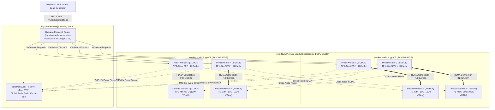
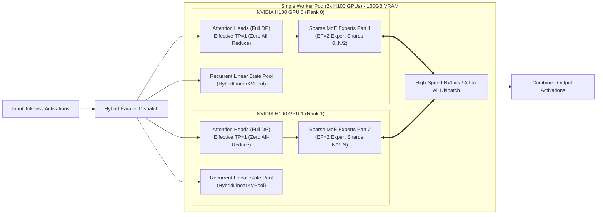
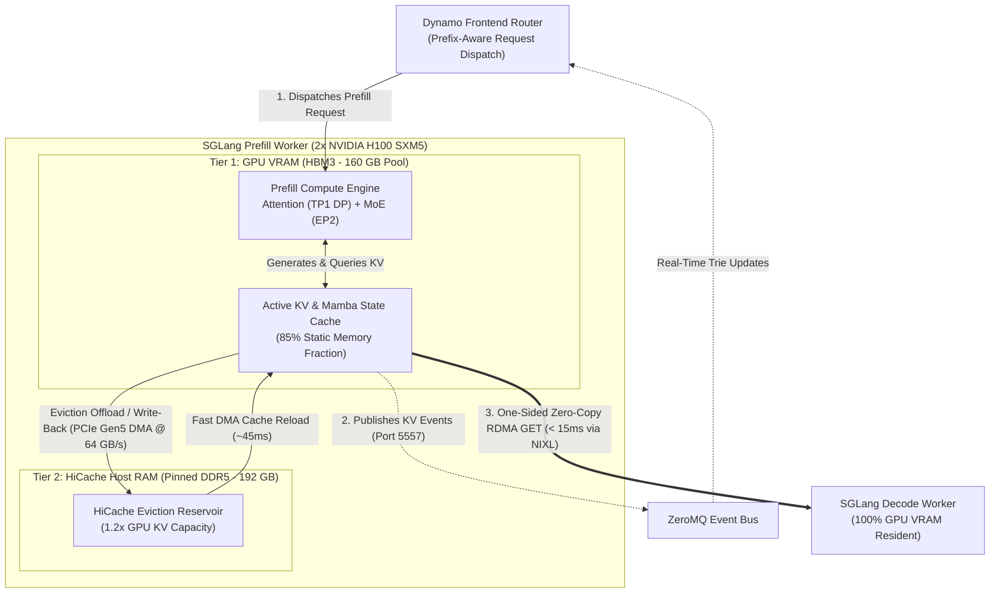
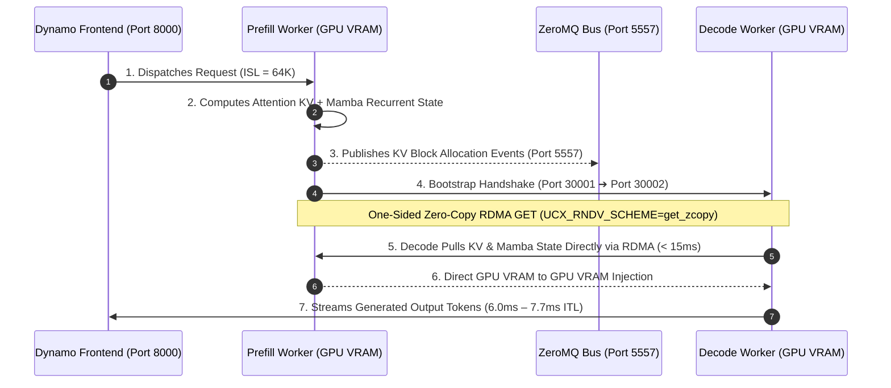
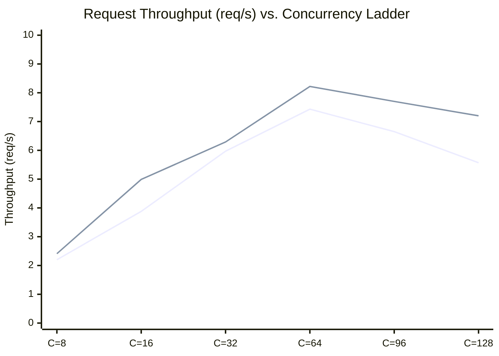

# Deploying KV-Aware Routing and Hierarchical CPU Offloading (HiCache) at Scale

KV cache offloading is one of the most interesting techniques in modern inference infrastructure—it unlocks the ability to serve significantly more concurrent users on a fixed set of GPU servers by expanding the effective prefix cache capacity into system host memory.

In this deep-dive engineering post, we compare **Baseline KV-Aware Routing** versus **Baseline + Hierarchical CPU KV Offloading (HiCache)** to examine how serving performance scales, where throughput gains emerge, and how traditional VRAM-only caching degrades over time under heavy concurrent traffic.

For this benchmark experiment, we deploy a **Disaggregated 4 Prefill + 4 Decode (4P4D)** serving topology across a dedicated **16x NVIDIA H100 GPU cluster** (2 bare-metal nodes, 8 GPUs each). Each worker runs with **2 GPUs per pod**, configured with a hybrid parallelism layout of `TP=2`, `DP=2`, and `EP=2` (effective TP=1 Data-Parallel Attention with Expert Parallelism EP=2) serving `Qwen/Qwen3.6-35B-A3B-FP8` with a full **131,072-token (~132K) context window**, within the model's native 262,144-token context window..

---

## The Goal

**The Goal:** To evaluate how **Hierarchical CPU KV Offloading (HiCache)** scales a production **Disaggregated 4P4D cluster** serving `Qwen3.6-35B-A3B-FP8` across its **131,072-token (~132K) context window**.

Specifically, we want to see what happens when you push a 16-GPU cluster to its limits:
- Does offloading to CPU memory actually keep throughput high when GPU VRAM runs out, or does it become a bottleneck?
- How much faster is fetching 64K cached tokens from system RAM compared to recalculating them on Tensor Cores?
- Can we offload aggressively on prefill workers without slowing down token generation for active users?
- How well does KV-aware routing protect cache hit rates under sustained multi-user pressure?

---

## 1. Hardware, Model & Runtime Specifications

Before diving into the architecture and manifests, here are the exact bare-metal cluster hardware, model configuration, interconnect, and runtime specifications used for this reference deployment:

| Parameter | Configuration | Details |
| :--- | :--- | :--- |
| **Model** | `Qwen/Qwen3.6-35B-A3B-FP8` | Hybrid Gated DeltaNet / Gated Attention / MoE in native FP8 (35B total, ~3B active/token) |
| **Supported Context Window** | **131,072 tokens (~132K context)** | Full enterprise context length configured via `--context-length 131072` |
| **Page Size & KV Staging** | **64 tokens per page** | Unified attention & recurrent linear state paging (`--page-size 64`) |
| **Static VRAM Allocation** | **85% GPU Memory Fraction** | `--mem-fraction-static 0.85` (~68 GB of 80 GB VRAM per GPU dedicated to KV) |
| **Hierarchical Host Memory** | **1.2x GPU KV Capacity** | Pinned DDR5 Host RAM eviction reservoir (~3.1M cached prefix tokens) |
| **Reasoning & Tool Parsing** | Native Qwen3 Reasoning + Coder | `--reasoning-parser qwen3` and `--dyn-tool-call-parser qwen3_coder` |
| **LLM Engine & Version** | **SGLang v0.5.14** | Disaggregated P/D runtime with HiCache CPU offloading |
| **Routing & Control Plane** | **NVIDIA Dynamo v1.3.0** | Prefix-aware KV router (`--router-mode kv`) with ZeroMQ telemetry |
| **Total Accelerators** | **16 × NVIDIA H100 SXM5 GPUs** | 80 GB HBM3 VRAM per GPU (1,280 GB cluster aggregate) |
| **Cluster Nodes** | 2 × Bare-Metal Worker Nodes (`gpu05`, `gpu06`) | 8 × H100 GPUs per node |
| **Worker Partitioning** | **8 Disaggregated Workers (4P4D)** | 4 Prefill Workers + 4 Decode Workers (2 GPUs per worker) |
| **Parallelism Strategy** | **TP=1 (DP-Attention) + EP=2 (MoE)** | DP Attention / LM-Head (`tp=2, dp=2, ep=2, moe-dense-tp=1`) |
| **Interconnect / State Transfer** | High-Speed RoCE RDMA Network | NVIDIA NIXL / UCX zero-copy transfer (`--disaggregation-transfer-backend nixl`) |
| **Kubernetes Platform** | Kubernetes v1.35 on Ubuntu 22.04 LTS | Managed via NVIDIA Network Operator & Dynamo CRD |

### Model Architecture & 132K Context Configuration

Serving `Qwen/Qwen3.6-35B-A3B-FP8` at scale requires tuning the inference engine to match its hybrid architecture and massive context capability:

- **Hybrid Architecture (Attention + Mamba + MoE):** `Qwen3.6-35B-A3B-FP8` is a state-of-the-art hybrid model that combines Multi-Head Self-Attention layers with Mamba Linear Recurrent SSM states (`HybridLinearKVPool`) and Sparse Mixture-of-Experts routing. Out of its 35B total parameters, only ~3B parameters are actively routed per token in native FP8 precision, delivering exceptional inference speed while drastically reducing computational overhead.
- **132K Context Window (`--context-length 131072`):** SGLang is configured with a full 131,072-token (~132K / 128K) context window, structured into **64-token pages** (`--page-size 64`). This enables the cluster to serve massive enterprise agentic workflows, long-context document synthesis, and multi-turn codebase reasoning without memory fragmentation.
- **Static Memory Fraction (`--mem-fraction-static 0.85`):** By dedicating 85% of each GPU's 80GB HBM3 VRAM (68GB per GPU, 136GB per 2-GPU pod) to the static KV and Mamba recurrent state cache pools, the engine maximizes in-GPU token residency while safely reserving 15% for dynamic forward-pass activations and CUDA kernel execution headroom.
- **Agentic Reasoning & Tool Calling Integration:** Configured with native reasoning parsing (`--reasoning-parser qwen3` and `--dyn-reasoning-parser qwen3`) to parse `<think>...</think>` reasoning tokens, alongside `--dyn-tool-call-parser qwen3_coder` to handle structured JSON function calling in multi-turn enterprise agent pipelines.

---

## 2. Deep-Dive Architecture & System Design

Let's break down the distributed serving architecture shown in the diagram below for our **16-GPU disaggregated cluster**:



### Hybrid Parallelism Strategy (TP=1 DP-Attention + EP=2 MoE)

For `Qwen3.6-35B-A3B-FP8`, standard Tensor Parallelism across attention layers introduces non-negligible all-reduce communication latency during the prefill phase. To maximize efficiency across our 2-GPU worker pods, we configure a specialized hybrid parallelism strategy combining **Data-Parallel Attention** with **Expert Parallelism ($EP=2$)**:



### Parallelism Strategy & CLI Argument Breakdown (`TP=1 Attention + EP=2 MoE`)

In SGLang, serving a hybrid MoE model like `Qwen3.6-35B-A3B-FP8` across a 2-GPU worker pod requires decoupling how dense/attention layers are parallelized from how sparse MoE expert layers are partitioned. 

Here is how the distributed flags work together under the hood:

```bash
--tp-size 2 \
--dp-size 2 \
--ep-size 2 \
--enable-dp-attention \
--enable-dp-lm-head \
--moe-dense-tp-size 1
```

The key idea behind this configuration is to cleanly separate the parallelism strategy used for dense attention layers from the one used for sparse MoE experts. Although each worker pod spans two physical GPUs, we do not want every part of the model to behave like conventional tensor parallelism.

The pod is initialized with `--tp-size 2`, which establishes a distributed process group across the two physical GPUs. On its own, this would normally cause dense model layers to be tensor-parallelized across both devices. For long-context prefill workloads, that is far from ideal: splitting attention projections across GPUs introduces synchronization points such as `all-reduce` operations throughout the forward pass, and those communication barriers become increasingly expensive when processing tens of thousands of input tokens (like our 64K prompt). 

To eliminate that bottleneck, we set **`--moe-dense-tp-size 1`**. This effectively tells the MoE runtime that the dense portion of the model should not use two-way tensor parallelism; instead, dense operations execute with a tensor-parallel degree of one (replicated on each GPU). Together with **`--enable-dp-attention`**, **`--enable-dp-lm-head`**, and **`--dp-size 2`**, the attention and LM-head paths are handled in a pure data-parallel fashion: each GPU processes its assigned tokens independently rather than repeatedly synchronizing intermediate matrix-multiplication results with its peer. This is especially valuable during large prefill phases—instead of turning the NVLink connection into a synchronization chokepoint after nearly every dense operation, both GPUs can spend 100% of their time performing useful attention computation independently.

The sparse MoE layers follow a completely different strategy. With **`--ep-size 2`**, the expert weights are distributed across the two GPUs using Expert Parallelism (EP=2). When the MoE router selects active experts for a token, that token is dispatched to whichever GPU owns the selected expert. Communication therefore happens primarily at the MoE boundaries through high-speed all-to-all token exchange over NVLink, rather than continuously stalling throughout the dense attention path.

In other words, the two GPUs play two different parallelism roles at the same time:
- For attention and other configured dense paths, they behave like independent data-parallel workers (zero `all-reduce` synchronization).
- For the sparse expert layers, they cooperate as a two-way expert-parallel team (NVLink all-to-all token exchange).

This allows the deployment to leverage the aggregate 160 GB VRAM capacity and compute power of the pod without imposing tensor-parallel synchronization on every layer of the model.

The final piece is disaggregation. With **`--disaggregation-transfer-backend nixl`**, prefill and decode workers do not need to reside in the same process or even on the same Kubernetes node. After prefill has constructed the request state required for generation, NIXL streams the full KV cache and Mamba linear recurrent states directly between disaggregated workers over high-speed RoCE RDMA via UCX.

The overall execution path flows seamlessly:

```
[Independent Dense Attention] ➔ [NVLink All-to-All Expert Dispatch] ➔ [Independent Attention / LM-Head] ➔ [Zero-Copy RDMA State Transfer via NIXL]
```

That separation is the core architectural takeaway. Rather than applying one parallelism scheme uniformly to the entire model, the runtime uses the communication pattern that best matches each part of the workload: data-parallel execution for communication-sensitive dense attention, expert parallelism for sparse MoE computation, and RDMA-backed transfer for high-throughput communication between the prefill and decode stages.
 

---

Now that we've covered the hybrid parallelism layout inside each pod, let's break down the cluster into its four core architectural components so you can see exactly how each layer is configured, interconnected, and tuned for production:

### 2.1 Component 1: Dynamo Frontend Router (Control & Routing Plane)

The **Dynamo Frontend** acts as the intelligent ingress gateway and central routing brain for the cluster. It terminates incoming client HTTP connections, parses multi-turn chat messages, continuously tracks real-time KV cache occupancy across all prefill workers via ZeroMQ, and dispatches requests based on prefix cache affinity.

> [!WARNING]
> #### One Critical Advice: Know Your Workload & Scale Your Frontend
> Know your workload when sizing your frontend setup. We faced router crashes far more than GPU engine crashes because if the frontend can't withstand the incoming traffic, it simply crashes and causes bad behavior across the entire cluster.
> 
> If you are handling large-context workloads at scale, make sure you scale your frontend replicas properly so you have smooth sailing without interrupting your workflow.


#### Frontend YAML Configuration Snippet (`deploy-kv-offloading.yaml`)

```yaml
    Frontend:
      componentType: frontend
      volumeMounts:
        - name: model-cache
          mountPoint: /opt/models
      extraPodSpec:
        mainContainer:
          image: nvcr.io/nvidia/ai-dynamo/sglang-runtime:1.3.0
          command: [python3, -m, dynamo.frontend]
          args:
            - --router-mode
            - kv
            - --router-host-cache-hit-weight
            - "0.75"
      envs:
        - name: HF_HOME
          value: /opt/models
      replicas: 6
      resources:
        requests: { cpu: "16", memory: 64Gi }
        limits: { cpu: "32", memory: 128Gi }
```
#### How KV-Aware Routing Works

Instead of blind round-robin scheduling, the Dynamo frontend matches incoming prompt tokens against an in-memory Radix Prefix Trie built from real-time ZeroMQ cache events (port `5557`). Configuring **`--router-mode kv`** activates cache-aware routing, while **`--router-host-cache-hit-weight 0.75`** scores host-memory resident prefixes at $75\%$ affinity relative to GPU VRAM matches ($1.0$). This scoring prioritizes workers with GPU-resident KV blocks first, followed by workers capable of fast sub-50ms PCIe DMA reloads from HiCache DDR5 RAM, over cold prompt recomputation. The router evaluates candidate worker affinity in $< 1.5\text{ ms}$ and dispatches the request to the highest-scoring prefill worker—for example, matching 48,000 tokens of a 64K prompt immediately skips $75\%$ of the prefill compute and slashes Time-to-First-Token (TTFT) from $4.5\text{s}$ down to under $850\text{ ms}$. Sizing the routing tier to **`replicas: 6`** ensures high-throughput trie lookups and concurrent token streaming without introducing frontend bottlenecks.

---

### 2.2 Component 2: SGLang Prefill Workers with HiCache (Compute & Cache Tier)

The **Prefill Worker** handles initial prompt tokenization, self-attention computation, linear recurrent state updates, and hierarchical KV caching across GPU HBM and CPU host RAM.


 

Under heavy concurrency (64+ concurrent requests), GPU VRAM alone cannot hold the working set of multiple 64K prefix groups. SGLang's **HiCache** engine creates a seamless two-tier memory hierarchy where Tier 1 (GPU HBM3) serves active prefill kernels and Tier 2 (Pinned DDR5 Host RAM) acts as a high-capacity eviction reservoir sized at 1.2x the GPU KV capacity. Under the **`write_back`** policy, newly generated KV blocks remain exclusively in GPU VRAM during active computation, keeping PCIe bandwidth completely free for prefill kernels. Only when GPU memory reaches capacity pressure are evicted blocks written back across PCIe Gen5 DMA into pinned host RAM. Subsequent requests that match evicted prefixes reload the cached blocks over PCIe Gen5 DMA in ~45 ms—over 40x faster than recomputing 64K tokens on Tensor Cores (1.5s to 3.0s).

#### Prefill Worker YAML Configuration Snippet (`deploy-kv-offloading.yaml`)

```yaml
    SglangPrefillWorker:
      componentType: worker
      subComponentType: prefill
      replicas: 4
      sharedMemory: { size: 80Gi }
      extraPodMetadata:
        annotations: { k8s.v1.cni.cncf.io/networks: qwen-roce }
      extraPodSpec:
        nodeSelector: { qwen.nvidia.com/role: prefill }
        mainContainer:
          image: nvcr.io/nvidia/ai-dynamo/sglang-runtime:1.3.0
          command: [/bin/sh, -c]
          args:
            - |
              set -e
              ulimit -l unlimited
              exec python3 -m dynamo.sglang \
                --model-path "$MODEL_PATH" \
                --served-model-name "$SERVED_MODEL_NAME" \
                --tp-size 2 --dp-size 2 --ep-size 2 \
                --enable-dp-attention --enable-dp-lm-head --moe-dense-tp-size 1 \
                --context-length 131072 --page-size 64 --mem-fraction-static 0.85 \
                --reasoning-parser qwen3 --dyn-reasoning-parser qwen3 --dyn-tool-call-parser qwen3_coder \
                --disaggregation-mode prefill --disaggregation-transfer-backend nixl \
                --disaggregation-bootstrap-port 30001 --host 0.0.0.0 --enable-cache-report \
                --enable-hierarchical-cache \
                --hicache-ratio 1.2 \
                --hicache-write-policy write_back \
                --hicache-mem-layout page_first_direct \
                --hicache-io-backend direct \
                --kv-events-config '{"publisher":"zmq","topic":"kv-events","endpoint":"tcp://*:5557"}' \
                --enable-metrics
```

#### Parameter Breakdown & Mechanics

Setting **`--disaggregation-mode prefill`** and **`--disaggregation-transfer-backend nixl`** designates these worker pods exclusively for prompt tokenization and attention computation. Once prefill completes—whether from GPU VRAM or reloaded host memory—the full KV cache and Mamba linear recurrent states are transferred directly across worker pods over high-speed RDMA via NIXL/UCX. Disaggregation handshakes are coordinated on **`--disaggregation-bootstrap-port 30001`**, while **`--enable-cache-report`** and **`--enable-metrics`** export live cache occupancy and SGLang performance metrics (TTFT, ITL, queue depth) on port 9090.

In this prefill worker manifest, **`--enable-hierarchical-cache`** activates SGLang's multi-tier storage subsystem, while **`--hicache-ratio 1.2`** allocates a pinned DDR5 host RAM cache sized at 1.2x the GPU KV cache capacity per rank, expanding total prefix storage capacity by 220%. Setting **`--hicache-write-policy write_back`** optimizes PCIe interconnect efficiency by keeping newly computed KV blocks strictly in GPU VRAM during active token computation. This eliminates PCIe bus contention during prompt execution, deferring host memory transfers until GPU VRAM reaches capacity limits and eviction is triggered.

> [!WARNING]
> #### HiCache Policy Takeaway: Avoid `write_through` for Standard Workloads
> Be cautious when using **`--hicache-write-policy write_through`**. Unless you explicitly need to stream every generated KV page into host memory, it causes heavy CPU churn and unnecessary host-page evictions. For most production workloads, safer and far more performant choices are **`write_back`** (which delays host writes until GPU cache eviction) or **`write_selective`**.

To ensure seamless compatibility with Qwen3.6's hybrid architecture, **`--hicache-mem-layout page_first_direct`** structures host memory buffers to store both multi-head attention KV tensors and recurrent linear states (`MambaPoolHost`) in unified page layouts. Paired with **`--hicache-io-backend direct`**, the engine bypasses intermediate CPU memory staging and drives direct PCIe Gen5 DMA transfers between GPU HBM3 and pinned host RAM at 64 GB/s, enabling evicted context blocks to reload in ~45 ms.

Finally, **`--kv-events-config`** streams real-time block allocation and eviction notifications over ZeroMQ to the Dynamo frontend on port 5557. This continuous telemetry loop ensures the frontend router's in-memory Radix Prefix Trie remains perfectly synchronized with actual GPU VRAM and host RAM cache residency across all prefill workers.

---

### 2.3 Component 3: Inter-Worker State Transfer Layer (NIXL over RDMA)

In a disaggregated Prefill/Decode architecture, prefill workers compute prompt activations but do not generate tokens. The completed state must be handed off to decode workers instantly with zero CPU overhead.



#### Port Architecture & Inter-Worker Communication Map

Port allocation and channel isolation are critical architectural decisions when orchestrating disaggregated inference at scale. With multiple control planes, ZeroMQ cache event streams, inter-worker bootstrap handshakes, and high-frequency telemetry scrapers operating concurrently across prefill and decode pods, maintaining an explicit port topology is essential to prevent network contention, socket exhaustion, and painful debugging during cluster operations.

To coordinate request routing, KV state hand-off, and distributed observability across the cluster, our deployment binds specific communication channels to dedicated endpoints:

| Port | Protocol / Transport | Source Component | Target Component | Purpose & Mechanics |
| :---: | :--- | :--- | :--- | :--- |
| **`8000`** | HTTP / REST | Client / AIPerf | Dynamo Frontend | Public API gateway terminating `/v1/chat/completions`. |
| **`5557`** | ZeroMQ (TCP) | Prefill Workers | Dynamo Frontend | Streams real-time KV cache block allocation and eviction events. |
| **`30001`** | TCP / SGLang Control | Dynamo Router | Prefill Workers | Prefill worker disaggregation bootstrap and control port (`--disaggregation-bootstrap-port 30001`). |
| **`30002`** | TCP / SGLang Control | Prefill Workers | Decode Workers | Decode worker disaggregation bootstrap port (`--disaggregation-bootstrap-port 30002`) where workers exchange GPU memory keys. |
| **RDMA** | Zero-Copy InfiniBand / RoCE | Decode Workers | Prefill Workers | Direct one-sided **RDMA GET** pulling KV and Mamba tensors GPU-to-GPU (`UCX_NET_DEVICES=mlx5_8:1`). |
| **`19090`** | HTTP / Prometheus | Prometheus Scraper | All Workers | NIXL state transfer telemetry (`agent_tx_bytes`, `agent_xfer_time`, `agent_errors`). |
| **`9090`** | HTTP / Prometheus | Prometheus Scraper | All Workers | SGLang system metrics (TTFT, ITL, queue depth, cache hits). |

---


#### State Transfer Environment Configuration Snippet (`worker-env`)

```yaml
          env: &worker-env
            - name: SGLANG_DISAGGREGATION_NIXL_BACKEND
              value: UCX
            - name: UCX_TLS
              value: rc_x,rc,cuda_copy,cuda_ipc
            - name: UCX_NET_DEVICES
              value: mlx5_8:1
            - name: UCX_IB_ADDR_TYPE
              value: eth
            - name: UCX_RNDV_SCHEME
              value: get_zcopy
            - name: UCX_RNDV_THRESH
              value: "0"
            - name: UCX_IB_REG_METHODS
              value: odp,rcache
            - name: NIXL_TELEMETRY_ENABLE
              value: "y"
            - name: NIXL_TELEMETRY_PROMETHEUS_PORT
              value: "19090"
```

#### How the Decode Worker "Pulls" State (Step-by-Step)

Here is the exact step-by-step sequence of how the decode worker pulls prompt state across pods with zero CPU overhead:

1. **Bootstrap Coordination (Port 30001 -> 30002):** Once the prefill worker finishes prompt tokenization and attention computation, it connects to the assigned decode worker over the bootstrap channel (`--disaggregation-bootstrap-port 30002`) to exchange remote GPU memory buffer addresses and cryptographic registration keys.
2. **One-Sided RDMA GET Execution:** Instead of having the prefill worker push data through CPU memory, the decode worker fires a **one-sided RDMA GET** directly from the prefill worker's GPU VRAM (`UCX_RNDV_SCHEME=get_zcopy` and `UCX_RNDV_THRESH=0`).
3. **Dual State Injection:** Both the self-attention KV blocks and the recurrent Mamba linear states (`HybridLinearKVPool`) are pulled simultaneously over the dedicated RoCE RDMA network interface (`mlx5_8:1`).
4. **Sub-15ms Hand-off to Token Generation:** The full 64K context state lands directly in the decode GPU's VRAM in **under 15 ms**, allowing the decode worker to immediately start generating tokens with zero pipeline bubbles.

#### Key Transport Parameters & Disaggregation Flags Explained

On the engine CLI side, **`--disaggregation-transfer-backend nixl`** designates NVIDIA's NIXL library as the high-throughput transport engine for transferring KV cache and recurrent Mamba linear states across pods. Disaggregation bootstrap coordination is established by binding dedicated ports: **`--disaggregation-bootstrap-port 30001`** on prefill workers and **`--disaggregation-bootstrap-port 30002`** on decode workers, allowing worker pods to exchange GPU memory addresses and cryptographic registration keys before firing RDMA transfers. We also enable **`--enable-cache-report`** for fine-grained prefix cache occupancy telemetry and **`--enable-metrics`** to export SGLang operational metrics (TTFT, ITL, queue depths) on port 9090.

For transport-level tuning, a few of our environment variables already have default values and technically don't need to be set, but I set them explicitly anyway so we know exactly what is happening under the hood and can easily analyze and fine-tune the transfer path.

To achieve direct GPU-to-GPU state transfers without CPU bottlenecks, our environment configuration tunes UCX and NIXL specifically for RoCE networking. Setting **`UCX_TLS rc_x,rc,cuda_copy,cuda_ipc`** instructs UCX to use CUDA IPC for intra-node GPU transfers and RDMA Reliable Connection (RC) for high-speed cross-node transfers over the dedicated RoCE network interface **`UCX_NET_DEVICES mlx5_8:1`** with Ethernet encapsulation (**`UCX_IB_ADDR_TYPE eth`**).

To guarantee zero-copy performance, **`UCX_RNDV_SCHEME get_zcopy`** combined with **`UCX_RNDV_THRESH 0`** forces zero-copy RDMA GET operations for all payload sizes, bypassing host CPU RAM entirely. Memory registration overhead is eliminated using **`UCX_IB_REG_METHODS odp,rcache`**, which enables On-Demand Paging and memory caching so large KV pools transfer without dynamic page-locking delays.

Finally, setting **`NIXL_TELEMETRY_ENABLE y`** and **`NIXL_TELEMETRY_PROMETHEUS_PORT 19090`** exposes live transfer throughput, transfer time, and error metrics directly to our Prometheus monitoring stack using Grafana! We will see the detailed NIXL transfer dashboard in the later section.

---

### 2.4 Component 4: SGLang Decode Workers (Autoregressive Generation Engine)

The **Decode Worker** is dedicated exclusively to token-by-token autoregressive generation, pulling live KV and GDN recurrent linear state directly from prefill workers via NIXL RDMA and streaming generated tokens back to the Dynamo frontend.

#### Why We Focused Offloading on Prefill Alone (Decode Offloading Disabled)

In our deployment, decode workers do not enable hierarchical caching (`--enable-hierarchical-cache`) or decode offloading (`--disaggregation-decode-enable-offload-kvcache`), remaining 100% resident in GPU VRAM. Because our benchmark and production traffic are heavily **prefill-dominated**—processing massive 64K prompts with repeated multi-turn prefix reuse—the primary cost and compute bottleneck lies in prompt evaluation. Concentrating DDR5 host offloading entirely on the prefill tier maximizes prefix cache hits where it matters most, without adding unnecessary host memory traffic to the generation loop.

Keeping decode workers fully VRAM-resident also guarantees **zero-jitter token generation**, ensuring inter-token latency (ITL / TPOT) stays locked between 6.0ms and 7.7ms without PCIe bus contention. Furthermore, Qwen3.6's hybrid architecture maintains recurrent linear states (`HybridLinearKVPool`) that require continuous register-level updates at every token step. SGLang keeps these states strictly on-device, making full GPU VRAM residency both the architectural requirement and the most performant choice.

#### Decode Worker YAML Configuration Snippet (`deploy-kv-offloading.yaml`)

```yaml
    SglangDecodeWorker:
      componentType: worker
      subComponentType: decode
      replicas: 4
      sharedMemory: { size: 80Gi }
      extraPodMetadata:
        annotations: { k8s.v1.cni.cncf.io/networks: qwen-roce }
      extraPodSpec:
        nodeSelector: { qwen.nvidia.com/role: decode }
        mainContainer:
          image: nvcr.io/nvidia/ai-dynamo/sglang-runtime:1.3.0
          command: [/bin/sh, -c]
          args:
            - |
              set -e
              ulimit -l unlimited
              exec python3 -m dynamo.sglang \
                --model-path "$MODEL_PATH" \
                --served-model-name "$SERVED_MODEL_NAME" \
                --tp-size 2 --dp-size 2 --ep-size 2 \
                --enable-dp-attention --enable-dp-lm-head --moe-dense-tp-size 1 \
                --context-length 131072 --page-size 64 --mem-fraction-static 0.85 \
                --reasoning-parser qwen3 --dyn-reasoning-parser qwen3 --dyn-tool-call-parser qwen3_coder \
                --disaggregation-mode decode --disaggregation-transfer-backend nixl \
                --disaggregation-bootstrap-port 30002 --host 0.0.0.0 --enable-cache-report \
                --enable-metrics
```

#### Parameter Breakdown & Mechanics

Decode workers explicitly mirror the prefill worker's hybrid parallelism topology (`TP=1 DP-Attention + EP=2 MoE`) to ensure that RDMA-transferred KV pools and recurrent Mamba linear states land directly into matching GPU ranks with zero tensor re-sharding or gather overhead across NVLink. Maintaining identical memory parameters (`--context-length 131072`, `--page-size 64`, and `--mem-fraction-static 0.85`) ensures that decode page buffers align 1:1 with prefill allocations, preventing memory fragmentation or block translation penalties during long-context token generation.

Additionally, binding the decode control plane to **`--disaggregation-bootstrap-port 30002`** separates inbound decode handshakes from prefill routing traffic, enabling instant key exchange so autoregressive kernels fire immediately upon transfer completion.

---

## 3. Production Manifests & Deployment

For the complete Kubernetes manifests and preflight validation checks, refer to the verified recipe files checked into the repository:
- **Baseline KV-Aware Manifest:** [`deploy.yaml`](https://github.com/Prasannajaga/deployment-guide/blob/main/models/qwen3.6-35B-A3B/sglang/disagg/tp1-ep2-4p4d/deploy.yaml) — Disaggregated 4P4D serving with TP1-attention + EP2 and ZeroMQ KV cache event streaming.
- **HiCache Offloading Manifest:** [`deploy-kv-offloading.yaml`](https://github.com/Prasannajaga/deployment-guide/blob/main/models/qwen3.6-35B-A3B/sglang/disagg/tp1-ep2-4p4d/deploy-kv-offloading.yaml) — Adds prefill-only CPU KV offloading (`--enable-hierarchical-cache --hicache-ratio 1.2`).
- **Complete Runbook & Preflight Canary:** [`README.md`](https://github.com/Prasannajaga/deployment-guide/blob/main/models/qwen3.6-35B-A3B/sglang/disagg/tp1-ep2-4p4d/README.md) and [`preflight.md`](https://github.com/Prasannajaga/deployment-guide/blob/main/models/qwen3.6-35B-A3B/sglang/disagg/tp1-ep2-4p4d/preflight.md).

### High-Level Deployment & Teardown

```bash
# 1. Setup workspace variables
export NAMESPACE=qwen32-bench
export EXP_DIR=/ephemeral/shared/qwen3.6-35b-a3b/sglang/disagg/tp1-ep2-4p4d
export DEPLOYMENT=q36-sgl-pd-tp1ep2-4p4d-kv-offload
export GRAPH_LABEL="nvidia.com/dynamo-graph-deployment-name=${DEPLOYMENT}"

# 2. Deploy HiCache serving topology (4 Prefill + 4 Decode workers across 16 GPUs)
kubectl apply -n "$NAMESPACE" -f "$EXP_DIR/deploy-kv-offloading.yaml"

# 3. Monitor rollout & ZeroMQ KV cache event streaming
kubectl get pods -n "$NAMESPACE" -l "$GRAPH_LABEL" -o wide -w

# 4. Teardown & release cluster resources
kubectl delete dynamographdeployment.nvidia.com "$DEPLOYMENT" \
  -n "$NAMESPACE" --wait=true --ignore-not-found
```

---

## 4. Benchmarking & Performance Analysis (Baseline vs. HiCache Offloading)

To evaluate real-world serving performance under sustained 
high-concurrency demand, we execute rigorous performance benchmarks using AIPerf against the cluster ingress endpoint:

- **Model & Tokenizer:** `Qwen/Qwen3.6-35B-A3B-FP8` using the official tokenizer snapshot
- **Input Sequence Length (ISL):** 64,536 tokens (~64K) in fixed mode (`workload_mode: fixed`)
- **Output Sequence Length (OSL):** 256 generated tokens (`min_tokens=256, max_tokens=256, ignore_eos=true`)
- **Shared Prefix Working Set:** 64 distinct prefix groups with 75% target prefix reuse (48,402 shared tokens/group x 64 = **3.10 Million** shared prefix tokens)
- **Concurrency Load Ladder:** C = 8, 16, 32, 64, 96, 128 concurrent client streams
- **Execution Window & Controls:** 300 seconds steady-state duration per concurrency level with 16 warmup requests, deterministic seed (`random_seed: 42`), and 3,600s request timeout ceiling

#### Workload & Memory Footprint Analysis

This is a **prefill-heavy experiment** (64K prompt vs. 256 decode tokens, a ~252:1 input-to-output ratio) specifically engineered to stress prefill compute and memory hierarchy limits under multi-turn enterprise agent workloads. For every request, 48,402 tokens (75% of the 64,536-token prompt) belong to a shared group prefix, while the remaining 16,134 tokens represent unique per-turn user context. Across all 64 distinct groups, this creates an active shared prefix working set of **3.10 Million tokens**.

Evaluating this scale is crucial because 3.10M tokens intentionally exceeds the physical GPU VRAM cache capacity of the 4 prefill worker pods (~1.3M tokens in HBM across 8 H100 GPUs). Testing across the concurrency ladder (C = 8 to 128) allows us to evaluate cluster stability under increasing memory pressure, observe when VRAM-only cache eviction occurs, and measure how effectively hierarchical offloading preserves throughput when working sets outgrow GPU memory.

---

### Concurrency 128 Performance Breakdown Analysis

<p align="center">
  
  <br />
  <sub><b>Figure 2:</b> Empirical performance breakdown at Concurrency 128 comparing Baseline VRAM-only serving against HiCache CPU KV Offloading across throughput, TTFT tail latency, token generation speed, and end-to-end turnaround time.</sub>
</p>

The side-by-side performance breakdown at peak concurrency (C=128) highlights how hierarchical host RAM caching fundamentally transforms cluster behavior when GPU memory runs out:

#### 1. Throughput Scaling & Eliminating the High-Concurrency Cliff
At peak concurrency (C=128), baseline VRAM-only serving hits a severe memory wall and collapses due to cache thrashing, delivering only **1,425 tokens/s** (5.57 req/s). With HiCache offloading enabled, output token throughput jumps to **1,843 tokens/s** and request rate climbs to **7.20 req/s**—a massive **+29.3% throughput boost** across both metrics. By using pinned DDR5 host RAM as a secondary cache tier, HiCache stops workers from falling into expensive 64K prefill recomputations, allowing the 16-GPU cluster to finish **2,471 completed requests** in 5 minutes compared to 1,973 on baseline (+498 more completed workflows).

#### 2. Slashing Tail Time-to-First-Token (P99 TTFT)
Under extreme saturation, the baseline setup suffers heavy queue stalls because prefill workers are constantly busy recalculating evicted 64K-token contexts, blowing out P99 TTFT to **63.72 seconds** (63,725 ms). With HiCache active, P99 TTFT drops down to **49.96 seconds** (49,955 ms)—making it **21.6% faster** and shaving **13.76 seconds** off worst-case initial response latency. Fetching cached KV tensors from host RAM over PCIe Gen5 DMA takes only **~45 ms**, compared to burning over 2 seconds of GPU Tensor Core compute to recompute the same prefix from scratch.

#### 3. Autoregressive Decode Isolation (P99 TPOT & ITL)
One of the biggest concerns with offloading is whether host RAM traffic slows down token generation. The benchmark results prove that decode speed remains rock-solid: P99 Time Per Output Token (TPOT) is **11.78 ms** on baseline vs. **13.09 ms** on HiCache, while P99 Inter-Token Latency (ITL) is **9.08 ms** vs. **9.95 ms** (under 1 ms difference). Because offloading is strictly confined to prefill workers while decode workers stay 100% GPU VRAM resident, the PCIe bus and memory bandwidth on decode workers stay completely free from contention during token generation.

#### 4. End-to-End Workflow Latency (P99 E2E)
Thanks to the massive prefill speedups, overall workflow turnaround improves drastically. At C=128, P99 End-to-End request latency drops from **65.17 seconds** (65,167 ms) on baseline down to **51.85 seconds** (51,852 ms) with HiCache—delivering a **20.4% speedup** (saving **13.32 seconds** per completed request). This gives enterprise agentic workflows much faster end-to-end completion without sacrificing per-token generation speed.

---

### Aggregate Benchmark Comparison & Cache Dynamics



| Metric Category | Baseline (GPU VRAM Only) | + HiCache CPU Offloading | Impact (+/- %) | Performance Behavior |
| :--- | :--- | :--- | :--- | :--- |
| **Throughput @ High Load (C=128)** | 5.57 req/s (1,425 tok/s) | **7.20 req/s (1,843 tok/s)** | **+29.3%** | **Eliminates High-Concurrency Performance Cliff** |
| **P95 Tail TTFT (@ C=16)** | 10.94 s | **6.12 s** | **-44.1%** | **4.82s Faster Initial Response under Load** |
| **P99 Tail TTFT (@ C=128)** | 63.72 s | **49.96 s** | **-21.6%** | **13.76s Tail Latency Reduction under Extreme Saturation** |
| **Cache Hit Rate (@ C=128)** | 54.4% (Eviction Collapse) | **67.7% (Resilient)** | **+13.3%** | **Pinned DDR5 RAM Tier Absorbs Eviction Pressure** |
| **Inter-Token Latency (ITL / TPOT)** | 7.02 ms (P50) / 9.08 ms (P99) | **7.59 ms (P50) / 9.95 ms (P99)** | ~0 ms | **Rock-Solid Decode Speed (100% VRAM Resident)** |
| **5-Min Completed Requests (C=128)** | 1,973 requests | **2,471 requests** | **+498 reqs** | **+25.2% More Completed Workflows** |

#### Cache Hit Rate Stability

The core driver behind throughput scaling across the concurrency ladder is **cache hit rate resilience**:

At high concurrency (C=96 to 128), the active working set overflows GPU VRAM, forcing continuous LRU evictions. In baseline serving, cache hit rates collapse from 77.0% down to **54.4%**, triggering costly 64K prefill recalculations on Tensor Cores that drop throughput by **25.0%**. 

HiCache offloading prevents this collapse by buffering evicted blocks in pinned host DDR5 RAM and reloading them over PCIe Gen5 DMA in **~45 ms**. This preserves a steady **67.7% cache hit rate** (+13.3% higher), completely eliminating the high-concurrency cliff and sustaining **7.20 req/s** under peak load.

---


### NIXL & HiCache Runtime Telemetry (Grafana Deep-Dive)

When deploying Prefill/Decode disaggregation with hierarchical offloading in production, monitoring real-time KV cache transfer latency and host memory saturation in Grafana is essential. In a disaggregated topology, any latency in transferring KV tensors from prefill pods to decode pods directly delays generation, while poor host memory utilization can lead to unexpected cache evictions.

The dashboard below captures the internal network and memory telemetry during our 4P4D benchmark run:

<p align="center">
  
  <br />
  <sub><b>Figure 3:</b> Real-time Grafana telemetry showing NIXL RDMA transfer performance (transmitted bytes, latency, throughput) alongside CPU HiCache token utilization across the 4 prefill worker pods.</sub>
</p>

Analyzing these panels provides direct visibility into how NIXL and HiCache operate harmoniously under heavy multi-agent concurrency:

#### 1. Zero-Copy RDMA KV Transfer Performance (NIXL)

In disaggregated serving, prefill workers calculate intermediate attention states and immediately stream them over the high-speed RDMA network directly into decode GPU memory. The telemetry confirms that network handoffs remain exceptionally fast and resilient under load:

- **Sub-20ms Transfer Latency:** After initial warmup, the **NIXL Average Transfer Time** settles into a tight **15 ms to 20 ms** window per request. Moving massive 64K-token KV caches and GDN recurrent linear state nodes in under 20 ms ensures decode workers fire autoregressive kernels almost instantly upon prefill completion.
- **High-Throughput State Streaming:** Total **NIXL Transmitted Bytes** climbs steadily past **2.50 TiB** across the test suite, with **NIXL Transfer Requests** sustaining burst transfer rates of **10 to 12 req/s** with zero packet drops or network queue buildup.

This confirms that NIXL's one-sided UCX memory registration completely prevents network transfer bottlenecks, even when all 4 prefill workers are simultaneously streaming KV tensors across the cluster.

#### 2. Host RAM Saturation & Working Set Absorption (HiCache)

Tracking token residency in host memory proves whether HiCache is actively shielding GPU memory or sitting idle. The Grafana telemetry reveals that the host tier behaves exactly as designed:

- **Exact Working Set Absorption:** The **CPU HiCache Used Tokens** panel shows token count ramping quickly during the first 10 minutes and plateauing right at **~3.1 Million tokens** across the 4 prefill workers—perfectly absorbing our 3.10M-token shared prefix working set.
- **Near-100% Host RAM Efficiency:** The gauge meters show **99.7% to 100.0% CPU HiCache Utilization** across all 4 prefill pods (`m9lfx`, `lrrsb`, `vq9q6`, and `j5qpb`), with **CPU HiCache Remaining Tokens** dropping down to just **832 to 7.87K tokens**.

This saturation confirms that the pinned DDR5 host RAM tier operates at maximum efficiency. By holding the overflow prefix working set in host memory, HiCache prevents GPU VRAM from thrashing and keeps prefill compute pipelines fully loaded without leaving host memory capacity wasted.

---

## 5. Conclusion  

This reference deployment proves that **Disaggregated 4P4D Serving with HiCache CPU KV Offloading** fundamentally resolves the memory capacity bottleneck of long-context LLM serving.

One of the biggest bottlenecks in distributed inference is managing massive KV caches across workers. When precious GPU High-Bandwidth Memory (HBM) is tied up purely storing static KV blocks, it starves active compute batching—leaving expensive Tensor Cores sitting idle while waiting on memory capacity. By leveraging host DDR5 RAM as a seamless secondary cache reservoir, prefill workers gain the headroom needed to fit significantly more concurrent long-context requests on the exact same cluster setup without leaving compute underutilized.

Coupling this hierarchical memory tier with Dynamo's prefix-aware routing and NIXL's zero-copy RDMA state transfer enables infrastructure teams to:

- **Eliminate Concurrency Cliffs:** Boost peak throughput by **+29.3%** at C=128 by preventing VRAM eviction collapse.
- **Slash Tail Latency:** Cut P95 TTFT by **44.1%** under load and shave **13.76s** off P99 response times via ~45 ms PCIe DMA reloads.
- **Protect Decode Speed:** Maintain rock-solid inter-token latency (<10 ms P99 ITL) with 100% VRAM-resident decode workers.
- **Expand Capacity at Zero GPU Cost:** Double effective prefix cache capacity (3.10M+ tokens) on existing hardware.

I promised that I’d bring production-scale inference benchmarks to this series, and here we go—we made it! Starting this journey alone and gaining so many incredible friends across the AI inference community has been such a blessing. When I first started this series, I had no idea how I was going to get access to a cluster, but here we are with **16 × NVIDIA H100 GPUs** to experiment across various architectures, models, and techniques. NGL, feeling fucking awesome!

What I've learned through all of this: if you just trust the process and keep grinding towards the things you genuinely love, what you're working for will find you and reward you. Never give up. I'm still working hard to land a full-time role, but I'm trusting the process, giving it my all, and staying optimistic that things will fall into place.

A massive thank you to **@TheZachMueller** and **@LambdaAPI** once again for their incredible support and generous compute grant—none of this deep-dive research would have been possible without them. It means the world, guys!

For the next technical write-up, I'll be diving deep into how tensor parallelism can unexpectedly hurt overall throughput and performance, and how to work around it. Really looking forward to what's next.

Thanks for reading until the end! 🙏
 

## 6. Sources & References

Below are official specifications, runtime repositories, and architectural references for this recipe:

### Official Architecture & Runtime Docs
- **SGLang Documentation & Hierarchical Caching:** [SGLang HiCache Architecture](https://sgl-project.github.io/)
- **NVIDIA Dynamo Platform:** [Dynamo Graph Deployment & KV-Aware Routing](https://github.com/NVIDIA/ai-dynamo)
- **NVIDIA NIXL State Transfer:** [NIXL UCX Backend Specifications](https://github.com/NVIDIA/nixl)

### Verified Recipe Manifests & Benchmarks
- **Baseline Deployment Manifest:** [`deploy.yaml`](https://github.com/Prasannajaga/deployment-guide/blob/main/models/qwen3.6-35B-A3B/sglang/disagg/tp1-ep2-4p4d/deploy.yaml)
- **HiCache Offload Deployment Manifest:** [`deploy-kv-offloading.yaml`](https://github.com/Prasannajaga/deployment-guide/blob/main/models/qwen3.6-35B-A3B/sglang/disagg/tp1-ep2-4p4d/deploy-kv-offloading.yaml)
- **AIPerf Benchmark Results & Analysis:** [`benchmark.md`](https://github.com/Prasannajaga/deployment-guide/blob/main/models/qwen3.6-35B-A3B/sglang/disagg/tp1-ep2-4p4d/benchmark.md)
- **Step-by-Step Cluster Runbook:** [`README.md`](https://github.com/Prasannajaga/deployment-guide/blob/main/models/qwen3.6-35B-A3B/sglang/disagg/tp1-ep2-4p4d/README.md)
