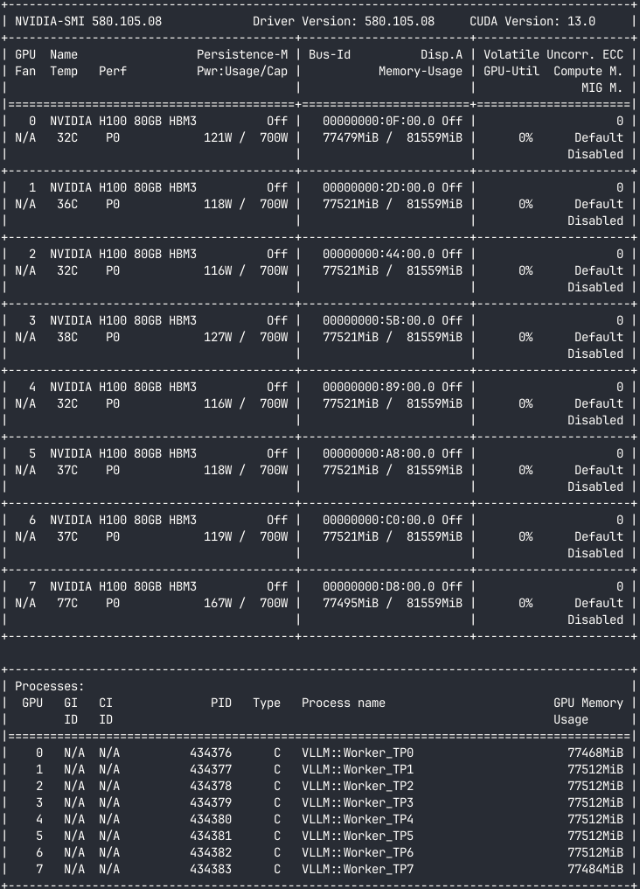

# Cluster Progress & Model Benchmarks

## Llama 8B (`meta-llama/Llama-3.1-8B-Instruct`)

I started off with the baseline deployment of Llama 8B using **TP=16** stretched across both nodes (`gpu05` and `gpu06`). While it worked to validate our multi-node setup and network connectivity.

it was pretty messy each node ended up occupying roughly 95% of its GPU VRAM (~76GB/80GB), and inter-node network communication became a bottleneck for every single layer!



### **TP=16 (Baseline):** Runs 1 single model instance across 16 GPUs

**Weight Distribution:** Llama 8B in FP16 precision takes ~16GB of total model weights. At TP=16, these weights are sharded across 16 GPUs, so **each individual GPU holds only ~1GB of model weights!** The rest of the 76GB+ VRAM allocated per GPU (as shown in the `nvidia-smi` output above) is pre-allocated by vLLM for KV cache and execution buffers.

  Because each GPU does tiny 1GB math operations, GPU computation finishes in microseconds while inter-node network communication between `gpu05` and `gpu06` stalls every transformer layer.

For a smaller model like 8B, scaling down to lower TP sizes (such as TP=8 for 2 single-node replicas on local NVLink, or TP=4 / TP=2 / TP=1 for multi-replica serving) would eliminate inter-node network communication and yield significantly higher request throughput. However, since we aren't experimenting further or benchmarking Llama 8B, we won't be deploying these lower TP configurations.

I'm not trying to play around with this model with higher throughput. I've done this only to test and verify that multi-node TP deployment is working properly with our current setup here, so we focus on the bigger models now!

## GLM-5.2 (FP8)

Evaluating feasibility for GLM-5.2 FP8 (~744–750 GB model weights) on our 16× H100 80GB cluster (1,280 GB total VRAM):

**Aggregated TP16 (1 Model Copy across 16 GPUs) — Feasible**  
Running a single model copy across all 16 GPUs works because the ~744 GB model weights split to roughly 46.5 GB per GPU (~744 GB total). This leaves about 530 GB of gross VRAM across the cluster for KV cache and runtime execution buffers.

**Disaggregated Prefill + Decode (8 H100 Prefill + 8 H100 Decode) — Not Feasible**  
Disaggregated P/D requires two complete model copies (one for prefill and one for decode), totaling ~1,488 GB in weights alone—which exceeds our cluster's 1,280 GB total VRAM. Additionally, an 8× H100 node only has 640 GB VRAM, but one copy requires ~744 GB (~93 GB/GPU), so an 8-GPU group cannot hold the model. This is why NVIDIA's reference P/D recipes target H200 nodes (141GB VRAM per GPU).

## Qwen3-32B-FP8: RDMA/NIXL backend incident

The Qwen disaggregated vLLM deployment encountered two separate RDMA
problems. The first prevented Kubernetes from advertising an RDMA resource.
The second allowed the Pod to open the RDMA device, but prevented UCX from
constructing a usable RoCE network path. Both had to be fixed before NIXL
could initialize.

### 1. Kubernetes initially advertised no `rdma/ib` resource

The following command showed eight GPUs but an empty RDMA allocation on the
nodes:

```bash
kubectl get nodes -o jsonpath='{range .items[*]}{.metadata.name}{"\tGPU="}{.status.allocatable.nvidia\.com/gpu}{"\tRDMA="}{.status.allocatable.rdma/ib}{"\n"}{end}'
```

The RDMA Shared Device Plugin requires the kernel RDMA subsystem to operate in
shared network-namespace mode on this cluster. `ib_core` was not persistently
configured with `netns_mode=1`, so the plugin could not publish usable
`rdma/ib` resources even though the physical HCAs were active.

The persistent host configuration was:

```bash
sudo tee /etc/modprobe.d/99-rdma-shared-netns.conf >/dev/null <<'EOF'
options ib_core netns_mode=1
EOF

sudo tee /etc/default/grub.d/99-rdma-shared-netns.cfg >/dev/null <<'EOF'
GRUB_CMDLINE_LINUX_DEFAULT="${GRUB_CMDLINE_LINUX_DEFAULT} ib_core.netns_mode=1"
EOF

sudo update-initramfs -u
sudo update-grub

grep -R --line-number \
  'ib_core\.netns_mode\|netns_mode=1' \
  /etc/modprobe.d \
  /etc/default/grub.d

sudo reboot
```

After rebooting both nodes, the device-plugin Pods became healthy and the
nodes advertised a nonzero `rdma/ib` allocation. This fixed Kubernetes RDMA
resource discovery, but it did not by itself make RoCE usable from an
isolated application Pod.

### 2. NIXL still failed inside ordinary Pod networking

Early worker manifests also inherited the upstream example
`UCX_NET_DEVICES=mlx5_0:1`, and a later revision selected `mlx5_8:1` without
pinning the cluster's known-good GID. Those configuration defects were fixed
first by setting `mlx5_8:1`, GID index `3`, and Ethernet address mode on both
roles. NIXL still failed after those values were correct, which exposed the
separate network-namespace problem described below.

Host inspection established the intended RoCE path:

```text
mlx5_8 port 1 -> rdma7
GID index 3   -> RoCE v2
prefill GID   -> 10.224.7.143
decode GID    -> 10.224.7.236
```

`ibv_devinfo` reported the port as active with `link_layer: Ethernet`. That
means the cluster uses RoCE rather than native InfiniBand. The zero LIDs in
`ibv_devinfo` were therefore not the error. The production UCX selection was
correct:

```yaml
- name: UCX_NET_DEVICES
  value: mlx5_8:1
- name: UCX_IB_GID_INDEX
  value: "3"
- name: UCX_IB_ADDR_TYPE
  value: eth
```

The failed preflight Pod requested `rdma/ib`, saw `/dev/infiniband`, read the
correct `mlx5_8` GID, and progressed far enough for UCX to create queues. It
then failed while constructing the RoCE address handle:

```text
ibv_create_ah(... dgid=::ffff:10.224.7.236 sgid_index=3 ...)
for UD mlx5 connect on mlx5_8 failed: No such device
UCX error: Address not valid
createBackend: backend 'UCX' ... NIXL_ERR_BACKEND
```

This error chain was the decisive evidence:

1. NIXL asked UCX to create its backend.
2. UCX opened `mlx5_8` and selected GID index 3 successfully.
3. UCX uses a UD address handle during connection setup, including when its
   main data transport is reliable-connected `rc_mlx5`.
4. Creating a RoCE address handle requires the Ethernet netdevice associated
   with the GID so the kernel can resolve the destination MAC and route.
5. The ordinary Calico Pod network namespace contained the overlay `eth0`, but
   not the host's physical `rdma7` netdevice.
6. The kernel therefore returned `ENODEV` (`No such device`), UCX translated
   it to `Address not valid`, and NIXL reported `NIXL_ERR_BACKEND`.

The later warnings about `mlx5dv_devx_obj_destroy(SRQ/CQ)`, pending
operations, objects not returned to the memory pool, and a nonempty async
event hash were cleanup after endpoint creation failed. They were not the
original cause. An inactive HCA, an incorrect GID, incompatible firmware, and
missing `/dev/infiniband` were ruled out by the host and Pod evidence.

### Why `hostNetwork` fixed it

A simple way to think about the failure is:

- `/dev/infiniband` gave the Pod the controls for the RDMA engine;
- the isolated Pod network namespace did not contain the `rdma7` road;
- UCX could start the engine, but it could not build a path to the destination.

The working Pod configuration is:

```yaml
spec:
  hostNetwork: true
  dnsPolicy: ClusterFirst
```

`hostNetwork: true` gives the worker the host's network namespace, including
`rdma7`, its `10.224.7.x` address, its GID-to-netdevice association, route, and
neighbor-resolution context. `ClusterFirst` preserves Kubernetes
Service DNS while using that host network.

After adding these settings independently to the prefill and decode
preflight Pods, both produced all of the required success evidence:

```text
Created backend: UCX
Backend UCX was instantiated
Initialized NIXL agent
NIXL_UCX_BACKEND_OK
ucp_context ... rma(rc_mlx5/mlx5_8:1) ... am(rc_mlx5/mlx5_8:1)
```

There was no TCP fallback. The `invalid gid[3] on mlx5_11` diagnostic was
irrelevant because UCX was pinned to `mlx5_8:1`. The `no active primary CUDA
context` diagnostic was expected because the initialization-only preflight
did not allocate or transfer a GPU buffer.

### Production settings and port isolation

The worker configuration must retain both:

```yaml
hostNetwork: true
dnsPolicy: ClusterFirst
```

Host networking removes the normal per-Pod TCP port namespace. Workers that
can share a physical node must therefore use distinct supported ports. The
current deployment assigns:

```text
Prefill: DYN_SYSTEM_PORT=9090, NIXL telemetry=19090
Decode:  DYN_SYSTEM_PORT=9091, NIXL telemetry=19091
```

The associated `hostPort` declarations also prevent the two identical
prefill replicas from being scheduled on the same node. Do not add
`--metrics-endpoint-port`: the `dynamo.vllm` argument parser in the pinned
`nvcr.io/nvidia/ai-dynamo/vllm-runtime:1.3.0` image rejects that option as an
unknown argument.

### Root cause summary

The final `NIXL_ERR_BACKEND` was not caused by an inactive HCA or an incorrect
GID. Kubernetes successfully exposed the RDMA verbs devices, but the ordinary
Calico Pod network namespace did not expose the physical RoCE netdevice
associated with the selected GID. UCX failed at `ibv_create_ah()` with
`ENODEV` because it could not construct the Ethernet/RoCE address path. Using
the host network restored the missing netdevice and allowed the UCX/NIXL
backend to initialize.

The successful initialization preflight proves device selection and backend
creation. Full acceptance still requires a real prefill-to-decode inference
request, no worker restarts, no TCP fallback, and successful NIXL KV-transfer
evidence in the production logs.

## Port collisions after enabling host networking

The RDMA fix introduced a separate networking consequence. Before
`hostNetwork: true`, every Pod had its own network namespace and therefore
its own private TCP port space. Two Pods on the same node could both listen on
`*:20380` or `*:5600` because those sockets existed in different namespaces.

With `hostNetwork: true`, the worker processes bind directly to the node's IP
and share the node's single TCP port space. A listening address is identified
by the combination of protocol, local IP, and port. Only one process can own a
particular combination at a time. For example, on node
`10.18.96.143`:

```text
Prefill binds tcp://*:20380       -> succeeds
Decode tries tcp://*:20380       -> EADDRINUSE / Address already in use

Prefill binds tcp://10.18.96.143:5600 -> succeeds
Decode tries the same address          -> EADDRINUSE / Address already in use
```

This is similar to two apartments becoming one shared house. With isolated
Pod networking, each apartment can have its own room number 5600. With host
networking, there is only one room 5600 in the house, so the second occupant
must use another number.

### Collision 1: forward-pass metrics ZMQ port `20380`

The first observed failure was:

```text
zmq.error.ZMQError: Address already in use (addr='tcp://*:20380')
```

`20380` is used by Dynamo's instrumented scheduler for its forward-pass
metrics ZMQ PUB socket. Both roles inherited the same default. When a prefill
worker and the decode worker were placed on the same host-networked node, the
first worker claimed `20380` and the second worker could not start its engine
core.

The supported environment variable was used to separate the roles:

```text
Prefill: DYN_FORWARDPASS_METRIC_PORT=20380
Decode:  DYN_FORWARDPASS_METRIC_PORT=20381
```

An attempted `--metrics-endpoint-port` workaround was removed because it is
not a valid command-line argument in the pinned
`nvcr.io/nvidia/ai-dynamo/vllm-runtime:1.3.0` image. The runtime terminated
with an unknown-argument error before startup. `DYN_FORWARDPASS_METRIC_PORT`
is the setting that controls the port involved in this collision.

### Collision 2: NIXL handshake side-channel port `5600`

After resolving `20380`, the decode worker reached NIXL initialization but
its handshake-listener thread failed with:

```text
zmq.error.ZMQError: Address already in use
(addr='tcp://10.18.96.143:5600')
```

Port `5600` is the default vLLM NIXL side channel. It carries NIXL connection
metadata and handshake messages; it is separate from the high-volume RDMA KV
data path. The prefill worker on `10.18.96.143` already owned port `5600`, so
the decode listener could not bind it.

The roles now use different supported side-channel ports:

```text
Prefill: VLLM_NIXL_SIDE_CHANNEL_PORT=5600
Decode:  VLLM_NIXL_SIDE_CHANNEL_PORT=5601
```

The decode process remained in Kubernetes `Running` state after this error
because only the background `nixl_handshake_listener` thread had exited.
However, the Pod stayed `0/1` and could not perform a valid NIXL handshake.
Changing the environment variable alone could not revive that dead thread;
the corrected manifest had to be applied and the decode Pod recreated.

### Complete role-specific port allocation

The deployment gives every potentially co-located role a distinct port for
each listener:

| Listener | Prefill | Decode | Reason |
| --- | ---: | ---: | --- |
| Dynamo system | `9090` | `9091` | Avoid a possible host-level system listener conflict |
| NIXL Prometheus telemetry | `19090` | `19091` | Avoid a possible metrics listener conflict |
| Forward-pass metrics ZMQ | `20380` | `20381` | Fix the observed `20380` collision |
| NIXL handshake side channel | `5600` | `5601` | Fix the observed `5600` collision |

The `20380` and `5600` failures were directly observed. The system and NIXL
telemetry pairs were separated proactively because those listeners also share
the host port namespace. These port errors were not RDMA hardware, GID, UCX,
or NIXL backend failures; they appeared only after the RDMA fix allowed worker
initialization to progress further under host networking.

Matching `containerPort` and `hostPort` entries document and reserve these
ports for Kubernetes scheduling. Because both prefill replicas request the
same prefill `hostPort` values, Kubernetes cannot schedule them on the same
node. A prefill and decode worker can share a node because all four of their
host ports differ.

Useful checks are:

```bash
# Show the listening processes and ports on a node.
sudo ss -lntp | grep -E ':(9090|9091|5600|5601|19090|19091|20380|20381)\b'

# Confirm the values injected into a worker Pod.
kubectl exec -n "$NAMESPACE" "$WORKER_POD" -- env \
  | grep -E 'DYN_SYSTEM_PORT|NIXL_TELEMETRY_PROMETHEUS_PORT|DYN_FORWARDPASS_METRIC_PORT|VLLM_NIXL_SIDE_CHANNEL_PORT'
```

The general rule for this deployment is: every process that may run on the
same physical node with `hostNetwork: true` must have a unique port for every
socket it binds. A port may be reused only when scheduling guarantees that
the processes will be on different nodes.

## Why 2P+1D works but 6P+2D does not

The 2-prefill + 1-decode disaggregated deployment works on our 2-node cluster
because the port math fits. The 6-prefill + 2-decode KV-aware routing
experiment does not, and the reason is entirely in how `hostPort` interacts
with replica counts under `hostNetwork: true`.

### The scheduling rule

When a Pod declares `hostPort: 9090`, the Kubernetes scheduler treats that
port as an exclusive resource on the physical node. Only one Pod can own
`hostPort: 9090` on a given node at a time. If a second Pod requests the same
`hostPort` on the same node, the scheduler leaves it `Pending` with the event:

```text
no nodes with enough resources were found:
2 node(s) didn't have free ports for the requested pod ports.
```

This is not a bug. It is the scheduler enforcing that two processes on the
same host network cannot bind the same port.

### Why 2P+1D fits

The working deployment explicitly assigns different port sets to prefill and
decode:

```text
Prefill:  system=9090  nixl-metrics=19090  fpm=20380  nixl-side=5600
Decode:   system=9091  nixl-metrics=19091  fpm=20381  nixl-side=5601
```

Both prefill replicas declare `hostPort: 9090`. The scheduler therefore
forces them onto separate nodes — one prefill per node. With 2 nodes, that
is exactly 2 prefill replicas. The single decode replica declares
`hostPort: 9091`, which does not collide with `9090`, so it can share either
node with a prefill worker.

The layout ends up being:

```text
gpu05:  1 prefill (ports 9090/19090/20380/5600)
        1 decode  (ports 9091/19091/20381/5601)
gpu06:  1 prefill (ports 9090/19090/20380/5600)
```

Three pods, two nodes, no port conflict, 8 GPUs fully used. The `hostPort`
constraint actually helps here — it acts as an implicit anti-affinity that
guarantees the two identical prefill replicas land on different nodes.

### Why 6P+2D does not fit

The 6P+2D experiment uses the same Dynamo Operator with `hostNetwork: true`.
The operator injects two `hostPort` declarations into every worker Pod
regardless of what we put in the manifest:

```text
Every prefill pod:  system=9090  nixl=19090
Every decode pod:   system=9090  nixl=19090
```

I tried `ports: []` in `mainContainer` to suppress these, but the operator
ignores that override — it always writes `hostPort: 9090` and
`hostPort: 19090` into the generated Pod spec. I confirmed this by inspecting
the actual Pod JSON:

```bash
kubectl get pod "$POD" -n "$NAMESPACE" -o json | jq '.spec.containers[].ports'
```

Every single worker pod had `hostPort: 9090` and `hostPort: 19090` regardless
of my `ports: []` override.

With those fixed ports, the scheduler can only place **one prefill per node**
and **one decode per node**:

```text
gpu05:  1 prefill (ports 9090/19090)  +  1 decode (ports 9090/19090) ← COLLISION
gpu06:  1 prefill (ports 9090/19090)  +  1 decode (ports 9090/19090) ← COLLISION
```

Wait, it is even worse. Prefill and decode use the **same** ports (9090 and
19090), so a prefill and a decode cannot even share a node. The scheduler can
place at most one worker of any type per node. With 2 nodes, that means
maximum 2 workers total — but we need 8 (6 prefill + 2 decode). The remaining
6 pods sit in `Pending` forever.

In the 2P+1D deployment, I could manually assign different ports to prefill
and decode because there are only two roles. For 6P+2D, I would need 8
unique port sets (one per replica), but the Dynamo Operator uses a single
component definition with `replicas: N` — every replica gets identical ports.

### The `VLLM_NIXL_SIDE_CHANNEL_HOST` confusion

I also added `VLLM_NIXL_SIDE_CHANNEL_HOST` set to `status.podIP` via the
Kubernetes downward API. This fixes a different problem entirely: without it,
vLLM defaults the NIXL side-channel address to `localhost`, so a decode worker
on `gpu06` cannot reach a prefill worker on `gpu05` for the initial NIXL
handshake. Setting it to the pod IP fixes cross-node reachability.

But `VLLM_NIXL_SIDE_CHANNEL_HOST` only controls the **IP address** the
side-channel socket advertises. It does not control the **port number**, and
it does not prevent the Dynamo Operator from injecting `hostPort: 19090` into
the Pod spec. The scheduling collision is a port problem, not an address
problem. These are two independent issues at two different layers:

- `VLLM_NIXL_SIDE_CHANNEL_HOST` → application layer, IP advertisement
- `hostPort` collision → Kubernetes scheduler layer, port reservation

### Without `hostNetwork` it also fails — differently

I tried removing `hostNetwork: true` to eliminate the port collision. The
pods scheduled fine — every pod got its own Calico overlay IP and its own
port namespace, so there was no port conflict at all. But then RDMA failed:

```text
ibv_create_ah(dgid=::ffff:10.224.7.143 sgid_index=3)
for UD mlx5 connect on mlx5_8 failed: No such device
NIXL_ERR_BACKEND
```

The Calico pod network namespace does not contain the host's `rdma7`
netdevice. The `dgid` in the error was a pod overlay IP that does not exist
in any GID table of `mlx5_8:1`. UCX could open the HCA but could not
construct the RoCE address path. This is the exact same failure we fixed
earlier by adding `hostNetwork: true` in the first place.

So we are stuck between two constraints:

- **With `hostNetwork: true`:** RDMA works, but `hostPort` limits us to 1
  worker per node.
- **Without `hostNetwork: true`:** No port collisions, but RDMA fails because
  the pod namespace lacks the physical RoCE netdevice.

## Final port-collision fix: isolated Pods with a secondary RoCE adapter

The Kubernetes scheduling problem was fixed without allocating a unique set
of host ports to every worker. Each prefill and decode Pod now keeps its
ordinary isolated network namespace and receives a second Kubernetes network
adapter dedicated to the RoCE fabric.

The resulting Pod network layout is:

```text
eth0  Calico Pod network   Kubernetes Services, control traffic, and the
                           vLLM NIXL handshake address
net1  Multus MacVLAN      rdma7-backed RoCE path for UCX/NIXL KV transfers
```

This design uses four cluster-level components:

1. **Multus** attaches more than one network interface to a Pod.
2. **MacVLAN CNI** creates the Pod's `net1` interface on the physical
   `rdma7` parent interface.
3. **NV-IPAM** gives each `net1` adapter a unique address from the reserved
   `qwen-roce-pool` subnet.
4. **RDMA Shared Device Plugin** exposes the `mlx5_8` verbs device through
   the `rdma/ib` extended resource.

The persistent cluster objects are:

```text
NV-IPAM IPPool:                 qwen-roce-pool
MacvlanNetwork:                 qwen-roce
NetworkAttachmentDefinition:   qwen32-bench/qwen-roce
Physical parent interface:     rdma7
RDMA HCA/port:                  mlx5_8:1
```

These objects are installed once per cluster and are not recreated for each
model deployment. New deployments reference the existing Network Attachment
Definition and request the existing RDMA resource.

### Worker manifest changes

Both prefill and decode components attach the secondary network:

```yaml
extraPodMetadata:
  annotations:
    k8s.v1.cni.cncf.io/networks: qwen32-bench/qwen-roce
```

They explicitly remain outside the host network:

```yaml
extraPodSpec:
  hostNetwork: false
  dnsPolicy: ClusterFirst
  mainContainer:
    ports: []
```

The workers retain access to the shared HCA by requesting `rdma/ib`:

```yaml
resources:
  requests:
    gpu: "2"
    custom:
      rdma/ib: "2"
  limits:
    gpu: "2"
    custom:
      rdma/ib: "2"
```

The NIXL handshake uses the primary Calico Pod IP from the Kubernetes
downward API. Because every Pod has a unique `eth0` address, replicas can all
listen on the same side-channel port without colliding:

```yaml
- name: VLLM_NIXL_SIDE_CHANNEL_HOST
  valueFrom:
    fieldRef:
      fieldPath: status.podIP
```

UCX remains restricted to the known RoCE HCA:

```yaml
- name: UCX_TLS
  value: "rc_x,rc,cuda_copy,cuda_ipc"
- name: UCX_NET_DEVICES
  value: "mlx5_8:1"
- name: UCX_IB_ADDR_TYPE
  value: "eth"
```

`UCX_IB_GID_INDEX` is deliberately not hardcoded in the pod-native manifests.
A GID index representing the host's `rdma7` address is not necessarily the
index associated with a Pod's MacVLAN `net1` address.

All `hostPort` declarations were removed. `ports: []` suppresses the default
worker port declarations produced by the DGD template in this configuration.

### Why this fixes Kubernetes scheduling

With `hostNetwork: true`, all workers placed on a node compete for the same
node-wide socket namespace. Kubernetes reserves each requested `hostPort` as
an exclusive per-node resource, which caused Kai Scheduler to report:

```text
2 node(s) didn't have free ports for the requested pod ports
```

With `hostNetwork: false`, each Pod owns a separate network namespace and
separate IP addresses. These socket tuples are distinct even when the port is
the same:

```text
192.168.12.145:5600  decode Pod A
192.168.12.186:5600  decode Pod B
192.168.63.147:5600  prefill Pod A
192.168.63.190:5600  prefill Pod B
```

Consequently, all replicas may use the same application ports. Kubernetes no
longer reserves `9090`, `19090`, `20380`, or `5600` on the physical nodes,
and Kai Scheduler can place multiple TP=2 workers on each eight-GPU node.

The separation of responsibilities is:

```text
Kubernetes scheduling fix: hostNetwork=false and no hostPort
RoCE device access:        rdma/ib resource exposes mlx5_8
RoCE network path:         Multus/MacVLAN adds net1 over rdma7
NIXL handshake:            unique Calico status.podIP on eth0
NIXL KV data:              UCX uses mlx5_8:1 through the RoCE path
```

### Verifying the port-collision fix

The live generated Pods, rather than only the DGD YAML, must be checked:

```bash
kubectl get pods -n "$NAMESPACE" -l "$GRAPH_LABEL" -o json |
jq -r '
  .items[] |
  [
    .metadata.name,
    (.spec.nodeName // "PENDING"),
    (.spec.hostNetwork // false),
    ([.spec.containers[].ports[]?.hostPort |
      select(. != null)] | join(","))
  ] | @tsv
'
```

PASS for the scheduling fix requires:

- every worker shows `hostNetwork=false`;
- the host-port column is empty;
- multiple workers can be placed on the same node;
- no Pod event contains `didn't have free ports`;
- Pods are no longer `Pending` because of port availability.

Verify that each worker also received the two network adapters:

```bash
kubectl get pods -n "$NAMESPACE" -l "$GRAPH_LABEL" -o name |
grep -E 'vllm(prefill|decode)worker' |
while read -r pod; do
  echo "===== $pod ====="
  kubectl get -n "$NAMESPACE" "$pod" -o json |
    jq -r '.metadata.annotations[
      "k8s.v1.cni.cncf.io/network-status"
    ] | fromjson'
done
```

PASS requires both `eth0` and a unique `net1` address on every worker.

### Current NIXL status after fixing scheduling

Removing host networking fixed the port collision and allowed the Pods to be
scheduled. It did **not** by itself prove that the RoCE data path works. The
current worker failure is later in startup:

```text
ibv_create_ah(... dgid=::ffff:10.224.7.143 ... sgid_index=3 ...)
for UD mlx5 connect on mlx5_8 failed: No such device
UCX error: Address not valid
NIXL_ERR_BACKEND
```

This shows that UCX can open `mlx5_8:1`, but selected GID index `3`, which is
associated with the host `rdma7` address `10.224.7.143`. The next debugging
gate is to inspect
`/sys/class/infiniband/mlx5_8/ports/1/gid_attrs/ndevs/*` inside a worker and
confirm that a RoCE v2 GID exists for its `net1` adapter. If a `net1` GID
exists, startup must select that Pod-specific index. If none exists, the
MacVLAN/RDMA namespace integration must be repaired before changing more UCX
variables.

The status is therefore:

```text
Host-port scheduling collision: FIXED
Pod-native network attachment:  CONFIGURED
End-to-end NIXL over RoCE:       NOT YET VALIDATED
```

The complete cluster setup and RDMA/NIXL validation gates are documented in
[`pod-native-roce.md`](models/qwen3-32B/experiments/vllm/disagg-routing-kv-aware/pod-native-roce.md).

## Qwen3-32B-FP8: benchmark completion and DCGM export

The disaggregated AIPerf benchmark matrix completed successfully and retained
its artifacts in:

```text
/ephemeral/shared/qwen3-32b/perf-cache/aiperf/disagg/1786442681_qwen3-32b-fp8-vllm-disagg-perf/
```

The cluster's client-facing Prometheus Service was confirmed as:

```text
namespace: monitoring
service:   monitoring-kube-prometheus-prometheus
port:      9090
```

Prometheus can therefore be opened locally with
`9095:9090` port-forwarding. The DCGM export is restricted to Kubernetes
workload label `exported_namespace="qwen32-bench"`, `exported_pod` names
matching the disaggregated prefill/decode workers, metric
`DCGM_FI_DEV_GPU_UTIL`, and the eight hours immediately before the query. The
plain `namespace` and `pod` labels identify the exporter in `gpu-operator`,
not the inference worker. Raw samples, a sample-level CSV, the exact query
window, and a per-worker/per-GPU utilization summary are saved under
`/ephemeral/shared/dynamo/aiperf-results/dcgm-last-8h/`.

The complete executable procedure is documented in
[`fetch-metrics.md`](models/qwen3-32B/experiments/vllm/disagg-routing/fetch-metrics.md).

NIXL transfer telemetry was not enabled for this completed run. NIXL latency
collection is deferred to the next benchmark round, when the NIXL exporter
will be enabled before traffic starts and scraped for the entire run.
